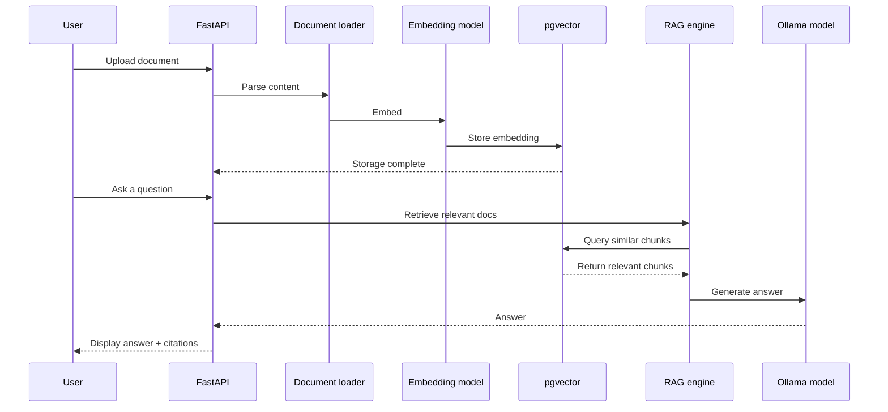
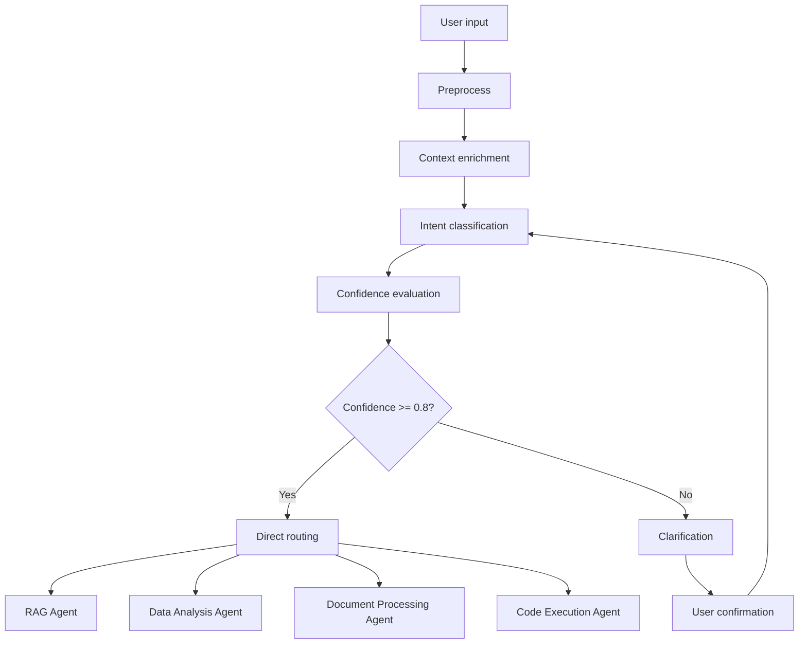
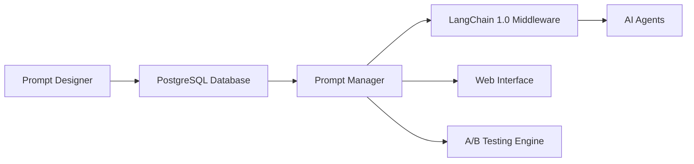

# 🤖 Industry AI Flow

> 🌐 Language: **English** · [中文](./README.md)

**An intelligent AI workflow platform** — an enterprise-grade RAG system built on LangChain 1.0, with intent classification, smart routing, and multiple cooperating agents.

## 🏗️ System Architecture

> 📊 **[Interactive architecture diagram](./docs/ARCHITECTURE_DIAGRAM.html)** — recommended. Visual, layered view with tooltips.
>
> 📖 **[Architecture overview](./docs/ARCHITECTURE.md)** — the full architecture write-up (already in English).
>
> 📖 **[Detailed system architecture](./docs/architecture/SYSTEM_ARCHITECTURE_DETAILED.en.md)** — deeper dive into multi-layer containerized architecture.

**Architecture highlights**:
- **Six-layer design** — clear separation of responsibilities, easy to understand and maintain
- **Color-coded** — each component/module has a distinct color
- **Explicit data flow** — every layer boundary is annotated with the data flowing across it
- **Interactive view** — hover to see component details

**At a glance**:
```
UI → API Gateway → Business Services → AI Runtime → Data Storage
                                          ↓
                      Security & Platform (cross-cutting)
```

## 🎯 Project Overview

Industry AI Flow is a modern AI workflow platform that integrates:
- 🔍 **Intent classification** — auto-detect user query intent and route to the right agent
- 📚 **RAG knowledge retrieval** — vector-database-backed document Q&A
- 📊 **Data analysis** — automated data processing and visualization
- 📄 **Document processing** — OCR, PDF parsing, content extraction
- 💻 **Code execution** — secure sandboxed execution environment
- 🎛️ **Prompt management** — enterprise-grade versioning and A/B testing

## ✨ Core Capabilities

### 🧠 Intent Classification
- **4 intent categories** — knowledge retrieval, data analysis, document processing, code execution
- **Confidence scoring** — 0.0–1.0 intelligent confidence signal
- **Context-aware** — uses session history and user preferences
- **Clarification** — prompts the user to clarify when confidence is low
- **LangChain 1.0 integration** — workflow orchestration via State Graph

### 🛠️ Enterprise Features
- **Prompt management** — centralized prompt database, versioning, A/B testing
- **High availability** — multi-layer fallback, load balancing, fault tolerance
- **Observability** — full monitoring, logs, and performance analysis
- **Docker support** — containerized deployment, Kubernetes-ready
- **API-first** — clean RESTful API for easy integration

### 📊 Technical Highlights
- **LangChain 1.0** — modern agent orchestration framework
- **PostgreSQL + pgvector** — high-performance vector database
- **Hybrid retrieval** — BM25 + vector + reranking
- **Async architecture** — high-throughput async I/O
- **Modular design** — clean separation of concerns, extensible

## 🔐 Security & Multi-Tenancy

- **API authentication** — set `REQUIRE_API_KEY=true` and list allowed keys (comma-separated) in `API_KEYS`. Default is permissive, for local dev.
- **User authentication** — enable `REQUIRE_USER_AUTH=true` with `AUTH_JWT_SECRET`/`AUTH_JWT_ALGORITHM` for Bearer Token (JWT) validation. Token `roles`/`permissions` are auto-injected into the request context.
- **Key encryption/hashing** — store Fernet-encrypted keys with `SECRET_ENCRYPTION_KEY` + `API_KEYS_ENCRYPTED`, or PBKDF2 hashes with `API_KEY_HASHES` (plus `SECRET_HASH_SALT`). Companion script: `python tools/secure_config.py`.
- **Tenant isolation** — declare tenant via `X-Tenant-ID` (customize with `TENANT_HEADER`); falls back to `DEFAULT_TENANT_ID`.
- **Rate limiting** — `API_RATE_LIMIT_PER_MINUTE` and `API_RATE_LIMIT_BURST` control sliding-window limits per (tenant + IP). Exceeding returns 429.
- **Input / upload safety** — key API fields are auto-checked and sanitized against XSS/SQL patterns; uploads are constrained by `MAX_UPLOAD_SIZE_BYTES` and `ALLOWED_UPLOAD_EXTENSIONS`, with filename sanitization.
- **Conversation memory** — a three-layer memory system (short-term + summary + long-term) is on by default (toggle with `ENABLE_CONVERSATION_MEMORY`, etc.). Summaries and structured facts are written to `conversation_memories`. See `docs/architecture/memory-system.md`.
- **Query cache** — `QUERY_CACHE_ENABLED` + `QUERY_CACHE_TTL_SECONDS`/`QUERY_CACHE_MAXSIZE` cache multi-tenant RAG results to reduce latency.
- **Unified dispatch** — `HYBRID_MODE` (`local_only | hybrid_auto | cloud_only`), `LOCAL_PRIMARY_BACKEND`, `CLOUD_PROVIDER`, `LOCAL_CONFIDENCE_THRESHOLD`. Manage local-first and cloud-fallback behavior via `/api/v1/query/dispatch`.
- **Demo mode** — `DEMO_MODE` (`live_hybrid | local_safe | scripted_replay`), with `/api/v1/demo/mode` to switch live, offline-safe, and scripted-replay modes on stage.
- **Cost governance** — `/api/v1/llm/usage` and `/api/v1/llm/budget/{tenant_id}`, backed by `llm_usage_logs` and `llm_budget_policies`. Supports per-tenant budget thresholds and overrun policies.
- **Privacy egress guard** — redaction and egress policy checks run before any cloud call; audit logs record `provider/redaction_applied/sensitive_hit_count/policy_decision`.
- **Observability** — `ENABLE_PROMETHEUS_METRICS=true` exposes `/metrics` for Prometheus/Alertmanager; `LOG_FORMAT_JSON=true` emits structured JSON logs for centralized analysis.
- **Friendly errors** — every HTTP exception returns `{success: false, error_code, message, detail}`.
- **Database performance** — startup creates critical indexes on `documents`/`document_chunks`; Prometheus histograms and slow-query logs (`DB_QUERY_SLOW_THRESHOLD_MS`) expose retrieval bottlenecks.
- **Memory guardrails** — `MEMORY_GUARD_LIMIT_MB` (and optional `MEMORY_GUARD_SOFT_LIMIT_MB`) cap per-process memory; over-threshold requests short-circuit with a structured error.
- **Compliance audit** — all sensitive operations are written to `logs/audit.log` (override via `AUDIT_LOG_PATH`) for SIEM/monitoring integration.

See `docs/implementation/security-and-tenant-guide.en.md` for detailed configuration and request examples.

## Runtime Flow



## Tech Stack

- **LLM**: Qwen3.5:4b/9b via Ollama (Metal GPU on Apple Silicon)
- **Vector DB**: PostgreSQL + pgvector (IVFFlat index)
- **Embeddings**: nomic-embed-text-v1.5 (768-dim, fastembed)
- **Backend**: FastAPI + LangChain 1.0 (langgraph State Graph)
- **Frontend**: Next.js + TypeScript
- **OCR**: PaddleOCR (requires Python 3.13.x)
- **Retrieval**: hybrid (BM25 + vector + RRF fusion)
- **Reranking**: bge-reranker-base cross-encoder
- **Cloud LLM**: Zhipu AI / Groq (code-generation tasks only)

## ⚠️ Environment Requirements

### Python (CRITICAL)

| Requirement | Details |
|---|---|
| **Python version** | **3.13.x ONLY** — `pyproject.toml` pins `>=3.13,<3.14` |
| **Virtualenv** | Standard `venv` — the only venv directory is `.venv/` |
| **Package manager** | `pip` — lock file at `requirements/lock/py313-capstone.txt` |
| **Forbidden** | Python 3.14+ (PaddleOCR incompatible), Conda, Poetry |

```bash
# Install Python 3.13 (macOS)
brew install python@3.13

# Verify
python3.13 --version  # → Python 3.13.x
```

### Other Requirements

- **macOS**: Apple Silicon M1/M2/M3/M4 (recommended)
- **Memory**: 16GB+ RAM (32GB recommended for 9B model)
- **PostgreSQL**: 14+ with pgvector extension
- **Ollama**: local LLM runtime (https://ollama.com)

## 🚀 Quick Start

### 🛠️ Makefile Shortcuts

An optimized Makefile streamlines development:

```bash
# List all commands
make help

# Quick start (recommended for new users)
make quick-start

# Run examples
make example-rag      # Run the RAG example
make example-ocr      # Run the OCR example

# Tests
make test             # Run all tests
make test-unit        # Unit tests only
make test-phase1-gate # Phase 1 correction gate (dispatch/privacy/cost/API compat)
make test-comprehensive # Full test suite

# Utilities
make utilities        # List available utility scripts
make import-docs      # Import sample documents
make import-data      # Import sample datasets

# Code quality
make format           # Format code
make lint             # Lint
```

### 📋 Environment (quick reference)

- **Python**: **3.13.x ONLY** ⚠️ (strict; 3.14+ not supported)
- **PostgreSQL**: 14+ (with pgvector extension)
- **Node.js**: 16+ (optional, for frontend tooling)
- **Docker**: 20+ (optional, for containerized deployment)

### 🔧 Installation

```bash
# 1. Clone
git clone <repository-url>
cd Industry-AI-Flow

# 2. Create standard venv (one-shot, recommended)
make capstone-env-setup    # Auto-creates .venv/ and installs the lock file

# Or manually:
python3.13 -m venv .venv
source .venv/bin/activate
pip install -r requirements/lock/py313-capstone.txt

# 3. (Optional) Install the PaddlePaddle nightly required by PaddleOCR
python -m pip install --pre paddlepaddle -i https://www.paddlepaddle.org.cn/packages/nightly/cpu/

# 4. Install Ollama and pull models
# Install from https://ollama.com, then:
ollama pull qwen3.5:4b        # Default demo model
ollama pull nomic-embed-text   # Embedding model (optional; fastembed is default)

# 5. Database
brew services start postgresql@14
make db-setup

# 6. Start services
make run                       # Backend API on :8000
make frontend-dev              # Frontend on :3123 (separate terminal)
```

### Dependency Management

```
requirements.txt                          # Entry → points to requirements/base.txt
├── requirements/base.txt                 # → points to the lock file
│   └── requirements/lock/py313-capstone.txt   # ← single source of truth
├── requirements/dev.txt                  # Dev tools (black, pytest, mypy...)
└── requirements/demo.txt                 # Demo extras (streamlit, jupyter)
```

**Rule**: when adding a new dependency, edit `requirements/lock/py313-capstone.txt` with an exact version.

### Environment Verification

```bash
# Check environment consistency
make capstone-env-check

# CI smoke test (no Postgres/Ollama needed)
make test-demo-smoke-gate

# Local full-stack smoke test (requires Postgres + Ollama)
make test-demo-smoke-live-gate
```

### 🎯 Core Feature Tests

```bash
# Test intent classification
make test-intent

# Test full workflow
make test-intent-full

# Launch the web UI
make streamlit

# Launch the prompt management UI
make streamlit-prompt

# Launch the new Prompt Admin (real API integration)
make prompt-admin

# Run the Prompt Admin demo (API probe + optional experiment traffic)
make prompt-admin-demo
```

### 🎨 Frontend MVP (Next.js)

```bash
# Install and start the frontend
make frontend-install
make frontend-dev

# Or directly from the frontend directory
cd frontend
npm run dev
```

- Default URL: `http://localhost:3123`
- The frontend proxies to the backend via `frontend/src/app/api/backend/[...path]/route.ts`
- Default backend address: `http://127.0.0.1:8000` (override with `BACKEND_BASE_URL` in `frontend/.env.local`)

### 🐳 Docker Deployment

```bash
# Build image
make docker-build

# Start containers
make docker-run

# Tail logs
make logs

# Stop services
make docker-stop
```

**Expected output**:
```
📁 Found X documents
[1/X] Processing: document.pdf
  ✓ Extracted text: 5000 chars
  ✓ Chunked: 12 chunks
  ✓ Embedded: 12 vectors
  ✓ Stored: doc_id=...

📊 Import complete
Success: X/X documents
Total chunks: XX
Elapsed: X.XX s
```

### 3. Run RAG Tests

```bash
make test
```

**Expected output**:
```
📊 Evaluation results
Accuracy: 80.0% (16/20)
Avg latency: 4.44s
P95 latency: 5.82s

✅ Acceptance checks
Accuracy > 70%: ✅ pass
P95 latency < 10s: ✅ pass
```

### 4. Manually Test a RAG Query

```bash
curl -X POST "http://localhost:8000/rag/query" \
  -H "Content-Type: application/json" \
  -d '{"question": "What is a RAG system?", "top_k": 3}'
```

## 🏗️ Project Structure

```
Industry-AI-Flow/
├── 📁 backend/                          # 🔧 Backend core services
│   ├── agents/                          # 🤖 AI agent implementations
│   ├── api/                             # 🌐 REST API routes
│   ├── middleware/                      # 🔀 Middleware
│   ├── migrations/                      # 🗄️ DB migrations
│   ├── services/                        # ⚙️ Core business services
│   │   ├── intent_classification/       # 🧠 Intent classification
│   │   ├── llm_integration/             # 🦙 LLM integration
│   │   ├── data_analysis/               # 📊 Data analysis
│   │   ├── feedback_system/             # 💬 User feedback
│   │   ├── core/                        # 🔧 Core utilities
│   │   ├── document_processing/         # 📄 Document processing
│   │   ├── document_loader.py           # 📚 Document loader
│   │   ├── embedding_generator.py       # 🎯 Embedding generator
│   │   ├── metadata_filter.py           # 🏷️ Metadata filter
│   │   ├── ocr_processor.py             # 👁️ OCR processor
│   │   ├── prompt_manager.py            # 📝 Prompt manager
│   │   ├── query_classifier.py          # 🔍 Query classifier
│   │   ├── rag_engine.py                # 🔗 RAG engine
│   │   ├── vectorstore.py               # 🗂️ Vector store
│   │   └── llm_client.py                # 🤖 LLM client
│   ├── tools/                           # 🛠️ Tool modules
│   ├── utils/                           # 🔧 Utilities
│   ├── main.py                          # 🚀 Application entry
│   ├── requirements.txt                 # 📦 Python dependencies
│   └── config.py                        # ⚙️ Configuration
│
├── 📁 examples/                         # 📚 Example code
├── 📁 datasets/                         # 📊 Datasets and test data
├── 📁 tests/                            # 🧪 Test suite
├── 📁 scripts/                          # 🔧 Tooling scripts
├── 📁 docs/                             # 📚 Project documentation
├── 📁 infrastructure/                   # 🏗️ Infrastructure (Docker, K8s, monitoring)
├── 📁 frontend/                         # 🎨 Next.js frontend
└── 📁 archive/                          # 📦 Archived (gitignored)
```

(See the [Chinese README](./README.md) for the full expanded tree — structure is identical; only the annotations are localized.)

### Core Architecture Components

> Prefer the visual layered diagram (HTML):
> **[docs/ARCHITECTURE_DIAGRAM.html](docs/ARCHITECTURE_DIAGRAM.html)**

#### 🧠 Intent Classification Workflow


#### 🔄 Prompt Management


## Configuration

### Environment Variables

Copy `.env.example` to `.env` and adjust:

```bash
# LLM backend
LLM_BACKEND=ollama              # ollama | zhipu
OLLAMA_HOST=http://localhost:11434
OLLAMA_MODEL=qwen3.5:4b         # default demo model (or qwen3.5:9b)

# Database
POSTGRES_HOST=localhost
POSTGRES_DB=ai_workflow

# RAG
CHUNK_SIZE=512
CHUNK_OVERLAP=128
TOP_K=8

# OCR
OCR_LANG=en                     # en | ch | en+ch
```

## API

### Health Check

```http
GET /health
```

**Response**:
```json
{
  "status": "ok",
  "memory_usage_mb": 245.67
}
```

### RAG Query

```http
POST /rag/query
Content-Type: application/json

{
  "question": "your question",
  "top_k": 3
}
```

**Response**:
```json
{
  "question": "your question",
  "answer": "Context-grounded answer...",
  "sources": ["doc_id_1", "doc_id_2"],
  "retrieved_chunks": [...]
}
```

## Resource Optimization

The project favors local Homebrew services over Docker for development. Compared to Docker:

- **Memory saved**: ~2–3 GB (no container overhead)
- **Disk saved**: no Docker images or volumes
- **Performance**: less virtualization overhead

## Phase 2 Upgrade Highlights

- **Accuracy**: 20% → 80% (4× improvement)
- **Hybrid retrieval**: BM25 + vector + RRF fusion
- **Document coverage**: images and scans via OCR
- **Reranking**: fine-grained with bge-reranker

## Development Progress

- [x] Day 1–2: environment setup
- [x] Day 3–4: FastAPI skeleton
- [x] Day 5–7: vectorization pipeline
- [x] Day 8–10: RAG core
- [x] Day 11–12: testing and evaluation
- [x] Day 13–14: documentation and tooling

## Next Steps

Based on Week 1–2 validation, pick a path:

### Path A: working well — keep investing
- Move to Phase 2: cloud GPU trials (AutoDL RTX 4090)
- Upgrade to Qwen2.5-14B
- Switch to Qdrant for vectors
- Build the full React frontend

### Path B: decent but needs tuning
- Prompt tuning
- Retrieval parameter tuning
- Data quality improvements

### Path C: approach not viable — rethink
- Pivot to pure API (ChatGPT/Claude)
- Use a managed RAG service
- Simplify scope

## License

MIT License

## 📚 Key Documentation Map

Industry AI Flow uses a **layered, categorized** documentation strategy. The table below is organized by role and purpose.

> ⚠️ **Translation status**: Most documentation is currently in Chinese. This README and the P0 architecture docs (marked with `.en.md` links below) are available in English. Other docs link to the Chinese source; ping the team if English is needed.

### 📋 Documentation Management
- **[Core Documentation Guide](docs/CORE_DOCUMENTATION_GUIDE.md)** (zh) — full documentation strategy and inventory

### 🏗️ Architecture (architects, tech leads)

| Document | Description | Audience | Update cadence |
|---|---|---|---|
| **[System Architecture](docs/ARCHITECTURE.md)** (en) | Six-layer architecture design | Architects, tech leads | Quarterly |
| **[Detailed System Architecture](docs/architecture/SYSTEM_ARCHITECTURE_DETAILED.en.md)** (en) | Multi-layer containerized deep dive | Architects, SREs | Quarterly |
| **[Interactive Architecture Diagram](docs/ARCHITECTURE_DIAGRAM.html)** | Visual architecture | All technical staff | Quarterly |
| **[Frontend Architecture](docs/architecture/FRONTEND_ARCHITECTURE.en.md)** (en) | Next.js frontend architecture | Frontend devs, architects | Monthly |

### 👨‍💻 Development (engineering team)

| Document | Description | Audience | Update cadence |
|---|---|---|---|
| **[API Reference](docs/implementation/api-reference.md)** (zh) | REST API details | Backend/frontend devs | Monthly |
| **[Code Style](docs/development/code-style.md)** (zh) | Coding standards and best practices | All devs | Quarterly |
| **[Contributing Guide](docs/development/contributing.md)** (zh) | How to contribute | Contributors, new devs | Quarterly |
| **[Security & Tenant Guide](docs/implementation/security-and-tenant-guide.en.md)** (en) | Security architecture and configuration | Devs, SREs | Quarterly |

### 🧪 Testing & Quality

| Document | Description | Audience | Update cadence |
|---|---|---|---|
| **[Test Strategy](docs/development/testing.md)** (zh) | Overall testing approach | Test leads, QA | Quarterly |
| **[Construction RAG Multi-Role Test Plan](docs/runbooks/construction-rag-multi-agent-test-plan.md)** (zh) | Architect/dev/QA co-validation plan | Architects, devs, QA | Per KB update |
| **[E2E Test Plan](docs/FRONTEND_E2E_TEST_PLAN.md)** (zh) | End-to-end test strategy | Test engineers, devs | Monthly |
| **[Test Case Specs](docs/testing/test-case-specs/README.md)** (zh) | Detailed test cases | Test engineers | Monthly |
| **[Test Resources](test_resources/README.md)** (zh) | Test data and fixtures | Test team | Monthly |

### 🚀 Deployment & Operations

| Document | Description | Audience | Update cadence |
|---|---|---|---|
| **[Deployment Guide](docs/implementation/deployment.md)** (zh) | Production configuration | SREs | Quarterly |
| **[Full-Stack Deployment Plan](docs/development/full-stack-deployment-smoke-plan.md)** (zh) | End-to-end deployment flow | Ops, devs | Quarterly |
| **[Construction RAG KB Init Runbook](docs/runbooks/construction-rag-kb-init.md)** (zh) | KB init and tuning workflow | QA, AI engineers, architects | Per KB update |
| **[Construction RAG Incremental OpCard](docs/runbooks/construction-rag-opcard-incremental.md)** (zh) | Daily document update flow | QA, AI engineers | Daily |
| **[Construction RAG Full Rebuild OpCard](docs/runbooks/construction-rag-opcard-full-rebuild.md)** (zh) | Tuning and full rebuild standard flow | QA, AI engineers, architects | Major versions |
| **[Version Management Guide](docs/development/version-management-guide.md)** (zh) | Versioning and release | Ops, release mgr | Quarterly |

### 📖 User Guides

| Document | Description | Audience | Update cadence |
|---|---|---|---|
| **[Memory System](docs/architecture/memory-system.md)** (en) | Three-layer conversation memory architecture | Devs, architects | Quarterly |
| **[Basic Usage Guide](docs/user/basic-usage.md)** (zh) | Feature usage | End users | Monthly |
| **[Prompt Management Guide](docs/developer/prompt-management.md)** (zh) | Prompt system usage | Admins, users | Monthly |
| **[Intent Classification Guide](docs/developer/intent-classification.md)** (zh) | Intent system deep dive | Advanced users, admins | Quarterly |

### 🔬 Research & Planning

| Document | Description | Audience | Update cadence |
|---|---|---|---|
| **[Project Roadmap](docs/development/status/active/ROADMAP.md)** (zh) | Product roadmap | PMs, team | Quarterly |
| **[Implementation Roadmap](research/implementation-roadmap.md)** (zh) | Technical implementation plan | Architects, devs | Per phase |
| **[Hybrid LLM Evaluation](research/reports/hybrid-llm-evaluation-report.md)** (zh) | LLM technology selection | Architects, PMs | Per phase |
| **[RAG Optimization Plan](research/plans/rag-workflow-deep-optimization-plan.md)** (zh) | RAG system optimization | Architects, devs | Per phase |

### 📊 Project Status & Reports

| Document | Description | Audience | Update cadence |
|---|---|---|---|
| **[Project Status Report](docs/development/status/active/PROJECT_STATUS_UPDATE.md)** (zh) | Project progress | Management, team | Weekly |
| **[Issue Tracker](docs/development/status/active/ISSUES_TRACKER.md)** (zh) | Issue management | All team members | Real-time |
| **[E2E Test Report](docs/FRONTEND_E2E_TEST_REPORT_2026-02-18.md)** (zh) | Test results and analysis | PMs, team | Per release |
| **[Code Review Report](docs/reports/CODE_REVIEW_REPORT.md)** (zh) | Code quality analysis | Tech leads, devs | Per release |
| **[Documentation Optimization Report](docs/DOCUMENTATION_OPTIMIZATION_REPORT.md)** (zh) | Documentation system optimization | Doc leads, team | Per phase |

### 🛠️ Tooling & Scripts

| Document | Description | Audience | Update cadence |
|---|---|---|---|
| **[Scripts Hub](scripts/README.md)** (zh) | Script collection | Devs, SREs | Monthly |
| **[Deployment Scripts](scripts/deploy/README.md)** (zh) | Automated deployment scripts | SREs | Quarterly |
| **[Monitoring Scripts](scripts/monitoring/README.md)** (zh) | Monitoring and alerting scripts | SRE | Quarterly |

## 📈 Documentation Quality

### Standards
- **Version control** — all docs live in Git
- **Regular review** — core docs are reviewed quarterly
- **Update flow** — doc changes go through team review
- **Quality checks** — standardized templates and checklists

### Category Map
```
📚 Documentation
├── 🏗️ Architecture (technical decisions, system design)
├── 👨‍💻 Development (coding, API, configuration)
├── 🧪 Testing & Quality (test cases, reports)
├── 🚀 Deploy & Ops (deploy, monitor, maintain)
├── 📖 User Guides (usage, admin)
├── 🔬 Research & Planning (tech selection, roadmap)
├── 📊 Project Status (progress, reports, issues)
└── 🛠️ Tooling & Scripts (automation, utilities)
```

### Finding Docs
1. **By role** — use the role filter in the tables above
2. **By purpose** — use the category map
3. **By keyword** — search the repo
4. **By freshness** — watch the high-cadence docs

## 🔄 Documentation Contribution Flow

We welcome doc improvements from everyone:
1. **Report** an issue on GitHub Issues
2. **Propose** an improvement or open a PR directly
3. **Review** — doc changes need at least two reviewers
4. **Merge** — approved changes land on the main branch

## 🗂️ Historical Archives

Obsolete research docs, migration records, and test reports are archived under:
- `.deprecated/` — deprecated guides and reports
- `docs/deprecated/` — deprecated technical docs
- `temp/reports/` — ad-hoc reports and analyses

These directories are managed via `.gitignore` rules. Browse them directly to look up history.
