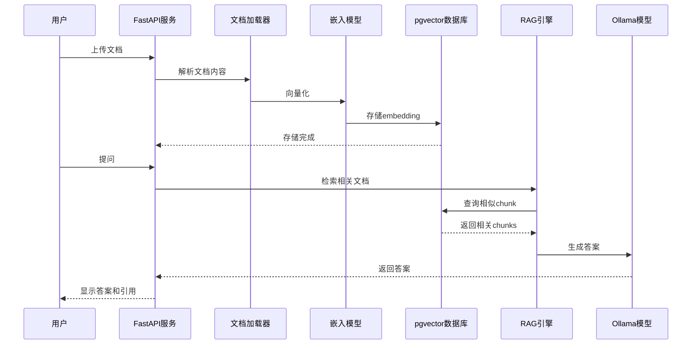
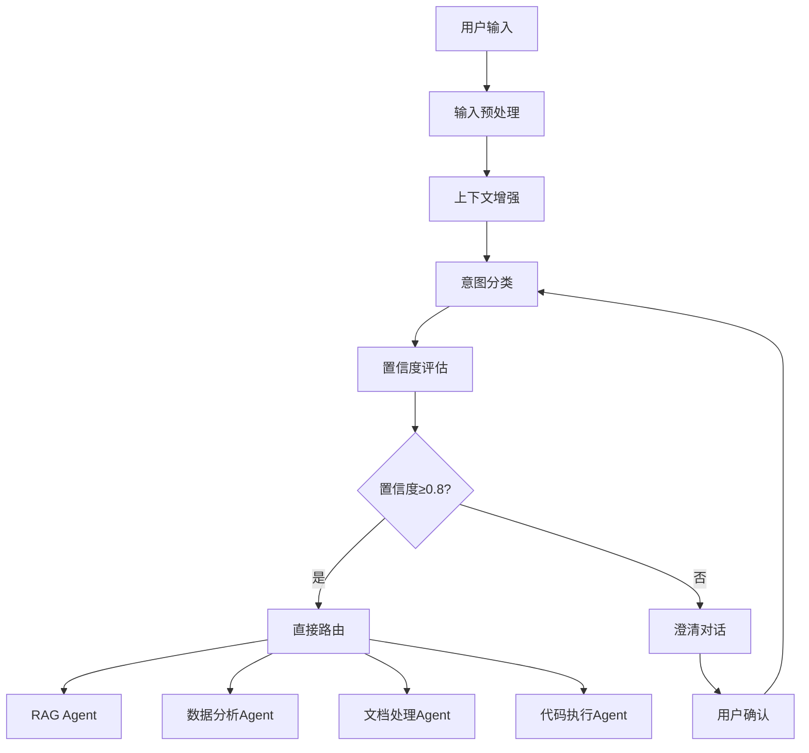
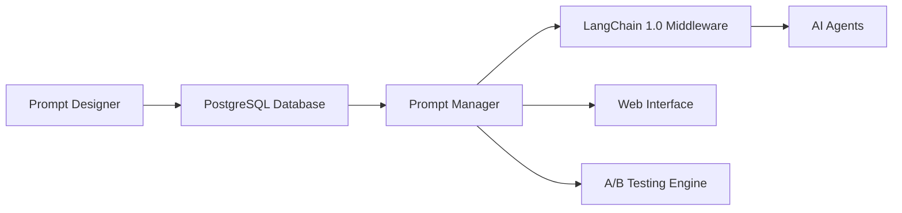

# 🤖 Industry AI Flow

**智能AI工作流平台** - 基于LangChain 1.0的企业级RAG系统，支持意图识别、智能路由和多种Agent协同工作。

## 🎯 项目概述

Industry AI Flow是一个现代化的AI工作流平台，集成了：
- 🔍 **智能意图分类** - 自动识别用户查询意图并路由到合适Agent
- 📚 **RAG知识检索** - 基于向量数据库的智能文档问答
- 📊 **数据分析** - 自动化的数据处理和可视化分析
- 📄 **文档处理** - OCR、PDF解析和内容提取
- 💻 **代码执行** - 安全的沙箱代码执行环境
- 🎛️ **Prompt管理** - 企业级的Prompt版本管理和优化

## ✨ 核心特性

### 🧠 智能意图分类系统
- **4大类意图识别**：知识检索、数据分析、文档处理、代码执行
- **置信度评估**：0.0-1.0的智能置信度评分机制
- **上下文感知**：基于会话历史和用户偏好的智能分类
- **澄清机制**：低置信度时的自动澄清对话
- **LangChain 1.0集成**：基于State Graph的工作流编排

### 🛠️ 企业级特性
- **Prompt管理**：集中化Prompt数据库，版本控制，A/B测试
- **高可用架构**：多层回退机制，负载均衡，容错处理
- **可观测性**：完整的监控、日志和性能分析
- **Docker支持**：容器化部署，Kubernetes集成
- **API优先**：RESTful API设计，易于集成

### 📊 技术栈优势
- **LangChain 1.0**：现代化的Agent编排框架
- **PostgreSQL + pgvector**：高性能向量数据库
- **混合检索**：BM25 + 向量搜索 + 重排序
- **异步架构**：高性能的异步I/O处理
- **模块化设计**：清晰的责任分离和可扩展架构

## 项目运行流程



## 技术栈

- **LLM**: Ollama + Qwen2.5:7b（本地运行）
- **向量库**: PostgreSQL + pgvector（本地 homebrew）
- **嵌入模型**: nomic-embed-text-v1.5（768维）
- **后端**: FastAPI
- **OCR**: PaddleOCR（支持图片文档）
- **检索**: 混合检索（BM25 + 向量 + RRF融合）
- **重排序**: bge-reranker-base

## 环境要求

- macOS（M1/M2/M3 推荐）
- 内存: 16GB+ RAM
- Python: 3.10+
- PostgreSQL: 14+（通过 homebrew 安装）
- Redis（通过 homebrew 安装）
- Ollama

## 🚀 快速开始

### 📋 环境要求

- **Python**: 3.10+
- **PostgreSQL**: 14+ (with pgvector extension)
- **Node.js**: 16+ (可选，用于前端工具)
- **Docker**: 20+ (可选，用于容器化部署)

### 🔧 快速安装

```bash
# 1. 克隆项目
git clone <repository-url>
cd Industry-AI-Flow

# 2. 快速启动 (推荐)
make quick-start

# 3. 或者手动安装
make install-dev
make db-setup
make run
```

### 🎯 核心功能测试

```bash
# 测试意图分类系统
make test-intent

# 测试完整工作流
make test-intent-full

# 启动Web界面
make streamlit

# 启动Prompt管理界面
make streamlit-prompt
```

### 🐳 Docker 部署

```bash
# 构建镜像
make docker-build

# 启动容器
make docker-run

# 查看日志
make logs

# 停止服务
make docker-stop
```

**预期输出**：
```
📁 找到 X 个文档
[1/X] 处理: document.pdf
  ✓ 提取文本: 5000 字符
  ✓ 分块完成: 12 块
  ✓ 向量化完成: 12 个向量
  ✓ 存储成功: doc_id=...

📊 导入完成
成功: X/X 文档
总块数: XX
耗时: X.XX 秒
```

### 3. 运行 RAG 测试

```bash
make test
```

**预期输出**：
```
📊 评估结果
准确率: 80.0% (16/20)
平均延迟: 4.44秒
P95延迟: 5.82秒

✅ 验收标准检查
准确率>70%: ✅ 通过
P95延迟<10秒: ✅ 通过
```

### 4. 手动测试 RAG 查询

```bash
curl -X POST "http://localhost:8000/rag/query" \
  -H "Content-Type: application/json" \
  -d '{"question": "什么是RAG系统?", "top_k": 3}'
```

## 🏗️ 项目架构

```
Industry-AI-Flow/
├── 📁 backend/                          # 后端核心服务
│   ├── agents/                         # AI Agent实现
│   ├── api/                           # REST API接口
│   ├── middleware/                    # 中间件层
│   ├── migrations/                    # 数据库迁移
│   ├── services/                      # 核心业务服务
│   │   ├── intent_classifier.py      # 意图分类器
│   │   ├── context_manager.py        # 上下文管理
│   │   ├── routing_decision.py      # 路由决策引擎
│   │   ├── intent_workflow.py        # 意图工作流
│   │   ├── prompt_manager.py         # Prompt管理
│   │   ├── rag_engine.py             # RAG检索引擎
│   │   └── ...                       # 其他服务
│   ├── tools/                         # 工具模块
│   ├── utils/                         # 工具函数
│   ├── main.py                        # 应用入口
│   └── requirements.txt               # Python依赖
│
├── 📁 docs/                           # 项目文档
│   ├── design/                       # 设计文档
│   ├── implementation/               # 实现总结
│   ├── api/                          # API文档
│   ├── guides/                       # 使用指南
│   └── research/                     # 研究文档
│
├── 📁 scripts/                        # 脚本工具
│   ├── setup/                        # 环境设置
│   ├── migration/                    # 数据迁移
│   ├── testing/                      # 测试脚本
│   └── deployment/                   # 部署脚本
│
├── 📁 tests/                          # 测试文件
│   ├── unit/                         # 单元测试
│   ├── integration/                  # 集成测试
│   ├── performance/                  # 性能测试
│   └── reports/                      # 测试报告
│
├── 📁 infrastructure/                 # 基础设施
│   ├── docker/                       # Docker配置
│   ├── kubernetes/                   # K8s配置
│   └── monitoring/                   # 监控配置
│
├── 📁 tools/                          # 开发工具
│   ├── data-generator/               # 数据生成工具
│   ├── performance-monitor/          # 性能监控
│   └── deployment-automation/        # 部署自动化
│
├── 📁 workspace/                      # 工作空间
│   ├── experiments/                  # 实验性代码
│   ├── prototypes/                   # 原型代码
│   └── sandbox/                      # 沙盒测试
│
├── 📁 examples/                       # 示例代码
├── 📄 README.md                        # 项目说明
├── 📄 requirements.txt                 # 统一依赖文件
├── 📄 .gitignore                       # Git忽略规则
├── 📄 Makefile                         # 构建脚本
└── 📄 .env.example                     # 环境变量示例
```

### 核心架构组件

#### 🧠 意图分类工作流


#### 🔄 Prompt管理系统


## 配置说明

### 环境变量

复制 `.env.example` 到 `.env` 并根据需要修改：

```bash
# 数据库配置（本地 PostgreSQL）
POSTGRES_HOST=localhost
POSTGRES_DB=ai_workflow

# Ollama 配置
OLLAMA_MODEL=qwen2.5:7b

# OCR 配置 (默认英文)
OCR_LANG=en  # 'en'=英文, 'ch'=中文, 'en+ch'=混合

# 文档处理配置
CHUNK_SIZE=300
CHUNK_OVERLAP=50

# RAG 配置
TOP_K=5
```

## API 接口

### 健康检查

```http
GET /health
```

**响应**：
```json
{
  "status": "ok",
  "memory_usage_mb": 245.67
}
```

### RAG 查询

```http
POST /rag/query
Content-Type: application/json

{
  "question": "你的问题",
  "top_k": 3
}
```

**响应**：
```json
{
  "question": "你的问题",
  "answer": "基于上下文的答案...",
  "sources": ["doc_id_1", "doc_id_2"],
  "retrieved_chunks": [...]
}
```

## 资源优化

本项目优先使用 homebrew 本地服务，相比 Docker 方案：

- **内存节省**: 约 2-3GB（无 Docker 容器开销）
- **磁盘节省**: 无需 Docker 镜像和卷存储
- **性能提升**: 减少虚拟化层开销

## Phase 2 升级亮点

- **准确率提升**: 从 20% → 80% (4倍提升!)
- **混合检索**: BM25 + 向量 + RRF融合
- **文档扩展**: 支持图片/扫描件 OCR
- **重排序**: bge-reranker 精排优化

## 开发进度

- [x] Day 1-2: 环境搭建
- [x] Day 3-4: FastAPI 基础应用
- [x] Day 5-7: 向量化管道
- [x] Day 8-10: RAG 核心功能
- [x] Day 11-12: 测试评估
- [x] Day 13-14: 文档和工具

## 下一步

根据 Week 1-2 验证结果，选择后续路径：

### 路径A: 效果良好，继续投入

- 进入 Phase 2：云 GPU 测试（AutoDL RTX 4090）
- 升级到 Qwen2.5-14B 模型
- 使用 Qdrant 向量库
- 实现完整 React 前端

### 路径B: 效果一般，优化调整

- 提示词优化
- 检索参数调整
- 数据质量改进

### 路径C: 方案不可行，重新评估

- 转向纯 API 方案（ChatGPT/Claude）
- 采用托管 RAG 服务
- 简化需求

## 许可证

MIT License

## 参考文档

- [本地开发可行性方案](research/local-development-feasibility.md)
- [Phase 2 技术总结](research/local-development-phase2-summary.md)
- [实施 Prompt v2.2](research/local-development-feasibility.prompt.v2.md)
- [综合架构方案](research/best-ai-workflow.plan.md)