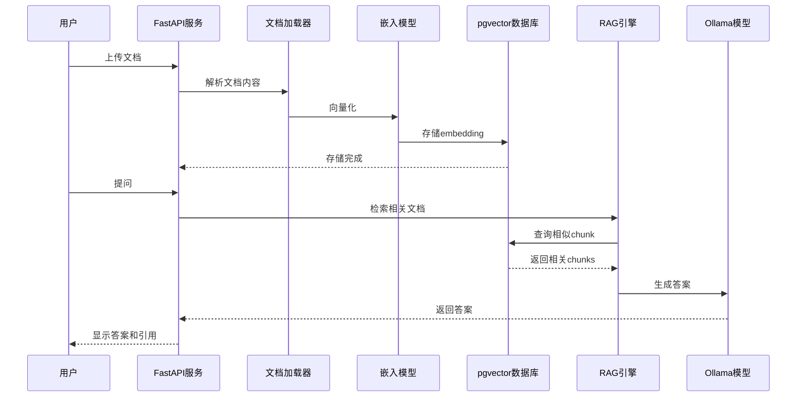
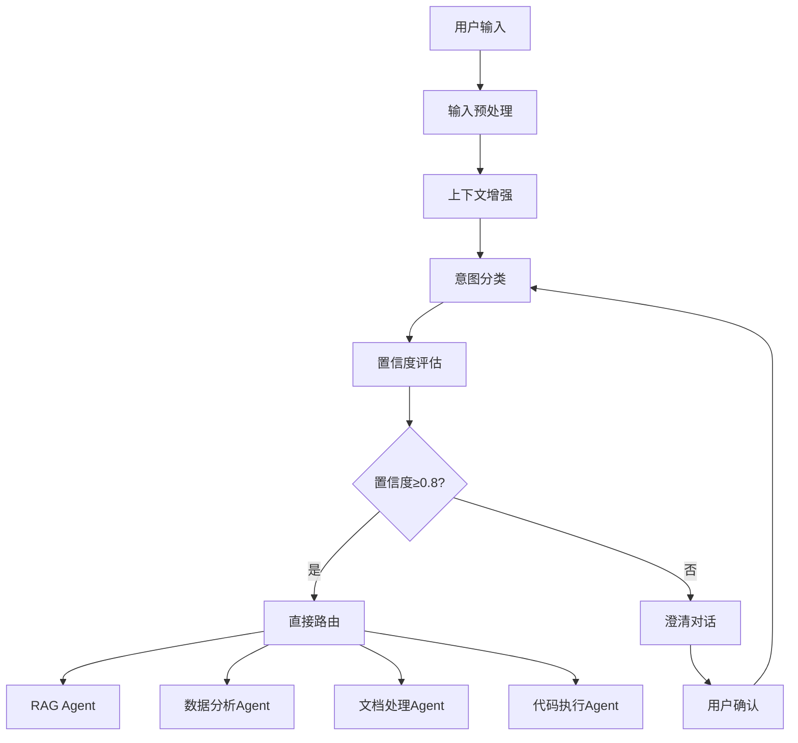
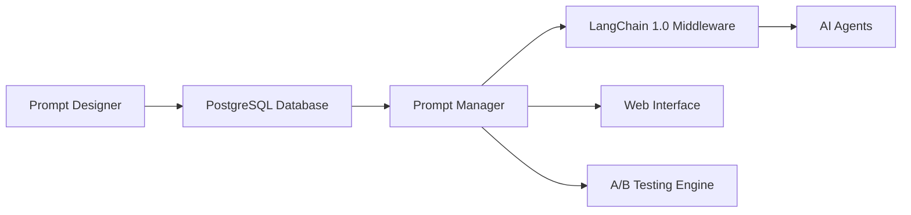

# 🤖 Industry AI Flow

**智能AI工作流平台** - 基于LangChain 1.0的企业级RAG系统，支持意图识别、智能路由和多种Agent协同工作。

## 🏗️ 系统架构

> 📊 **[查看交互式架构图](./docs/ARCHITECTURE_DIAGRAM.html)** - 推荐！更直观的分层架构可视化
>
> 📖 **[查看详细架构说明](./docs/ARCHITECTURE.md)** - 完整的架构设计文档

**架构亮点**:
- **6层分层架构** - 清晰的职责分离，易于理解和维护
- **颜色编码** - 不同颜色区分不同组件和模块
- **数据流向清晰** - 每一层之间有明确的数据流向标注
- **交互式展示** - 鼠标悬停查看组件详情

**快速预览**:
```
用户界面层 → API网关层 → 业务服务层 → AI引擎层 → 数据存储层
                                            ↓
                          安全与基础设施层 (全栈支撑)
```

## 🎯 项目概述

Industry AI Flow是一个现代化的AI工作流平台，集成了：
- 🔍 **智能意图分类** - 自动识别用户查询意图并路由到合适Agent
- 📚 **RAG知识检索** - 基于向量数据库的智能文档问答
- 📊 **数据分析** - 自动化的数据处理和可视化分析
- 📄 **文档处理** - OCR、PDF解析和内容提取
- 💻 **代码执行** - 安全的沙箱代码执行环境
- 🎛️ **Prompt管理** - 企业级的Prompt版本管理和优化

## ✨ 核心特性

### 🧠 智能意图分类系统
- **4大类意图识别**：知识检索、数据分析、文档处理、代码执行
- **置信度评估**：0.0-1.0的智能置信度评分机制
- **上下文感知**：基于会话历史和用户偏好的智能分类
- **澄清机制**：低置信度时的自动澄清对话
- **LangChain 1.0集成**：基于State Graph的工作流编排

### 🛠️ 企业级特性
- **Prompt管理**：集中化Prompt数据库，版本控制，A/B测试
- **高可用架构**：多层回退机制，负载均衡，容错处理
- **可观测性**：完整的监控、日志和性能分析
- **Docker支持**：容器化部署，Kubernetes集成
- **API优先**：RESTful API设计，易于集成

### 📊 技术栈优势
- **LangChain 1.0**：现代化的Agent编排框架
- **PostgreSQL + pgvector**：高性能向量数据库
- **混合检索**：BM25 + 向量搜索 + 重排序
- **异步架构**：高性能的异步I/O处理
- **模块化设计**：清晰的责任分离和可扩展架构

## 🔐 安全与多租户配置

- **API认证**：设置 `REQUIRE_API_KEY=true` 并在 `API_KEYS` 中维护允许的密钥（逗号分隔），默认为可选模式便于本地开发。
- **用户认证**：启用 `REQUIRE_USER_AUTH=true` 并配置 `AUTH_JWT_SECRET`/`AUTH_JWT_ALGORITHM` 后即可使用 Bearer Token（JWT）进行身份与角色校验，令牌中的 `roles`/`permissions` 会自动注入上下文。
- **密钥加密/哈希**：通过 `SECRET_ENCRYPTION_KEY` + `API_KEYS_ENCRYPTED` 存储Fernet加密后的密钥，或使用 `API_KEY_HASHES`（配合 `SECRET_HASH_SALT`）保存PBKDF2哈希，配套脚本 `python tools/secure_config.py`。
- **租户隔离**：通过 `X-Tenant-ID`（`TENANT_HEADER` 可自定义）声明租户，未提供时回落到 `DEFAULT_TENANT_ID`。
- **限流保护**：`API_RATE_LIMIT_PER_MINUTE` 和 `API_RATE_LIMIT_BURST` 控制每个租户+IP 的滑动窗口限速，超限返回 429。
- **输入/上传安全**：关键API请求字段会自动做 XSS/SQL 关键字检测并清洗；文件上传通过 `MAX_UPLOAD_SIZE_BYTES` 与 `ALLOWED_UPLOAD_EXTENSIONS` 统一限制，并强制文件名消毒。
- **对话记忆**：默认开启「短期 + 摘要 + 长期」三层记忆体系（`ENABLE_CONVERSATION_MEMORY` 等变量可调），记忆摘要和结构化事实自动写入 `conversation_memories` 表，详情见 `docs/MEMORY_SYSTEM.md`。
- **智能缓存**：`QUERY_CACHE_ENABLED` + `QUERY_CACHE_TTL_SECONDS`/`QUERY_CACHE_MAXSIZE` 可缓存多租户 RAG 查询结果，降低响应延迟。
- **统一调度**：新增 `HYBRID_MODE`（`local_only | hybrid_auto | cloud_only`）、`LOCAL_PRIMARY_BACKEND`、`CLOUD_PROVIDER`、`LOCAL_CONFIDENCE_THRESHOLD`，通过 `/api/v1/query/dispatch` 统一管理本地优先与云端回退。
- **演示模式**：支持 `DEMO_MODE`（`live_hybrid | local_safe | scripted_replay`），并提供 `/api/v1/demo/mode` 管理接口，可在答辩现场快速切换主模式、离线保底模式和脚本回放模式。
- **成本治理**：新增 `/api/v1/llm/usage` 与 `/api/v1/llm/budget/{tenant_id}`，并落库 `llm_usage_logs`、`llm_budget_policies`，支持租户预算阈值与超限策略。
- **隐私出站守卫**：云端调用前执行脱敏与 egress policy 校验，审计日志会记录 `provider/redaction_applied/sensitive_hit_count/policy_decision`。
- **可观测性**：启用 `ENABLE_PROMETHEUS_METRICS=true` 暴露 `/metrics` 供 Prometheus/Alertmanager 抓取；`LOG_FORMAT_JSON=true` 提供结构化JSON日志，便于集中化分析。
- **友好错误**：所有 HTTP 异常会统一返回 `{success: false, error_code, message, detail}`，便于前端展示用户可读提示。
- **数据库性能**：系统启动时自动为 `documents` / `document_chunks` 创建关键索引，并通过 Prometheus 直方图和慢查询日志（`DB_QUERY_SLOW_THRESHOLD_MS`）观察检索瓶颈。
- **内存护栏**：`MEMORY_GUARD_LIMIT_MB`（可配 `MEMORY_GUARD_SOFT_LIMIT_MB`）限制单进程内存峰值，超过后自动短路请求并返回结构化错误。
- **合规审计**：所有敏感操作都会写入 `logs/audit.log`（`AUDIT_LOG_PATH` 可覆盖），便于对接 SIEM/监控。

参考 `docs/SECURITY_AND_TENANT_GUIDE.md` 获取更加详细的配置说明与调用示例。

## 项目运行流程



## 技术栈

- **LLM**: llama.cpp + Qwen2.5:7b GGUF（本地推理，Metal 加速）
- **向量库**: PostgreSQL + pgvector（本地 homebrew）
- **嵌入模型**: nomic-embed-text-v1.5（768维）
- **后端**: FastAPI
- **OCR**: PaddleOCR（支持图片文档）
- **检索**: 混合检索（BM25 + 向量 + RRF融合）
- **重排序**: bge-reranker-base
- **备用LLM**: Ollama（兼容后端）

## ⚠️ 环境要求

### 🔴 CRITICAL: Python Version Requirement

**本项目必须使用 Python 3.13.x**

```bash
# ✅ 正确的Python版本
python3.13 --version
# 输出: Python 3.13.x

# ❌ 错误 - 不支持Python 3.14+
python3.14 --version  # 会导致PaddlePaddle安装失败！
```

**原因**:
- PaddlePaddle on macOS 需要使用 **Developer Nightly Build** 版本
- Nightly Build 最高支持 Python 3.13 (支持 3.9/3.10/3.11/3.12/3.13)
- Python 3.14+ 将导致 PaddlePaddle 无法安装，进而影响 PaddleOCR OCR 功能

**安装 Python 3.13** (如果未安装):
```bash
# macOS (推荐使用 Homebrew)
brew install python@3.13

# 验证安装
python3.13 --version
```

### 其他环境要求

- **macOS**: M1/M2/M3 Apple Silicon (推荐)
- **内存**: 16GB+ RAM
- **Python**: **3.13.x ONLY** (严格要求)
- **PostgreSQL**: 14+ (通过 homebrew 安装)
- **Redis**: 通过 homebrew 安装
- **Ollama**: 本地LLM运行环境

## 🚀 快速开始

### 🛠️ 使用 Makefile 快速操作

我们提供了优化的 Makefile 来简化开发流程：

```bash
# 查看所有可用命令
make help

# 快速开始（推荐新用户）
make quick-start

# 运行示例
make example-rag      # 运行RAG示例
make example-ocr      # 运行OCR示例

# 测试相关
make test             # 运行所有测试
make test-unit        # 只运行单元测试
make test-phase1-gate # 运行一期纠偏方案门禁（dispatch/privacy/cost/API兼容）
make test-comprehensive # 运行综合测试套件
make test-ocr         # 运行OCR集成测试
make test-rag         # 运行RAG系统测试

# 实用工具
make utilities        # 查看可用工具脚本
make import-docs      # 导入示例文档
make import-data      # 导入示例数据集

# 代码质量
make format           # 格式化代码
make lint             # 运行代码检查
```

### 📋 环境要求（快速参考）

- **Python**: **3.13.x ONLY** ⚠️ (严格限制，不支持3.14+)
- **PostgreSQL**: 14+ (with pgvector extension)
- **Node.js**: 16+ (可选，用于前端工具)
- **Docker**: 20+ (可选，用于容器化部署)

### 🧩 Capstone Demo 环境标准（推荐）

```bash
# 1) 一键创建并安装锁定环境（Python 3.13）
make capstone-env-setup

# 2) 检查当前环境与锁定清单的一致性
make capstone-env-check

# 3) 运行 CI 友好型冒烟 gate（跳过 Postgres/Ollama，保留 API TestClient 检查）
make test-demo-smoke-gate

# 4) 运行本地 live 冒烟 gate（检查 Postgres/Ollama + API）
make test-demo-smoke-live-gate
```

在执行 `make test-demo-smoke-live-gate`（或 `make test-demo-smoke`）前，请先确保：

```bash
# PostgreSQL 服务已启动
brew services start postgresql@14 || brew services start postgresql

# Ollama 模型与配置一致（二选一）
ollama pull qwen2.5:7b
# 或修改 .env
# OLLAMA_MODEL=deepseek-r1:8b

# 如果不改 .env，也可以临时覆盖 live gate 的模型参数
make test-demo-smoke-live-gate DEMO_SMOKE_LIVE_ARGS="--ollama-model deepseek-r1:8b"
```

依赖分层文件位于：
- `requirements/base.txt`
- `requirements/dev.txt`
- `requirements/demo.txt`
- `requirements/lock/py313-capstone.txt`

### 🔧 快速安装

```bash
# 1. 克隆项目
git clone <repository-url>
cd Industry-AI-Flow

# 2. ⚠️ CRITICAL: 使用 Python 3.13 创建虚拟环境
python3.13 -m venv venv
source venv/bin/activate

# 3. 安装 PaddlePaddle Nightly Build (macOS required)
python -m pip install --pre paddlepaddle -i https://www.paddlepaddle.org.cn/packages/nightly/cpu/

# 4. 安装 llama-cpp-python (with Metal acceleration for Apple Silicon)
export CMAKE_ARGS="-DGGML_METAL=on -DCMAKE_OSX_ARCHITECTURES=arm64"
export ARCHFLAGS="-arch arm64"
pip install --no-cache-dir llama-cpp-python==0.2.90

# 5. 安装其他依赖
pip install -r backend/requirements.txt

# 6. 创建模型软链接（使用 Ollama 已下载的模型）
mkdir -p models
ln -sf ~/.ollama/models/blobs/sha256-xxx models/qwen2.5-7b-instruct.gguf

# 7. 数据库设置
make db-setup

# 8. 启动服务
make run
```

**重要提示**:
- 步骤 2-3 是 macOS 系统的必要步骤
- 必须先安装 PaddlePaddle Nightly Build，再安装其他依赖
- 不要跳过步骤 2 的 Python 3.13 虚拟环境创建

### 🎯 核心功能测试

```bash
# 测试意图分类系统
make test-intent

# 测试完整工作流
make test-intent-full

# 启动Web界面
make streamlit

# 启动Prompt管理界面
make streamlit-prompt

# 启动新的Prompt Admin（真实 API 联调）
make prompt-admin

# 运行 Prompt Admin 演示脚本（API 探活 + 可选实验流量演练）
make prompt-admin-demo
```

### 🎨 Frontend MVP（Next.js）

```bash
# 安装并启动前端
make frontend-install
make frontend-dev

# 或直接在 frontend 目录执行
cd frontend
npm run dev
```

- 默认访问地址: `http://localhost:3000`
- 前端通过 `frontend/src/app/api/backend/[...path]/route.ts` 代理到后端
- 默认后端地址: `http://127.0.0.1:8000`（可在 `frontend/.env.local` 设置 `BACKEND_BASE_URL`）

### 🐳 Docker 部署

```bash
# 构建镜像
make docker-build

# 启动容器
make docker-run

# 查看日志
make logs

# 停止服务
make docker-stop
```

**预期输出**：
```
📁 找到 X 个文档
[1/X] 处理: document.pdf
  ✓ 提取文本: 5000 字符
  ✓ 分块完成: 12 块
  ✓ 向量化完成: 12 个向量
  ✓ 存储成功: doc_id=...

📊 导入完成
成功: X/X 文档
总块数: XX
耗时: X.XX 秒
```

### 3. 运行 RAG 测试

```bash
make test
```

**预期输出**：
```
📊 评估结果
准确率: 80.0% (16/20)
平均延迟: 4.44秒
P95延迟: 5.82秒

✅ 验收标准检查
准确率>70%: ✅ 通过
P95延迟<10秒: ✅ 通过
```

### 4. 手动测试 RAG 查询

```bash
curl -X POST "http://localhost:8000/rag/query" \
  -H "Content-Type: application/json" \
  -d '{"question": "什么是RAG系统?", "top_k": 3}'
```

## 🏗️ 项目架构

```
Industry-AI-Flow/
├── 📁 backend/                          # 🔧 后端核心服务
│   ├── agents/                         # 🤖 AI Agent实现
│   ├── api/                           # 🌐 REST API接口
│   ├── middleware/                    # 🔀 中间件层
│   ├── migrations/                    # 🗄️ 数据库迁移
│   ├── services/                      # ⚙️ 核心业务服务
│   │   ├── intent_classification/      # 🧠 意图分类服务
│   │   ├── llm_integration/           # 🦙 LLM集成服务
│   │   ├── data_analysis/             # 📊 数据分析服务
│   │   ├── feedback_system/           # 💬 用户反馈系统
│   │   ├── core/                      # 🔧 核心工具服务
│   │   ├── document_processing/       # 📄 文档处理服务
│   │   ├── document_loader.py         # 📚 文档加载器
│   │   ├── embedding_generator.py     # 🎯 嵌入生成器
│   │   ├── metadata_filter.py         # 🏷️ 元数据过滤器
│   │   ├── ocr_processor.py           # 👁️ OCR处理器
│   │   ├── prompt_manager.py          # 📝 提示管理器
│   │   ├── query_classifier.py        # 🔍 查询分类器
│   │   ├── rag_engine.py              # 🔗 RAG引擎
│   │   ├── vectorstore.py             # 🗂️ 向量存储
│   │   └── llm_client.py              # 🤖 LLM客户端
│   ├── tools/                         # 🛠️ 工具模块
│   ├── utils/                         # 🔧 工具函数
│   ├── main.py                        # 🚀 应用入口
│   ├── requirements.txt               # 📦 Python依赖
│   └── config.py                      # ⚙️ 配置文件

├── 📁 examples/                       # 📚 示例代码集合
│   ├── README.md                      # 📖 示例说明文档
│   ├── basic_usage/                   # 🟢 基础使用示例
│   │   ├── rag_example.py             # 🔍 RAG功能演示
│   │   ├── ocr_example.py             # 📷 OCR功能演示
│   │   └── intent_classification_example.py # 🧠 意图分类演示
│   ├── advanced_features/             # 🔧 高级功能示例
│   │   ├── custom_agent_example.py    # 🤖 自定义Agent示例
│   │   ├── workflow_example.py        # 🔄 工作流编排示例
│   │   └── performance_tuning.py      # ⚡ 性能调优示例
│   ├── api_examples/                  # 🔌 API集成示例
│   │   ├── rest_api_example.py        # 🌐 REST API示例
│   │   ├── websocket_example.py       # 🔌 WebSocket示例
│   │   └── batch_processing.py        # 📦 批量处理示例
│   └── integration_examples/          # 🔗 集成示例
│       ├── database_integration.py    # 🗄️ 数据库集成
│       ├── message_queue.py           # 📨 消息队列
│       └── monitoring.py              # 📊 监控集成

├── 📁 datasets/                       # 📊 数据集和测试数据
│   ├── sample_documents/              # 📄 示例文档
│   │   └── ai_basics.md               # 🤖 AI基础知识文档
│   ├── test_queries/                  # ❓ 测试查询集合
│   │   └── ai_queries.json            # 🧠 AI相关测试查询
│   └── reference_data/                # 📋 参考数据和答案

├── 📁 tests/                          # 🧪 优化后的测试结构
│   ├── unit/                          # 🔬 单元测试
│   │   ├── test_intent_classifier.py  # 🧠 意图分类测试
│   │   ├── test_rag_engine.py         # 🔍 RAG引擎测试
│   │   └── test_ocr_processor.py      # 📷 OCR处理器测试
│   ├── integration/                   # 🔗 集成测试
│   │   ├── test_end_to_end_workflow.py # 🔄 端到端工作流测试
│   │   ├── test_api_integration.py    # 🌐 API集成测试
│   │   └── test_database_integration.py # 🗄️ 数据库集成测试
│   ├── performance/                   # ⚡ 性能测试
│   │   ├── test_load_performance.py   # 📊 负载性能测试
│   │   └── test_stress_testing.py     # 💪 压力测试
│   ├── fixtures/                      # 📁 测试数据和固件
│   │   ├── sample_documents/          # 📄 测试文档
│   │   └── test_data.json             # 📊 测试数据
│   ├── test_question_classification.py # 🧠 问题分类测试
│   ├── test_vector_retrieval.py       # 🔍 向量检索测试
│   ├── test_answer_generation.py      # 💬 回答生成测试
│   ├── test_ocr_integration.py        # 📷 OCR集成测试
│   ├── test_data_analysis_code_execution.py # 📊 数据分析和代码执行测试
│   ├── test_streamlit_interface.py    # 🎨 Streamlit接口测试
│   ├── test_frontend_chat_interface.py # 💬 前端聊天接口测试
│   ├── test_user_feedback_rag_impact.py # 💬 用户反馈RAG影响测试
│   └── run_comprehensive_tests.py     # 🧪 综合测试运行器

├── 📁 scripts/                        # 🔧 重新组织的脚本工具
│   ├── README.md                      # 📖 脚本说明文档
│   ├── deployment/                    # 🚀 部署脚本
│   │   └── build_data_analysis_docker.sh # 🐳 Docker构建脚本
│   ├── migration/                     # 🗄️ 迁移脚本
│   │   ├── migrate_to_pgvector.sh     # 🗂️ pgvector迁移
│   │   ├── init_prompt_system.py      # 📝 初始化提示系统
│   │   ├── migrate_existing_prompts.py # 🔄 迁移现有提示
│   │   └── seed_intent_prompts.py     # 🌱 意图提示种子数据
│   ├── monitoring/                    # 📊 监控脚本（预留）
│   │   └── README.md                  # 📖 监控说明
│   ├── setup/                         # ⚙️ 安装设置脚本
│   │   ├── setup_local.sh             # 🏠 本地环境设置
│   │   ├── verify_env.sh              # ✅ 环境验证
│   │   ├── setup_test_database.sh     # 🗄️ 测试数据库设置
│   │   └── install_pgvector_pg14.sh   # 🐘 pgvector安装
│   ├── testing/                       # 🧪 测试脚本
│   │   ├── quick_test.sh              # ⚡ 快速测试
│   │   ├── test_ocr.py                # 📷 OCR测试
│   │   ├── test_rag.py                # 🔍 RAG测试
│   │   ├── comprehensive_system_test.py # 🧪 综合系统测试
│   │   ├── test_realistic_rag.py      # 🔍 现实RAG测试
│   │   ├── test_improved_system.py    # 💫 改进系统测试
│   │   ├── test_document_loader_ocr.py # 📄 文档加载OCR测试
│   │   ├── test_paddleocr_integration.py # 🏓 PaddleOCR集成测试
│   │   ├── test_llama_cpp_integration.py # 🦙 llama.cpp集成测试
│   │   ├── test_llama_cpp_simple.py   # 🦙 简单llama.cpp测试
│   │   └── create_test_image.py       # 🖼️ 创建测试图像
│   └── utilities/                     # 🛠️ 实用工具脚本
│       ├── README.md                  # 📖 实用工具说明
│       ├── compare_configs.py         # ⚙️ 配置比较
│       ├── generate_test_embeddings.py # 🎯 生成测试嵌入
│       ├── import_csv_datasets.py     # 📊 导入CSV数据集
│       └── import_docs.py             # 📄 导入文档

├── 📁 docs/                           # 📚 项目文档中心
│   ├── README.md                      # 📖 文档导航索引
│   ├── architecture/                  # 🏗️ 架构设计文档
│   │   ├── system-overview.md         # 系统整体架构
│   │   ├── intent-classifier.md       # 意图分类系统设计
│   │   ├── prompt-management.md       # 提示管理策略
│   │   ├── metadata-retrieval.md      # 元数据检索方案
│   │   ├── llama.cpp.md               # 本地模型集成
│   │   └── PaddleOCR.md               # OCR文字识别
│   ├── implementation/                # 🔧 实现和部署文档
│   │   ├── setup-guide.md             # 环境配置和安装
│   │   ├── configuration.md           # 系统配置参数
│   │   ├── api-reference.md           # API接口文档
│   │   ├── deployment.md              # 生产环境部署
│   │   ├── ocr-optimization.md        # OCR功能优化
│   │   └── zhipu-integration.md       # 智谱AI集成
│   ├── development/                   # 👨‍💻 开发文档
│   │   ├── contributing.md            # 贡献指南
│   │   ├── testing.md                 # 测试框架和用例
│   │   ├── code-style.md              # 代码规范
│   │   └── debugging.md               # 调试技巧
│   └── user-guide/                    # 📖 用户指南
│       ├── basic-usage.md             # 基础功能使用
│       ├── advanced-features.md       # 高级功能说明
│       ├── troubleshooting.md         # 故障排除
│       └── faq.md                     # 常见问题

├── 📁 infrastructure/                 # 🏗️ 基础设施配置
│   ├── docker/                        # 🐳 Docker配置
│   ├── kubernetes/                    # ☸️ Kubernetes配置
│   └── monitoring/                    # 📊 监控配置

├── 📁 streamlit/                      # 🎨 Streamlit前端界面
│   ├── streamlit_app.py               # 🎨 主应用界面
│   └── streamlit_prompt_manager.py    # 📝 提示管理界面

├── 📁 archive/                        # 📦 归档文档（.globalignore忽略）
│   ├── research/                      # 🔬 过时的研究文档
│   ├── migration/                     # 🗄️ 迁移相关文档
│   ├── test-reports/                  # 📊 历史测试报告
│   └── old-docs/                      # 📄 其他临时文档

├── 📄 README.md                        # 📖 项目主页
├── 📄 .deprecated/guides/2026-02-12-batch3/QUICK_START_GUIDE.md  # 🚀 快速开始指南（归档）
├── 📄 .deprecated/guides/2026-02-12-batch3/INSTALLATION_GUIDE.md # ⚙️ 详细安装指南（归档）
├── 📁 temp/reports/PROJECT_STRUCTURE_OPTIMIZATION_PLAN.md # 📋 项目结构优化计划（归档）
├── 📄 Makefile                         # 🔨 优化的构建脚本
├── 📄 .globalignore                    # 🚫 忽略归档和临时文件
└── 📄 .env.example                     # 📝 环境变量示例
```

### 核心架构组件

> 推荐优先查看可视化楼层架构图（HTML）：
> **[docs/ARCHITECTURE_DIAGRAM.html](docs/ARCHITECTURE_DIAGRAM.html)**

#### 🧠 意图分类工作流


#### 🔄 Prompt管理系统


## 配置说明

### 环境变量

复制 `.env.example` 到 `.env` 并根据需要修改：

```bash
# 数据库配置（本地 PostgreSQL）
POSTGRES_HOST=localhost
POSTGRES_DB=ai_workflow

# Ollama 配置
OLLAMA_MODEL=qwen2.5:7b

# OCR 配置 (默认英文)
OCR_LANG=en  # 'en'=英文, 'ch'=中文, 'en+ch'=混合

# 文档处理配置
CHUNK_SIZE=300
CHUNK_OVERLAP=50

# RAG 配置
TOP_K=5
```

## API 接口

### 健康检查

```http
GET /health
```

**响应**：
```json
{
  "status": "ok",
  "memory_usage_mb": 245.67
}
```

### RAG 查询

```http
POST /rag/query
Content-Type: application/json

{
  "question": "你的问题",
  "top_k": 3
}
```

**响应**：
```json
{
  "question": "你的问题",
  "answer": "基于上下文的答案...",
  "sources": ["doc_id_1", "doc_id_2"],
  "retrieved_chunks": [...]
}
```

## 资源优化

本项目优先使用 homebrew 本地服务，相比 Docker 方案：

- **内存节省**: 约 2-3GB（无 Docker 容器开销）
- **磁盘节省**: 无需 Docker 镜像和卷存储
- **性能提升**: 减少虚拟化层开销

## Phase 2 升级亮点

- **准确率提升**: 从 20% → 80% (4倍提升!)
- **混合检索**: BM25 + 向量 + RRF融合
- **文档扩展**: 支持图片/扫描件 OCR
- **重排序**: bge-reranker 精排优化

## 开发进度

- [x] Day 1-2: 环境搭建
- [x] Day 3-4: FastAPI 基础应用
- [x] Day 5-7: 向量化管道
- [x] Day 8-10: RAG 核心功能
- [x] Day 11-12: 测试评估
- [x] Day 13-14: 文档和工具

## 下一步

根据 Week 1-2 验证结果，选择后续路径：

### 路径A: 效果良好，继续投入

- 进入 Phase 2：云 GPU 测试（AutoDL RTX 4090）
- 升级到 Qwen2.5-14B 模型
- 使用 Qdrant 向量库
- 实现完整 React 前端

### 路径B: 效果一般，优化调整

- 提示词优化
- 检索参数调整
- 数据质量改进

### 路径C: 方案不可行，重新评估

- 转向纯 API 方案（ChatGPT/Claude）
- 采用托管 RAG 服务
- 简化需求

## 许可证

MIT License

## 📚 文档导航

- **📖 [文档中心](docs/README.md)** - 完整的文档索引和导航
- **🚀 [快速开始](.deprecated/guides/2026-02-12-batch3/QUICK_START_GUIDE.md)** - 5分钟快速上手
- **⚙️ [安装指南](.deprecated/guides/2026-02-12-batch3/INSTALLATION_GUIDE.md)** - 详细的环境配置
- **👨‍💻 [开发指南](docs/development/contributing.md)** - 参与项目开发
- **🧪 [测试指南](docs/development/testing.md)** - 运行和编写测试
- **📝 [测试用例](test_cases/README.md)** - 测试用例规格说明
- **📦 [测试资源](test_resources/README.md)** - 测试数据和资源
- **📖 [用户手册](docs/user-guide/basic-usage.md)** - 功能使用说明

## 🔗 相关链接

- **架构设计**：[系统架构](docs/architecture/)、[RAG设计](docs/architecture/rag-design.md)
- **实现文档**：[API参考](docs/implementation/api-reference.md)、[部署指南](docs/implementation/deployment.md)
- **开发资源**：[贡献指南](docs/development/contributing.md)、[代码规范](docs/development/code-style.md)

## 🗂️ 历史文档

过时的研究文档、迁移记录和测试报告已归档到 `archive/` 目录（通过 `.globalignore` 忽略），如需查阅可进入该目录。
