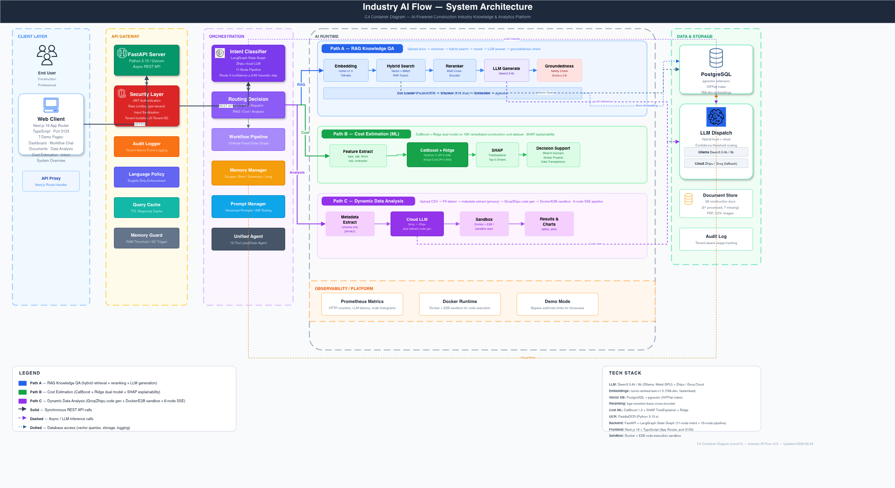

# Industry AI Flow

**面向建筑行业的 AI 平台**，基于 LangChain 1.0 构建——在统一的意图路由工作流之下，集成了检索增强的文档问答、机器学习成本估算和沙箱化数据分析。

> 🇬🇧 English： **[README.md](README.md)**

SAIT 综合 AI 专业毕业设计项目。平台把零散的建筑规范、标准和项目数据，转化为带来源引用的单次查询答案。

---

## 核心能力

三大能力，一套工作流：

1. **RAG 知识问答** —— 上传建筑文档（PDF、图片、CSV），系统向量化后存入 pgvector，通过混合检索（BM25 + 向量 + RRF 融合 + bge-reranker）返回带来源引用的答案。已加载 16 份加拿大与美国建筑规范标准（NBC 2020、OSHA、BC/魁北克/安大略各省规范等）。
2. **成本估算** —— CatBoost + Ridge 双模型预测成本超支率与实际成本，配合 SHAP 单次预测可解释性、What-if 情景分析，以及在 1 万个项目数据集上的相似项目查找。
3. **动态数据分析** —— 对成本模型之外的用户数据集，系统仅提取元数据（隐私优先设计），交由云端 LLM 生成 Python 代码，在加固的 Docker/E2B 沙箱中执行，返回结果与图表。

## 系统架构



六层分层设计：**用户界面 → API 网关 → 业务服务 → AI 运行时 → 数据存储 → 安全与基础设施**。

核心创新是一条两阶段 AI 流水线：

- **11 节点意图分类状态图**（LangGraph）：负责输入 → 分类 → 多轮澄清 → 查询重写，并按置信度把查询路由到合适的 Agent。低于置信度阈值时主动澄清，而不是盲猜。
- **10 节点固定顺序执行流水线**：`intent → safety → cost_estimation → retrieval → rerank → prompt → route → code_exec → response → groundedness`，每个节点都有独立的超时 SLA。

完整设计见 [`docs/ARCHITECTURE.md`](docs/ARCHITECTURE.md)；分层/容器视图见 [`docs/architecture/SYSTEM_ARCHITECTURE_DETAILED.zh.md`](docs/architecture/SYSTEM_ARCHITECTURE_DETAILED.zh.md)；前端见 [`docs/architecture/FRONTEND_ARCHITECTURE.zh.md`](docs/architecture/FRONTEND_ARCHITECTURE.zh.md)。

## 技术栈

| 层 | 选型 |
|----|------|
| 本地 LLM | Qwen3.5 4b/9b（Ollama，macOS Metal GPU 加速） |
| 云端 LLM | Zhipu / Groq —— 代码生成 + 意图分类，双路回退 |
| 嵌入模型 | nomic-embed-text-v1.5（768 维，fastembed） |
| 向量库 | PostgreSQL 14+ + pgvector（IVFFlat 索引） |
| 检索 | 混合 BM25 + 向量 + RRF，bge-reranker-base 交叉编码器重排 |
| 成本 ML | CatBoost 1.2（超支率）+ Ridge（成本）+ SHAP TreeExplainer |
| OCR | PaddleOCR（需 Python 3.13.x） |
| 后端 | FastAPI + LangChain 1.0（LangGraph 状态图） |
| 前端 | Next.js（App Router）+ TypeScript + Tailwind |
| 代码沙箱 | Docker / E2B |

## 快速开始

需要 **Python 3.13.x**（已锁定：PaddleOCR 在 3.14+ 上不兼容）、PostgreSQL 14+（含 pgvector），以及 [Ollama](https://ollama.com)。

```bash
git clone https://github.com/DISSIDIA-986/Industry-AI-Flow.git
cd Industry-AI-Flow

# 1. 环境（创建 .venv/ 并安装锁定依赖）
make capstone-env-setup

# 2. 本地 LLM
ollama pull qwen3.5:4b

# 3. 数据库（pgvector + 迁移 + 种子数据）
make db-setup

# 4. 启动
make run             # FastAPI :8000
make frontend-dev    # Next.js :3123（另一个终端）
```

用 `make capstone-env-check` 校验环境，或用 `make test-demo-smoke-gate` 运行离线冒烟门禁。

## 安全与多租户

企业级控制项，通过 `.env` 配置（详见 [`docs/developer/setup-guide.md`](docs/developer/setup-guide.md)）：

- **认证** —— 可选 API Key 网关（`REQUIRE_API_KEY`），以及带角色/权限的 JWT Bearer 认证（`REQUIRE_USER_AUTH`）。
- **密钥** —— 通过 `tools/secure_config.py` 实现 Fernet 加密或 PBKDF2 哈希的 API Key 存储。
- **租户隔离** —— `X-Tenant-ID` 请求头驱动按租户的限流、预算策略和审计日志。
- **输入安全** —— 自动 XSS/SQL 关键字检测、上传大小/扩展名限制、文件名消毒。
- **成本治理** —— 按租户记录 LLM 用量并执行预算阈值（`/api/v1/llm/usage`、`/api/v1/llm/budget`）。
- **隐私出站守卫** —— 云端调用前执行脱敏与出站策略校验，并写入审计日志。
- **可观测性** —— Prometheus `/metrics`、结构化 JSON 日志、慢查询追踪、内存护栏。

## 项目状态

毕业设计进行中。原始文档大多为面向 SAIT 评审的中文版；英文文档集为主参考。

## 许可证

MIT
