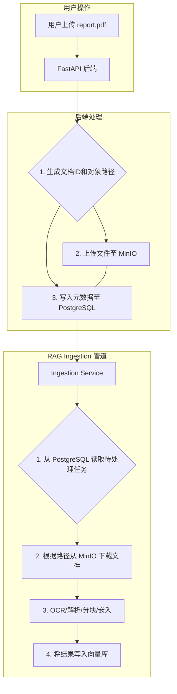

# 企业级RAG文档存储与归档技术方案

> **目的**: 调研并推荐一套高效、安全、可扩展且支持多租户的文档存储与归档方案，以解决企业级RAG系统中原始文档的持久化问题。
> **版本**: 1.1
> **日期**: 2025-11-01

---

### 1. 问题分析

随着系统规模扩大，企业用户将上传大量包含敏感信息的原始文档（PDF, Word, 图片等）。一个简单的文件系统存储方案将面临四大挑战：

1.  **可扩展性与成本 (Scalability & Cost)**: 数百万份文档的存储需求会迅速超出单个服务器的磁盘容量，且存储成本会线性增长，缺乏弹性。
2.  **安全性与隔离 (Security & Isolation)**: 在多租户环境下，必须从物理或逻辑上严格隔离不同租户的文档，防止数据泄露。简单的文件夹权限管理难以满足要求。
3.  **数据持久性与可靠性 (Durability & Reliability)**: 单点存储有数据丢失风险（如硬盘损坏）。需要高可用的、带备份和容灾能力的方案。
4.  **集成与生命周期管理 (Integration & Lifecycle)**: 存储的文档需要能被RAG管道中的其他服务（如Ingestion服务）方便地访问。同时，需要管理文档的生命周期（如自动归档、删除过期文件）以控制成本。

---

### 2. 主流方案对比

| 特性 | **本地/网络文件系统 (NFS)** | **数据库存储 (如 PostgreSQL a BLOB)** | **对象存储 (Object Storage)** |
| :--- | :--- | :--- | :--- |
| **核心思想** | 将文件作为普通文件存放在服务器磁盘上。 | 将文件内容本身作为二进制大对象（BLOB）存入数据库行。 | 将文件作为独立的“对象”存储，每个对象包含数据、元数据和唯一ID。 |
| **可扩展性** | 差，受限于单机磁盘容量和I/O。 | 极差，严重拖慢数据库性能，导致数据库膨胀。 | **极好**，理论上无限扩展，专为海量非结构化数据设计。 |
| **成本** | 线性增长，管理成本高。 | 极高，数据库存储成本远高于专用文件存储。 | **低**，按量付费，并提供不同成本的存储层（标准、低频、归档）。 |
| **安全性** | 基础，依赖操作系统文件权限，难以做精细化和多租户隔离。 | 好，可利用数据库的事务和权限管理。 | **优秀**，提供精细的访问控制策略（IAM/Policy）、服务端加密、防篡改。 |
| **可靠性** | 低，单点故障风险高，需手动配置备份。 | 中，依赖数据库的备份和高可用方案。 | **极高**，云服务商通常提供99.999999999%（11个9）的持久性设计。 |
| **适用场景** | 个人项目、小型内部工具。 | **强烈不推荐**，仅用于存储极小的文件（如用户头像）。 | **所有云原生应用、大数据、AI应用的事实标准。** |
| **代表产品** | 服务器磁盘, NAS | PostgreSQL (`bytea`), MySQL (`BLOB`) | **Amazon S3**, **Google GCS**, **Azure Blob**, **MinIO (开源)** |

**结论**: **对象存储** 在所有关键维度上都全面胜出，是唯一适合企业级应用的方案。

---

### 3. 推荐方案与理由

#### 推荐方案：**“元数据与对象分离”架构 + MinIO**

1.  **核心架构：元数据与对象分离 (Metadata-Object Decoupling)**
    -   **原始文档**: 存储在**对象存储**中。
    -   **文档元数据**: 存储在您现有的 **PostgreSQL** 数据库中。

2.  **技术选型：MinIO**
    -   **MinIO** 是一个开源的、高性能的对象存储服务，它**完全兼容 Amazon S3 API**。
    -   在**本地开发和私有化部署**时，使用 MinIO。
    -   未来若需上云，应用代码**无需任何修改**，只需将配置指向云厂商（如AWS S3, 阿里云 OSS）的对象存储服务即可。

#### 推荐理由

1.  **兼顾开发与生产**: MinIO 提供了与生产环境（云对象存储）完全一致的开发体验。它轻量且易于通过 Docker 部署，完美契合您当前的技术栈。
2.  **高性能与可扩展**: 对象存储专为非结构化数据设计，读写性能和扩展性远超文件系统和数据库。
3.  **安全与隔离的天然支持**:
    -   **路径隔离**: 可以通过路径前缀实现多租户隔离，例如 `/<tenant_id>/documents/`。
    -   **策略控制**: 可以为不同租户或服务生成独立的访问凭证（Access Key/Secret Key），并限制其只能访问自己的路径，从根本上保证数据安全。
4.  **成本效益**: 对象存储的单位存储成本极低，并且其生命周期管理功能可以自动将不常用的旧文档迁移到更便宜的“冷存储”层，进一步节约成本。
5.  **行业标准**: S3 API 是事实上的行业标准，所有主流的云服务、数据处理框架（Spark, Flink等）和AI工具都原生支持，生态系统极为丰富。

---

### 4. 落地建议

#### 实施步骤

1.  **引入 MinIO 到本地开发环境**
    -   在 `infra/docker-compose.yaml` 中增加一个 `minio` 服务。
        ```yaml
        # infra/docker-compose.yaml (新增部分)
        minio:
          image: minio/minio:latest
          container_name: rag_minio
          ports:
            - "9000:9000"  # API 端口
            - "9001:9001"  # 控制台端口
          environment:
            MINIO_ROOT_USER: minioadmin
            MINIO_ROOT_PASSWORD: minioadmin
          command: server /data --console-address ":9001"
          volumes:
            - minio_data:/data

        volumes:
          minio_data:
        ```

2.  **改造数据库与 `.env` 配置**
    -   在 PostgreSQL 的 `documents` 表中，移除存储文件内容的字段（如果有），增加一个 `storage_path` 字段，用于存放文件在 MinIO 中的对象键（Object Key）。
    -   在 `.env` 文件中增加 MinIO/S3 的配置。
        ```bash
        # .env.example (新增部分)
        S3_ENDPOINT_URL=http://localhost:9000
        S3_ACCESS_KEY=minioadmin
        S3_SECRET_KEY=minioadmin
        S3_BUCKET_NAME=rag-documents
        ```

3.  **改造文档上传与处理流程**
    -   安装 S3 客户端库: `pip install boto3`。
    -   **上传流程 (在 `documents.py` API中)**:
        1.  用户上传文件 `report.pdf`。
        2.  系统生成一个唯一的文档ID（如 `doc_uuid_123`）和一个租户ID（如 `tenant_abc`）。
        3.  构建对象键: `object_key = f"{tenant_abc}/{doc_uuid_123}/report.pdf"`。
        4.  使用 `boto3` 客户端将文件上传到 MinIO，对象键为 `object_key`。
        5.  在 PostgreSQL 的 `documents` 表中插入一条记录，包含 `doc_uuid_123`, `tenant_abc`, `report.pdf` 以及 `storage_path: object_key`。
    -   **处理流程 (在 `IngestionService` 中)**:
        1.  服务从数据库中读取需要处理的文档记录。
        2.  根据记录中的 `storage_path`，使用 `boto3` 从 MinIO 下载原始文件到临时位置。
        3.  执行 OCR、分块、嵌入等操作。
        4.  处理完成后删除临时文件。

#### 最终工作流



---

### **5. 补充建议：利用 LLM 实现文档自动分类与归档**

这是一个非常高级且有价值的功能，能将您的系统从被动存储提升为智能管理。核心思想是**引入一个异步的“文档处理与分流（Triage）”服务**。

#### 方案：异步处理与 LLM 分类

不直接将用户上传的文档存入最终位置，而是先放入一个临时的“收件箱（Inbox）”，然后由后台任务进行智能处理。

**为什么需要异步？**
- **性能**: LLM 调用和文件处理相对耗时，同步处理会导致用户上传接口响应缓慢，影响体验。
- **可靠性**: 如果 LLM 分析失败，可以进行重试，不影响主上传流程。

**增强后的工作流程**:

```mermaid
graph TD
    A[用户上传 report.pdf] --> B[1. API接收文件];
    B --> C[2. 存入MinIO临时目录<br/>/inbox/temp_xyz.pdf];
    C --> D{3. 发送处理任务到<br/>消息队列 (Redis/RabbitMQ)};
    B -- 立即响应 --> E[返回用户: "上传成功，后台处理中"];

    subgraph "后台异步处理 (Triage Service)"
        F(后台Worker) -- 4. 从队列获取任务 --> G[5. 下载临时文件];
        G --> H[6. 提取文本内容 (含OCR)];
        H --> I{7. 调用LLM进行分析};
        I -- Prompt: "分类、重命名、提取元数据" --> J((LLM));
        J -- Response: JSON --> K{8. 解析LLM结果};
        K -- category: 'finance' --> L[9. 构建最终路径<br/>/finance/2025/];
        K -- suggested_name: 'Q3财报.pdf' --> M[10. 移动并重命名文件];
        L & M --> N[11. 更新PostgreSQL元数据];
        N --> O{12. 触发后续RAG<br/>Ingestion任务};
    end
```

#### 实施建议

1.  **引入任务队列 (Task Queue)**
    -   既然您已使用 Redis，最简单的方案是引入 `Celery` 或 `Redis Queue (RQ)`。它们都是成熟的 Python 任务队列库，可以轻松实现后台任务的派发和执行。

2.  **设计一个强大的 LLM Prompt**
    -   这是实现智能分类的核心。您的 Prompt 应该要求 LLM 以 **JSON 格式**返回一个结构化的分析结果。
    -   **Prompt 示例**:
        ```
        你是一个专业的文档管理员。请根据以下文档内容，以JSON格式返回分析结果。如果某个字段无法确定，请返回null。

        JSON格式要求:
        {
          "category": "(从 [财务, 法务, 人力, 市场, 技术, 其他] 中选择一个)",
          "suggested_filename": "(生成一个简洁、有意义的文件名，格式如 '2025-Q3-财务报告-项目X.pdf')",
          "extracted_metadata": {
            "project_name": "(提取项目名称)",
            "document_date": "(提取文档日期，格式 YYYY-MM-DD)",
            "keywords": ["(提取3-5个核心关键词)"]
          }
        }

        文档内容:
        """
        {这里是提取出的文档全文}
        """
        ```

3.  **改造上传和 Ingestion 逻辑**
    -   **上传 API**: 功能简化为只接收文件、存入临时目录、并派发一个后台任务，然后立即返回。
    -   **Triage Service (后台Worker)**: 实现上述流程图中的步骤5到11，包括调用 LLM、移动文件、更新数据库。
    -   **Ingestion Service**: 它的触发方式从“定时扫描数据库”变为“监听任务队列”，只处理已经由 Triage Service 分类归档好的文档。

#### 备选方案：LLM 的函数调用 (Function Calling / Tool Use)

对于更高级的 LLM（如 GPT-4, Gemini Advanced），可以使用其“函数调用”功能。您可以定义 `move_document`, `update_metadata` 等函数，LLM 在分析后会决定调用哪个函数并提供参数，这比解析 JSON 更可靠、更强大，但实现也更复杂，可以作为未来的演进方向。

---

### 6. 最终结论与行动建议

**结论**:
采用**“元数据在PostgreSQL，原始文件在对象存储”**的架构是当前场景下的最佳实践。它在可扩展性、安全性、成本和可维护性之间取得了最佳平衡。

**行动建议**:
1.  **立即采纳该方案**: 将其作为系统存储模块的标准架构。
2.  **本地开发使用 MinIO**: 在 `docker-compose.yaml` 中添加 MinIO 服务，并更新 `.env` 配置。
3.  **分阶段实施智能归档**:
    - **第一步**: 先实现基础的“元数据-对象分离”存储。
    - **第二步**: 引入任务队列和后台 Worker，实现上述**异步的、由 LLM 驱动的智能分类与重命名**流程。

通过这一系列的改造，您的系统将不仅是一个 RAG 应用，更是一个具备自我整理和管理能力的、真正智能化的企业知识库。
