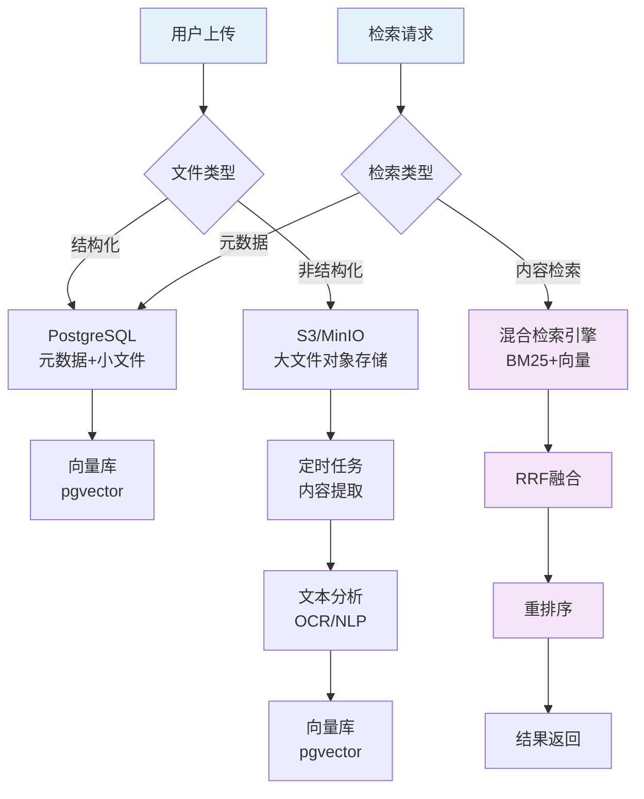
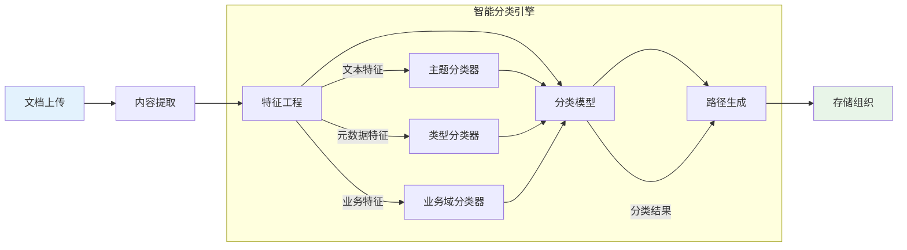
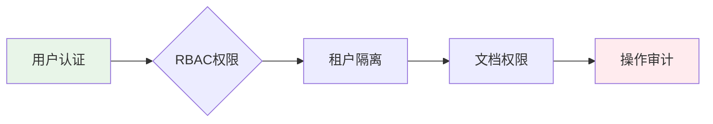

# 企业级文档存储与归档技术方案

> **问题背景**: 企业内部用户上传各种格式文档，需解决多租户数据隔离、高效存储检索、安全合规等核心问题

---

## 1. 问题分析

### 1.1 核心挑战

| 挑战类型 | 具体问题 | 影响 |
|---------|---------|------|
| **多租户隔离** | 不同企业/部门数据混存风险 | 数据泄露、合规风险 |
| **存储效率** | 海量文档存储成本高 | 运营成本上升 |
| **检索性能** | 非结构化文档快速定位 | 用户体验下降 |
| **安全保障** | 敏感文档访问控制 | 数据安全隐患 |
| **合规要求** | 审计日志、数据保留策略 | 法律风险 |

### 1.2 技术需求

```
企业文档存储系统必须满足：
┌─────────────┬────────────────────────────────┐
│ 功能需求    │ 技术要求                       │
├─────────────┼────────────────────────────────┤
│ 多租户支持  │ 数据隔离、访问控制、配额管理   │
│ 高效存储    │ 压缩、去重、分层存储           │
│ 快速检索    │ 全文搜索、元数据索引           │
│ 安全管控    │ 加密存储、访问日志、权限控制   │
│ 合规支持    │ 审计跟踪、生命周期管理         │
│ 智能分类    │ 自动分类、智能命名、标签提取   │
└─────────────┴────────────────────────────────┘
```

---

## 2. 主流方案对比

### 2.1 对象存储方案 (MinIO/S3)

```yaml
方案特点:
  存储架构: 分布式对象存储
  代表产品: AWS S3, 阿里云OSS, MinIO
  适用场景: 大容量非结构化数据存储

优势:
  ✅ 成本低廉: 按需付费，支持冷热存储分层
  ✅ 扩展性强: 支持PB级存储扩展
  ✅ 生态完善: 丰富的SDK和工具链
  ✅ 高可用性: 99.99% SLA保障

劣势:
  ❌ 检索困难: 仅支持基本元数据查询
  ❌ 事务支持弱: 不支持复杂查询操作
  ❌ 实时性差: 文件上传后无法立即检索
```

### 2.2 分布式文件系统 (Ceph/GlusterFS)

```yaml
方案特点:
  存储架构: 分布式文件系统
  代表产品: CephFS, GlusterFS
  适用场景: 高性能文件共享存储

优势:
  ✅ POSIX兼容: 可直接挂载为文件系统
  ✅ 高性能: 支持随机读写操作
  ✅ 强一致性: ACID事务支持
  ✅ 自主可控: 可私有化部署

劣势:
  ❌ 运维复杂: 需要专业运维团队
  ❌ 扩展成本高: 硬件投入较大
  ❌ 单点故障: 配置不当易出现性能瓶颈
```

### 2.3 企业内容管理 (Alfresco/SharePoint)

```yaml
方案特点:
  存储架构: 企业级文档管理系统
  代表产品: Alfresco, Microsoft SharePoint
  适用场景: 企业文档协同管理

优势:
  ✅ 功能完整: 版本控制、工作流、协作功能
  ✅ 权限精细: 支持角色和细粒度权限
  ✅ 检索强大: 全文搜索、元数据过滤
  ✅ 合规支持: 审计日志、保留策略

劣势:
  ❌ 成本高昂: 商业授权费用较高
  ❌ 学习曲线: 功能复杂，上手难度大
  ❌ 定制困难: 二次开发成本高
```

---

## 3. 推荐方案：混合存储架构

### 3.1 架构设计



### 3.2 存储策略矩阵

| 文档类型 | 存储方案 | 策略说明 |
|---------|---------|---------|
| **配置文件** | PostgreSQL | 小于1MB，频繁读写 |
| **文档元数据** | PostgreSQL | 结构化信息，关联查询 |
| **小型附件** | PostgreSQL | 小于5MB，直接存储 |
| **大型文档** | S3/MinIO | 大于5MB，对象存储 |
| **图片/音视频** | S3/MinIO | 二进制大对象 |
| **临时文件** | 本地缓存 | 短期使用，自动清理 |

### 3.3 多租户隔离方案

```python
# 多租户数据隔离实现 (概念代码)
class TenantStorageManager:
    def __init__(self):
        self.object_storage = S3Client()
        self.metadata_db = PostgreSQLConnection()
    
    def store_document(self, tenant_id: str, file_path: str, metadata: dict):
        """存储租户文档"""
        # 1. 生成租户专属路径
        object_key = f"tenants/{tenant_id}/documents/{uuid4()}/{os.path.basename(file_path)}"
        
        # 2. 上传到对象存储
        self.object_storage.upload_file(file_path, object_key)
        
        # 3. 记录元数据到租户专属Schema
        schema_name = f"tenant_{tenant_id}"
        self.metadata_db.execute(
            f"INSERT INTO {schema_name}.documents (object_key, metadata) VALUES (%s, %s)",
            (object_key, json.dumps(metadata))
        )
        
        # 4. 触发内容提取和向量化流程
        self.trigger_processing_pipeline(tenant_id, object_key)
```

---

## 4. 智能文档分类与命名方案

### 4.1 AI驱动的自动分类架构



### 4.2 文档内容智能分析

#### 文本特征提取
```python
class DocumentAnalyzer:
    def __init__(self):
        self.nlp_model = spacy.load("zh_core_web_sm")  # 中文NLP模型
        self.classification_model = self.load_classification_model()
        
    def extract_features(self, file_path: str) -> dict:
        """提取文档特征用于智能分类"""
        content = self.extract_content(file_path)
        
        # 1. 基础文本特征
        features = {
            "word_count": len(content.split()),
            "char_count": len(content),
            "line_count": content.count('\n'),
            "avg_word_length": self.calculate_avg_word_length(content),
        }
        
        # 2. NLP特征
        doc = self.nlp_model(content)
        features.update({
            "named_entities": [ent.text for ent in doc.ents],
            "key_phrases": self.extract_key_phrases(doc),
            "sentiment_score": self.analyze_sentiment(content),
            "language": self.detect_language(content),
        })
        
        # 3. 关键词密度分析
        features["keyword_density"] = self.analyze_keyword_density(content)
        
        # 4. 文档类型推断
        features["inferred_type"] = self.infer_document_type(content)
        
        return features
    
    def generate_meaningful_filename(self, original_name: str, content: str, features: dict) -> str:
        """生成有意义的文件名"""
        # 1. 提取核心主题词
        topic_words = self.extract_topic_words(content, top_k=3)
        
        # 2. 识别关键实体 (日期、编号等)
        entities = features.get("named_entities", [])
        dates = [e for e in entities if self.is_date_entity(e)]
        numbers = [e for e in entities if self.is_number_entity(e)]
        
        # 3. 构建文件名
        name_parts = []
        
        # 添加主题词
        if topic_words:
            name_parts.extend(topic_words[:2])  # 最多2个主题词
            
        # 添加关键日期
        if dates:
            name_parts.append(dates[0].replace("/", "-"))  # 格式化日期
            
        # 添加文档类型标识
        doc_type = features.get("inferred_type", "document")
        name_parts.append(doc_type)
        
        # 组合文件名
        base_name = "_".join(name_parts)
        extension = os.path.splitext(original_name)[1]
        
        return f"{base_name}{extension}"
```

### 4.3 多维度分类策略

#### 分类维度矩阵
| 分类维度 | 分类方法 | 技术实现 | 应用场景 |
|---------|---------|---------|---------|
| **文档类型** | 监督学习 | CNN/RNN分类器 | 报告/合同/邮件/表格 |
| **业务领域** | 主题模型 | LDA/Transformer | 财务/人事/技术/法务 |
| **敏感等级** | 规则引擎+ML | 关键词匹配+NLP | 公开/内部/机密 |
| **时效性** | 规则匹配 | 日期实体提取 | 历史/当前/规划 |

#### 分类模型实现
```python
class DocumentClassifier:
    def __init__(self):
        # 加载预训练分类模型
        self.type_classifier = self.load_model("doc_type_classifier.pkl")
        self.domain_classifier = self.load_model("domain_classifier.pkl")
        self.sensitivity_classifier = self.load_model("sensitivity_classifier.pkl")
        
    def classify_document(self, features: dict) -> dict:
        """多维度文档分类"""
        classification = {}
        
        # 1. 文档类型分类
        classification["type"] = self.type_classifier.predict([features])[0]
        
        # 2. 业务领域分类
        classification["domain"] = self.domain_classifier.predict([features])[0]
        
        # 3. 敏感等级分类
        classification["sensitivity"] = self.sensitivity_classifier.predict([features])[0]
        
        # 4. 时效性分析
        classification["timeliness"] = self.analyze_timeliness(features)
        
        return classification
    
    def generate_storage_path(self, classification: dict, tenant_id: str) -> str:
        """根据分类结果生成存储路径"""
        # 路径结构: tenants/{tenant_id}/{domain}/{type}/{sensitivity}/{timeliness}/
        path_parts = [
            "tenants",
            tenant_id,
            classification["domain"],      # 业务领域
            classification["type"],         # 文档类型
            classification["sensitivity"],  # 敏感等级
            classification["timeliness"],   # 时效性
        ]
        
        return "/".join(path_parts)
```

### 4.4 智能存储组织策略

#### 动态路径生成
```python
class IntelligentStorageOrganizer:
    def __init__(self):
        self.classifier = DocumentClassifier()
        self.analyzer = DocumentAnalyzer()
        
    def process_uploaded_document(self, file_path: str, tenant_id: str) -> str:
        """处理上传文档并智能组织存储"""
        # 1. 提取文档特征
        features = self.analyzer.extract_features(file_path)
        
        # 2. 文档分类
        classification = self.classifier.classify_document(features)
        
        # 3. 生成有意义文件名
        meaningful_name = self.analyzer.generate_meaningful_filename(
            os.path.basename(file_path), 
            self.extract_content(file_path), 
            features
        )
        
        # 4. 生成存储路径
        storage_path = self.classifier.generate_storage_path(classification, tenant_id)
        
        # 5. 构造完整对象键
        object_key = f"{storage_path}/{meaningful_name}"
        
        # 6. 上传到对象存储
        s3_client.upload_file(file_path, bucket_name, object_key)
        
        # 7. 记录元数据
        self.record_metadata(tenant_id, object_key, classification, features)
        
        return object_key
    
    def record_metadata(self, tenant_id: str, object_key: str, classification: dict, features: dict):
        """记录文档元数据"""
        metadata = {
            "classification": classification,
            "features": features,
            "storage_path": object_key,
            "uploaded_at": datetime.now().isoformat(),
            "tenant_id": tenant_id,
        }
        
        # 存储到PostgreSQL元数据表
        db.execute("""
            INSERT INTO document_metadata (object_key, tenant_id, metadata, classification)
            VALUES (%s, %s, %s, %s)
        """, (object_key, tenant_id, json.dumps(metadata), json.dumps(classification)))
```

### 4.5 分类模型训练与优化

#### 训练数据准备
```python
class ClassificationTrainingData:
    def prepare_training_data(self):
        """准备分类模型训练数据"""
        # 1. 收集已标注文档样本
        labeled_docs = self.collect_labeled_documents()
        
        # 2. 特征工程
        features = []
        labels = []
        
        for doc_path, doc_labels in labeled_docs:
            # 提取文档特征
            doc_features = self.extract_document_features(doc_path)
            features.append(doc_features)
            
            # 准备标签
            labels.append({
                "type": doc_labels.get("type"),
                "domain": doc_labels.get("domain"),
                "sensitivity": doc_labels.get("sensitivity"),
            })
        
        # 3. 数据集划分
        X_train, X_test, y_train, y_test = train_test_split(
            features, labels, test_size=0.2, random_state=42
        )
        
        return X_train, X_test, y_train, y_test
    
    def extract_document_features(self, file_path: str) -> dict:
        """提取文档特征用于训练"""
        content = self.extract_content(file_path)
        
        # 文本统计特征
        features = {
            "length": len(content),
            "word_count": len(content.split()),
            "sentence_count": len(content.split('.')),
            "paragraph_count": len(content.split('\n\n')),
        }
        
        # TF-IDF特征
        tfidf_vectorizer = TfidfVectorizer(max_features=1000, stop_words='english')
        tfidf_features = tfidf_vectorizer.fit_transform([content]).toarray()[0]
        features["tfidf"] = tfidf_features.tolist()
        
        # N-gram特征
        ngram_vectorizer = CountVectorizer(ngram_range=(1, 3), max_features=500)
        ngram_features = ngram_vectorizer.fit_transform([content]).toarray()[0]
        features["ngrams"] = ngram_features.tolist()
        
        return features
```

---

## 5. 技术实现要点

### 5.1 存储分层策略

```
存储分层架构:
┌─────────────────────────────────────────────────────────────┐
│ 热数据层 (Hot Tier)                                        │
│  • PostgreSQL 存储元数据和小文件                           │
│  • 高频访问的最近3个月文档                                 │
│  • 响应时间: <10ms                                         │
├─────────────────────────────────────────────────────────────┤
│ 温数据层 (Warm Tier)                                        │
│  • S3/MinIO 标准存储                                       │
│  • 3个月-2年的历史文档                                     │
│  • 响应时间: <100ms                                        │
├─────────────────────────────────────────────────────────────┤
│ 冷数据层 (Cold Tier)                                        │
│  • S3/MinIO 归档存储                                       │
│  • 2年以上的历史文档                                       │
│  • 响应时间: <1小时                                         │
└─────────────────────────────────────────────────────────────┘
```

### 5.2 数据生命周期管理

```yaml
生命周期策略:
  第0-30天: 热数据层，实时访问优化
    - PostgreSQL直接存储
    - 全文索引建立
    - 向量化实时处理

  第31-730天: 温数据层，标准对象存储
    - 文件迁移至S3/MinIO
    - 保留元数据索引
    - 按需加载内容

  第731天+: 冷数据层，归档存储
    - 自动归档至Glacier/冷存储
    - 保留核心元数据
    - 恢复需人工审批
```

### 5.3 安全与合规

#### 访问控制模型


#### 数据加密策略
```python
# 存储加密实现
class SecureStorage:
    def encrypt_and_store(self, file_path: str, tenant_id: str):
        """安全存储文档"""
        # 1. 生成租户专属密钥
        tenant_key = self.key_management.get_tenant_key(tenant_id)
        
        # 2. AES-256-GCM 加密文件
        encrypted_file = self.crypto.encrypt_file(file_path, tenant_key)
        
        # 3. 计算文件SHA-256哈希用于完整性校验
        file_hash = self.crypto.calculate_hash(file_path)
        
        # 4. 存储加密文件和元数据
        object_key = self.storage.store_object(encrypted_file)
        
        # 5. 记录审计日志
        self.audit.log_document_upload(
            tenant_id=tenant_id,
            object_key=object_key,
            file_hash=file_hash,
            user_id=get_current_user()
        )
```

---

## 6. 落地建议

### 6.1 阶段性实施路径

#### Phase 1: 基础存储 (1-2周)
```bash
# 1. 部署MinIO对象存储
docker run -p 9000:9000 -p 9001:9001 \
  -e MINIO_ROOT_USER=admin \
  -e MINIO_ROOT_PASSWORD=password \
  minio/minio server /data --console-address ":9001"

# 2. 配置PostgreSQL大对象支持
ALTER SYSTEM SET max_large_objects = 10000;
```

#### Phase 2: 多租户支持 (2-3周)
```python
# 实现租户隔离框架
class TenantManager:
    def create_tenant_schema(self, tenant_id: str):
        """为租户创建独立数据库Schema"""
        schema_name = f"tenant_{tenant_id}"
        sql = f"""
        CREATE SCHEMA IF NOT EXISTS {schema_name};
        CREATE TABLE {schema_name}.documents (
            id UUID PRIMARY KEY DEFAULT gen_random_uuid(),
            filename TEXT NOT NULL,
            object_key TEXT NOT NULL,
            file_size BIGINT,
            content_type TEXT,
            uploaded_at TIMESTAMP DEFAULT NOW(),
            metadata JSONB
        );
        """
        execute_sql(sql)
```

#### Phase 3: 智能分类 (3-4周)
```python
# 实现智能文档分类
class IntelligentClassificationPipeline:
    def process_document(self, file_path: str):
        """处理文档并实现智能分类"""
        # 1. 内容提取
        content = self.extract_document_content(file_path)
        
        # 2. 特征提取
        features = self.extract_features(content)
        
        # 3. 文档分类
        classification = self.classify_document(features)
        
        # 4. 生成智能文件名
        smart_filename = self.generate_smart_filename(file_path, content, classification)
        
        # 5. 生成存储路径
        storage_path = self.generate_storage_path(classification)
        
        # 6. 存储文档
        final_path = f"{storage_path}/{smart_filename}"
        self.store_document(file_path, final_path)
        
        return final_path
```

#### Phase 4: 生命周期管理 (3-4周)
```python
# 实现自动分层迁移
class LifecycleManager:
    def migrate_cold_documents(self):
        """迁移冷数据至归档存储"""
        cutoff_date = datetime.now() - timedelta(days=730)
        
        cold_docs = execute_sql("""
            SELECT id, object_key FROM documents 
            WHERE uploaded_at < %s AND storage_tier = 'warm'
        """, (cutoff_date,))
        
        for doc in cold_docs:
            # 迁移至冷存储
            self.migrate_to_glacier(doc.object_key)
            # 更新存储层级标记
            execute_sql("UPDATE documents SET storage_tier = 'cold' WHERE id = %s", (doc.id,))
```

### 6.2 成本优化建议

| 优化策略 | 预期效果 | 实施难度 |
|---------|---------|---------|
| **智能压缩** | 存储成本降低30-50% | 低 |
| **内容去重** | 相同文档存储节省70%+ | 中 |
| **分层存储** | 热数据成本降低40% | 中 |
| **冷存储归档** | 长期存储成本降低80% | 高 |

### 6.3 性能监控指标

```
关键监控指标 (SLA):
┌───────────────────┬────────────┬────────────┐
│ 指标类型         │ 目标值     │ 告警阈值   │
├───────────────────┼────────────┼────────────┤
│ 上传响应时间     │ <1秒       │ >3秒       │
│ 下载响应时间     │ <500ms     │ >2秒       │
│ 检索响应时间     │ <500ms     │ >2秒       │
│ 存储可用性       │ 99.9%      │ <99.5%     │
│ 数据完整性       │ 99.99%     │ <99.9%     │
│ 分类准确率       │ >85%       │ <80%       │
└───────────────────┴────────────┴────────────┘
```

---

## 7. 技术选型建议

### 7.1 推荐技术栈

| 组件 | 推荐方案 | 理由 |
|-----|---------|------|
| **对象存储** | MinIO (私有化) + AWS S3 (公有云) | 成本低，生态完善 |
| **关系数据库** | PostgreSQL 15+ | 向量支持，ACID事务 |
| **文件系统** | 本地文件系统 + NFS | 简单高效，成本可控 |
| **缓存层** | Redis 7+ | 高性能，支持多种数据结构 |
| **搜索引擎** | Elasticsearch (可选) | 全文检索，实时性强 |
| **AI分类引擎** | Transformers + Scikit-learn | 成熟稳定，易于训练 |

### 7.2 部署架构建议

```yaml
部署模式:
  开发环境:
    - 本地MinIO + PostgreSQL Docker Compose
    - 单节点部署
    - 适用于验证和测试
  
  生产环境:
    - 分布式MinIO集群 + PostgreSQL主从
    - 多AZ部署保障高可用
    - 配合CDN加速全球访问
    
  混合部署:
    - 热数据本地 + 冷数据云端
    - 降低存储成本的同时保证性能
    - 适合成长型企业
```

---

## 8. 风险与对策

### 8.1 技术风险

| 风险类型 | 风险描述 | 应对措施 |
|---------|---------|---------|
| **数据丢失** | 硬件故障导致数据永久丢失 | 多副本存储，定期备份 |
| **性能瓶颈** | 高并发访问导致系统响应慢 | 缓存优化，负载均衡 |
| **安全漏洞** | 未授权访问造成数据泄露 | 权限控制，加密传输 |
| **成本失控** | 存储费用超出预算 | 生命周期管理，成本监控 |
| **分类错误** | AI分类不准确影响检索 | 持续训练优化，人工校验 |

### 8.2 实施建议

```bash
# 1. 制定数据治理策略
- 建立文档分类标准
- 制定保留期限策略
- 设计访问控制规则

# 2. 构建监控告警体系
- 存储容量监控
- 访问性能监控
- 安全日志审计

# 3. 建立应急预案
- 数据恢复演练
- 故障切换流程
- 灾难恢复计划
```

---

## 9. 智能分类最佳实践

### 9.1 分类模型选择建议

| 场景 | 推荐模型 | 理由 |
|-----|---------|------|
| **文档类型分类** | BERT + Linear Classifier | 预训练模型泛化能力强 |
| **业务领域分类** | FastText + TF-IDF | 快速训练，适合文本分类 |
| **敏感度识别** | 规则引擎 + 关键词匹配 | 可解释性强，合规要求 |
| **时效性判断** | 规则匹配 + 日期实体提取 | 准确度高，规则明确 |

### 9.2 持续优化机制

```python
class ClassificationOptimizer:
    def __init__(self):
        self.feedback_queue = Queue()
        self.model_updater = ModelUpdater()
        
    def collect_user_feedback(self, predicted_class: str, actual_class: str, confidence: float):
        """收集用户反馈用于模型优化"""
        feedback_data = {
            "predicted": predicted_class,
            "actual": actual_class,
            "confidence": confidence,
            "timestamp": datetime.now()
        }
        self.feedback_queue.put(feedback_data)
        
    def periodic_model_update(self):
        """定期更新分类模型"""
        # 1. 收集反馈数据
        feedback_data = self.collect_feedback_batch()
        
        # 2. 分析模型表现
        performance_metrics = self.analyze_model_performance(feedback_data)
        
        # 3. 如果准确率低于阈值或有足够反馈数据，则重新训练
        if performance_metrics["accuracy"] < 0.85 or len(feedback_data) > 1000:
            self.retrain_model(feedback_data)
            
    def retrain_model(self, training_data: list):
        """重新训练分类模型"""
        # 1. 数据预处理
        processed_data = self.preprocess_training_data(training_data)
        
        # 2. 模型训练
        new_model = self.train_classification_model(processed_data)
        
        # 3. 模型评估
        evaluation_results = self.evaluate_model(new_model, processed_data["test_set"])
        
        # 4. 如果新模型表现更好，则部署
        if evaluation_results["accuracy"] > self.current_model_accuracy:
            self.deploy_new_model(new_model)
```

### 9.3 文件命名规范建议

```
智能文件命名规则:
┌─────────────────────────────────────────────────────────────┐
│ 命名结构: {主题}_{日期}_{编号}_{类型}.{扩展名}                │
├─────────────────────────────────────────────────────────────┤
│ 示例:                                                       │
│ • 年度财务报告_20231231_FY2023_report.pdf                    │
│ • 项目需求文档_20240115_PRJ001_spec.docx                     │
│ • 员工考核表_20240120_HC001_form.xlsx                       │
│ • 技术架构设计_20240110_ARCH001_design.drawio              │
└─────────────────────────────────────────────────────────────┘

命名元素说明:
• 主题: 从文档内容提取的核心关键词(2-3个)
• 日期: 文档中的关键日期或上传日期(YYYYMMDD格式)
• 编号: 文档编号或项目编号(如存在)
• 类型: 文档类型标识(report/spec/form/design等)
```

---

## 10. 结论与行动建议

### 10.1 核心结论

1. **混合存储架构**是解决企业文档存储的最佳方案
2. **PostgreSQL + MinIO**组合平衡了性能、成本和可维护性
3. **多租户隔离**需在应用层和存储层双重保障
4. **生命周期管理**是控制长期存储成本的关键
5. **AI驱动的智能分类**极大提升文档管理效率和检索准确性

### 10.2 行动建议

#### 短期行动 (1个月内)
- [ ] 部署MinIO对象存储环境
- [ ] 扩展PostgreSQL存储策略
- [ ] 实现基础文件上传下载API
- [ ] 建立文档元数据管理表
- [ ] 开发基础文档分类模型(规则引擎)

#### 中期规划 (3个月内)
- [ ] 实现租户隔离存储框架
- [ ] 集成内容提取和向量化流程
- [ ] 建立存储分层迁移机制
- [ ] 完善安全管控和审计功能
- [ ] 开发AI驱动的智能分类引擎

#### 长期目标 (6个月内)
- [ ] 实现智能生命周期管理
- [ ] 建立完善的监控告警体系
- [ ] 优化成本控制和性能调优
- [ ] 支持多云和混合云部署
- [ ] 持续优化AI分类模型准确性

### 10.3 决策参考

> 对于企业级AI工作流平台，**建议采用PostgreSQL + MinIO的混合存储架构**，既能满足当前RAG系统对向量化检索的需求，又能为未来的多租户、大规模文档管理提供可扩展的基础。该方案具有成本可控、技术成熟、易于维护的优势，是现阶段最合适的存储解决方案。结合AI驱动的智能文档分类和命名，可大幅提升文档管理效率和用户体验。