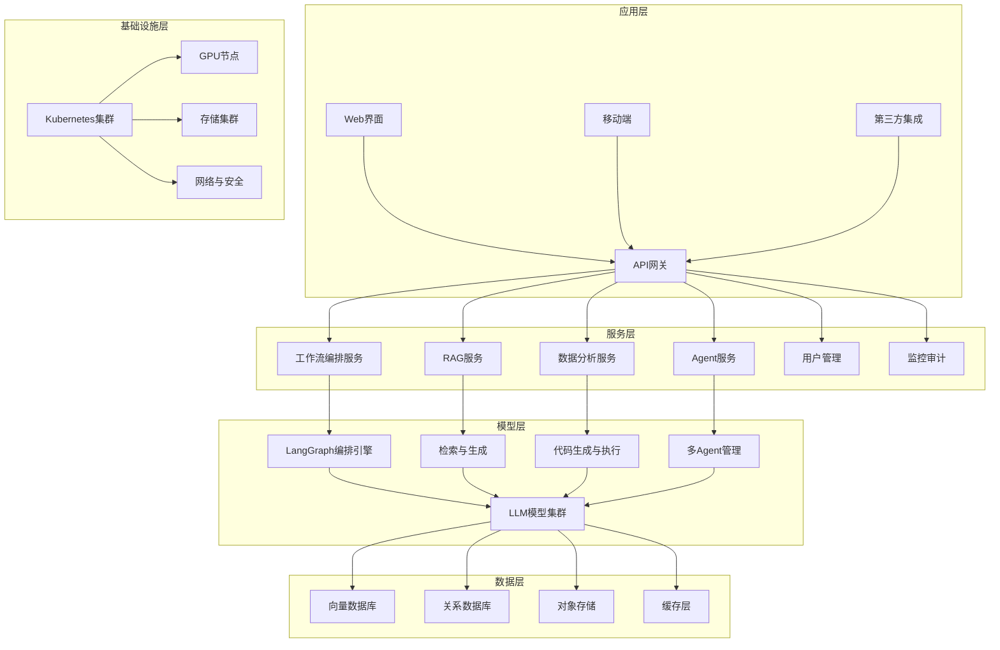
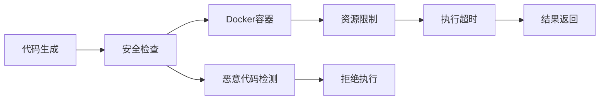

基于你的技术背景和项目目标，我为你梳理了一套模块化、可扩展的企业级AI工作流平台实现方案。该方案整合了RAG、高级数据分析、AI Agent等能力，并充分考虑了数据安全、可控性和企业级部署需求。

# 🧠 企业级AI工作流平台架构方案

## 📋 1. 整体架构设计

采用分层架构设计，确保系统的模块化、可扩展性和高可用性：



## 🛠️ 2. 核心技术选型与实现方案

### 2.1 工作流编排引擎

**推荐方案**：**LangGraph** + **Prefect** 双引擎架构

- **LangGraph**：用于AI核心工作流编排，支持有状态的多步骤AI任务【turn0search6】【turn0search7】
- **Prefect**：用于数据处理和ETL工作流，提供强大的任务调度和依赖管理

**实现要点**：
```python
# LangGraph工作流示例
from langgraph.graph import StateGraph, END
from typing_extensions import TypedDict

class WorkflowState(TypedDict):
    query: str
    context: list
    response: str

def retrieve_node(state: WorkflowState):
    # 检索逻辑
    return {"context": retrieve_documents(state["query"])}

def generate_node(state: WorkflowState):
    # 生成逻辑
    return {"response": generate_response(state["query"], state["context"])}

workflow = StateGraph(WorkflowState)
workflow.add_node("retrieve", retrieve_node)
workflow.add_node("generate", generate_node)
workflow.add_edge("retrieve", "generate")
workflow.set_entry_point("retrieve")
workflow.set_finish_point("generate")
```

### 2.2 向量数据库选型

根据数据规模和性能需求选择：

| 数据规模 | 推荐方案 | 特点 |
|---------|---------|------|
| < 100万文档 | **Chroma** | 轻量级，易部署，适合快速原型【turn0search11】 |
| 100万-5000万 | **Qdrant** | 高性能，过滤能力强，资源占用低【turn0search11】【turn0search13】 |
| > 5000万 | **Milvus** | 分布式架构，高吞吐，支持GPU加速【turn0search10】【turn0search14】 |

**混合检索策略**：结合向量搜索和关键词搜索(BM25)，提升检索准确率【turn0search1】【turn0search2】

### 2.3 文档处理与OCR

**文档处理管道**：
1. **文档采集**：支持多数据源(文件系统、数据库、API、网页爬虫)
2. **文档解析**：使用Unstructured处理多格式文档【turn0search1】
3. **OCR处理**：**DeepSeek-OCR** + **PaddleOCR** 双引擎【turn0search30】【turn0search34】
4. **文档切块**：智能分段策略，结合语义和结构信息【turn0search1】【turn0search2】

```python
# 文档处理管道示例
def process_document(file_path):
    # 1. 文档解析
    raw_content = parse_document(file_path)

    # 2. OCR处理(如需要)
    if contains_images(raw_content):
        ocr_content = deepseek_ocr_process(raw_content)
        raw_content = merge_text_and_ocr(raw_content, ocr_content)

    # 3. 清洗和预处理
    clean_content = clean_and_normalize(raw_content)

    # 4. 智能分段
    chunks = semantic_chunking(clean_content, chunk_size=512, overlap=50)

    return chunks
```

### 2.4 模型管理与优化

**LLM模型选型**：
- **主模型**：Qwen2.5-72B / DeepSeek-V3 (平衡性能与成本)【turn0search16】【turn0search17】
- **代码生成**：Qwen2.5-Coder / DeepSeek-Coder【turn0search16】
- **轻量级任务**：Llama-3.1-8B / Qwen2.5-7B(快速响应)【turn0search16】

**模型优化策略**：
- **量化**：使用INT4/INT8量化减少显存占用
- **LoRA微调**：针对垂直领域进行高效微调【turn0search41】【turn0search42】
- **模型蒸馏**：将大模型知识蒸馏到小模型，提升推理效率

### 2.5 代码执行环境

**安全沙箱方案**：


**实现要点**：
- 使用Docker容器隔离执行环境【turn0search7】
- 设置严格的资源限制(CPU、内存、网络)
- 实现代码静态分析，检测恶意代码【turn0search36】【turn0search37】
- 限制执行时间，防止无限循环

### 2.6 会话记忆管理

**分层记忆架构**：
1. **短期记忆**：ConversationalBufferWindowMemory(最近k轮对话)【turn0search48】
2. **中期记忆**：ConversationSummaryMemory(对话摘要)【turn0search48】
3. **长期记忆**：向量数据库存储历史对话，支持语义检索【turn0search49】

```python
# 记忆管理示例
from langchain.memory import ConversationSummaryMemory, VectorStoreRetrieverMemory

# 短期记忆
short_term_memory = ConversationBufferWindowMemory(k=10, return_messages=True)

# 长期记忆
long_term_memory = VectorStoreRetrieverMemory(
    retriever=vectorstore.as_retriever(search_kwargs={"k": 5})
)

# 组合记忆
def get_contextual_memory(query):
    recent_context = short_term_memory.load_memory_variables({})
    relevant_history = long_term_memory.load_memory_variables({"input": query})
    return merge_contexts(recent_context, relevant_history)
```

## 🚀 3. 主要实现步骤

### 阶段一：基础设施搭建(1-2周)

1. **环境准备**
   - Kubernetes集群部署
   - GPU节点配置(NVIDIA A100/H100)
   - 存储和网络配置

2. **基础服务部署**
   - PostgreSQL数据库(含pgvector扩展)
   - Redis缓存
   - 对象存储(MinIO)

### 阶段二：数据管道构建(2-3周)

1. **文档处理管道**
   - 多源数据连接器
   - 文档解析和OCR服务
   - 数据清洗和标准化

2. **向量数据库部署**
   - 根据数据规模选择合适方案
   - 索引优化和配置
   - 数据导入和同步机制

### 阶段三：RAG系统实现(3-4周)

1. **检索系统**
   - 多种检索策略实现(向量、关键词、混合)
   - 重排序模型集成【turn0search1】【turn0search2】
   - 查询优化和路由

2. **生成系统**
   - LLM模型部署和优化
   - Prompt工程和模板管理
   - 生成质量评估

### 阶段四：AI Agent开发(4-5周)

1. **Agent框架**
   - 基于LangGraph的多Agent架构【turn0search6】【turn0search7】
   - 工具调用和API集成
   - Agent协作机制

2. **代码执行环境**
   - 安全沙箱实现
   - 代码生成和优化
   - 执行结果处理

### 阶段五：前端集成与用户体验(2-3周)

1. **Web界面开发**
   - React前端框架
   - 实时交互和流式响应
   - 多租户支持

2. **API和集成**
   - RESTful API设计
   - WebSocket实时通信
   - 第三方系统集成

### 阶段六：安全与合规(1-2周)

1. **安全措施**
   - 数据加密(传输和存储)
   - 访问控制和权限管理
   - 审计日志和监控【turn0search22】【turn0search23】

2. **合规性**
   - 数据隐私保护
   - 符合GDPR等法规
   - 内容审核和过滤

### 阶段七：测试与优化(2-3周)

1. **系统测试**
   - 功能测试
   - 性能测试
   - 安全测试

2. **优化调整**
   - 性能调优
   - 用户反馈收集
   - 迭代改进

## 📊 4. 关键技术实现细节

### 4.1 高级RAG优化策略

**查询理解与路由**：
```python
def query_router(query):
    # 查询意图分类
    intent = classify_intent(query)

    if intent == "factual_query":
        return "vector_search"
    elif intent == "analytical_query":
        return "data_analysis"
    elif intent == "conversational":
        return "chat_mode"
    else:
        return "hybrid_search"
```

**检索增强技术**：
- **HyDE**：生成假设性文档提升检索效果【turn0search2】
- **查询重写**：多查询生成和分解【turn0search2】
- **上下文压缩**：压缩检索结果，保留关键信息【turn0search29】

### 4.2 微调与优化方案

**LoRA微调流程**【turn0search41】【turn0search42】：
```python
from peft import LoraConfig, get_peft_model

# LoRA配置
lora_config = LoraConfig(
    r=16,  # 低秩矩阵维度
    lora_alpha=32,
    target_modules=["q_proj", "v_proj"],
    lora_dropout=0.1
)

# 加载基础模型
model = AutoModelForCausalLM.from_pretrained("base_model")

# 应用LoRA
peft_model = get_peft_model(model, lora_config)

# 微调训练
trainer = Trainer(
    model=peft_model,
    train_dataset=train_data,
    args=training_args
)
trainer.train()
```

### 4.3 监控与评估体系

**RAG评估指标**【turn0search26】【turn0search27】【turn0search28】：
- **检索质量**：召回率、准确率、MRR
- **生成质量**：忠实度、答案相关性、BLEU/ROUGE
- **系统性能**：延迟、吞吐量、错误率
- **用户体验**：满意度评分、点击率

**监控仪表板**：
```python
# 监控指标收集
def collect_metrics():
    return {
        "request_count": get_request_count(),
        "avg_latency": calculate_avg_latency(),
        "error_rate": calculate_error_rate(),
        "user_satisfaction": survey_results(),
        "system_health": check_system_health()
    }
```

## 🔒 5. 安全与合规设计

### 5.1 数据安全措施

- **加密**：所有数据传输和存储使用AES-256加密
- **访问控制**：基于角色的访问控制(RBAC)【turn0search22】
- **审计日志**：记录所有操作和数据访问【turn0search23】
- **数据脱敏**：敏感信息自动识别和脱敏【turn0search22】

### 5.2 模型安全

- **输入验证**：严格过滤恶意输入和提示注入【turn0search22】
- **输出审核**：生成内容安全检查和过滤
- **模型水印**：追踪模型生成内容，防止滥用【turn0search38】

## 💡 6. 优化建议与最佳实践

1. **渐进式部署**：先小规模试点，再逐步推广【turn0search4】
2. **持续评估**：建立评估体系，持续优化系统性能【turn0search26】【turn0search27】
3. **用户反馈**：收集用户反馈，快速迭代改进
4. **成本控制**：优化模型使用，降低推理成本【turn0search45】
5. **团队培训**：提供培训，确保团队有效使用平台

---

这套方案为你提供了一个全面的企业级AI工作流平台架构，结合了你的技术背景和项目需求。方案中的每个组件都经过精心选择，确保技术栈的成熟度和可靠性。你可以根据实际需求和资源情况，分阶段实施这个方案。
