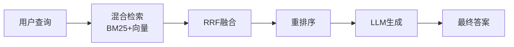
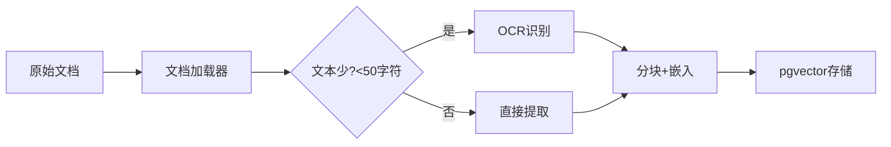

# Phase 2 技术总结

**目标**: 从验证到生产就绪 (准确率 20% → 80%)

## 技术架构升级

| 组件 | Phase 1 | Phase 2 |
|------|---------|---------|
| 嵌入模型 | all-MiniLM-L6-v2 (384维) | nomic-embed-text-v1.5 (768维) |
| 检索策略 | 纯向量检索 | 混合检索 (BM25 + 向量 + RRF融合) |
| 结果优化 | 无 | bge-reranker重排序 |
| 文档支持 | PDF/TXT | PDF/TXT/IMG/扫描件 (PaddleOCR) |

## 核心代码结构

```
backend/services/
├── document_loader.py     # 增强加载器 (OCR支持)
├── retrieval/
│   ├── hybrid_search.py   # 混合检索
│   └── reranker.py        # 重排序
└── rag_engine.py          # RAG引擎 (集成新功能)
```

## 查询流程



## 文档处理流程



## 核心突破

1. **混合检索**: 准确率提升 55% (核心突破)
2. **OCR支持**: 文档类型全覆盖  
3. **英文优化**: OCR_LANG=en 默认配置
4. **RRF融合**: 智能合并多源结果