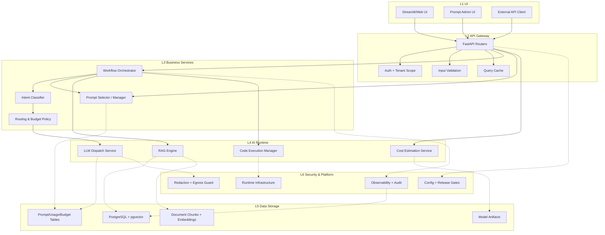

# Industry AI Flow Architecture

推荐先看交互式楼层图：`./ARCHITECTURE_DIAGRAM.html`

## Layer Map (6 Layers)

| Layer | Responsibility | Main code locations |
|---|---|---|
| L1 UI | 用户输入、展示、管理操作 | `frontend/`, API clients |
| L2 API Gateway | 路由、鉴权、参数校验、缓存入口 | `backend/main.py`, `backend/api/` |
| L3 Business Services | 工作流编排、意图识别、提示词策略、路由策略 | `backend/services/workflows/`, `backend/services/intent_classification/`, `backend/services/routing_decision.py`, `backend/services/prompt_manager.py` |
| L4 AI Runtime | RAG、LLM调度、代码执行、成本估算模型 | `backend/services/rag_engine.py`, `backend/services/llm_integration/dispatch_service.py`, `backend/services/code_executor/`, `backend/services/cost_estimation_service.py` |
| L5 Data Storage | 向量检索、提示词/用量/预算、模型工件 | PostgreSQL/pgvector + `workspace/models/cost_estimation/` |
| L6 Security & Platform | 脱敏、出站守卫、审计、指标、配置和发布门禁 | `backend/services/security/`, `backend/observability/`, `scripts/testing/`, `Makefile` |

## Core Flows

### 1) Workflow Query (RAG / Code / Hybrid LLM)
1. Request enters `backend/api/workflow_query_routes.py`.
2. Workflow runs pipeline in `backend/services/workflows/graph.py`.
3. Intent/routing/prompt nodes decide execution path.
4. Runtime calls RAG / dispatch / code execution services.
5. Data read/write through PostgreSQL + pgvector and usage tables.
6. Security/observability are applied across the path.

### 2) Cost Estimation
1. Request enters `backend/api/cost_estimation_routes.py`.
2. Service uses `backend/services/cost_estimation_service.py`.
3. Model artifact loaded from `workspace/models/cost_estimation/*.json`.
4. Prediction + confidence interval returned to API caller.

### 3) Prompt Admin
1. Request enters `backend/api/prompt_routes.py`.
2. Logic handled by `backend/services/prompt_manager.py`.
3. Prompt/experiment/usage metadata persisted in PostgreSQL tables.

## Connection Types

- Request flow: synchronous request path between layers.
- Control flow: orchestration, policy, and route decisions.
- Data flow: retrieval/writeback and artifact I/O.
- Security/observability flow: redaction, audit, metrics, and release gates.

## Mermaid Quick View

