# Industry AI Flow — C4 Container Diagram (Level 2)

> Mermaid fallback for `ARCHITECTURE_DIAGRAM.drawio`. Open in any Markdown renderer.

```mermaid
graph LR
    %% ─────────────────────────────────────────
    %% STYLING
    %% ─────────────────────────────────────────
    classDef client fill:#F8FAFC,stroke:#94A3B8,stroke-width:2px,color:#1E293B
    classDef gateway fill:#FFFBEB,stroke:#FCD34D,stroke-width:1px,color:#1E293B
    classDef orch fill:#F5F3FF,stroke:#C4B5FD,stroke-width:1px,color:#1E293B
    classDef ragNode fill:#DBEAFE,stroke:#93C5FD,stroke-width:1px,color:#1E293B
    classDef costNode fill:#DCFCE7,stroke:#86EFAC,stroke-width:1px,color:#1E293B
    classDef dataNode fill:#F5D0FE,stroke:#E9D5FF,stroke-width:1px,color:#1E293B
    classDef storage fill:#F0FDF4,stroke:#6EE7B7,stroke-width:1.5px,color:#1E293B
    classDef platform fill:#FFF7ED,stroke:#FDBA74,stroke-width:1px,color:#1E293B
    classDef llmNode fill:#EDE9FE,stroke:#C4B5FD,stroke-width:1px,color:#1E293B
    classDef safetyNode fill:#FEE2E2,stroke:#FECACA,stroke-width:1px,color:#1E293B
    classDef badgeBlue fill:#2563EB,stroke:none,color:#FFF
    classDef badgeGreen fill:#16A34A,stroke:none,color:#FFF
    classDef badgePurple fill:#9333EA,stroke:none,color:#FFF

    %% ─────────────────────────────────────────
    %% CONTAINER 1: CLIENT LAYER
    %% ─────────────────────────────────────────
    subgraph C1["CLIENT LAYER"]
        UI["Next.js Frontend<br/><small>TypeScript · App Router</small>"]:::client
        PROXY["API Proxy<br/><small>Next.js Route Handler</small>"]:::client
    end

    %% ─────────────────────────────────────────
    %% CONTAINER 2: API GATEWAY
    %% ─────────────────────────────────────────
    subgraph C2["API GATEWAY"]
        FAST["FastAPI<br/><small>main.py · uvicorn</small>"]:::gateway
        AUTH["Auth & Security<br/><small>JWT · Rate Limit · CORS</small>"]:::gateway
        TENANT["Tenant Isolation<br/><small>X-Tenant-ID</small>"]:::gateway
        CACHE["Query Cache<br/><small>Response caching</small>"]:::gateway
    end

    %% ─────────────────────────────────────────
    %% CONTAINER 3: ORCHESTRATION
    %% ─────────────────────────────────────────
    subgraph C3["ORCHESTRATION"]
        INTENT["Intent Classifier<br/><small>11-Node LangGraph<br/>State Machine</small>"]:::orch
        ROUTER["Routing Decision<br/><small>Confidence-based routing</small>"]:::orch
        PROMPT["Prompt Manager<br/><small>A/B testing · versioned</small>"]:::orch
        MEM["Memory Manager<br/><small>3-layer: short / summary / long</small>"]:::orch
    end

    %% ─────────────────────────────────────────
    %% CONTAINER 4: AI RUNTIME
    %% ─────────────────────────────────────────

    %% --- Path A: RAG Knowledge QA (Blue) ---
    subgraph PathA["Path A — RAG Knowledge QA"]
        EMBED["Embedding<br/><small>nomic-v1.5 · 768-dim</small>"]:::ragNode
        HSEARCH["Hybrid Search<br/><small>Vector + BM25 · RRF</small>"]:::ragNode
        RERANK["Reranker<br/><small>BGE Cross-Encoder</small>"]:::ragNode
        LLMGEN["LLM Generate<br/><small>Qwen3.5:4b</small>"]:::llmNode
        GROUND["Groundedness<br/><small>Safety Check ≥ 0.8</small>"]:::safetyNode
        INGEST["Doc Loader · PaddleOCR → Chunker 512c → Embedder → pgvector"]:::ragNode
    end

    %% --- Path B: Cost Estimation (Green) ---
    subgraph PathB["Path B — Cost Estimation ML"]
        FEAT["Feature Extract<br/><small>type, sqft, floors<br/>risk, contractor</small>"]:::costNode
        RIDGE["Ridge Regression<br/><small>scikit-learn</small>"]:::costNode
        REPORT["Cost Report<br/><small>Prediction +<br/>Confidence Interval</small>"]:::costNode
    end

    %% --- Path C: Dynamic Data Analysis (Purple) ---
    subgraph PathC["Path C — Dynamic Data Analysis"]
        META["Metadata Extract<br/><small>schema only · privacy</small>"]:::dataNode
        CLOUD["Cloud LLM<br/><small>Gemini / Claude<br/>GLM-4 code gen</small>"]:::dataNode
        SANDBOX["Sandbox<br/><small>Docker / local<br/>Python exec</small>"]:::dataNode
        VIZ["Results & Charts<br/><small>tables, plots</small>"]:::dataNode
    end

    %% ─────────────────────────────────────────
    %% CONTAINER 5: DATA & STORAGE
    %% ─────────────────────────────────────────
    subgraph C5["DATA & STORAGE"]
        PG[("PostgreSQL<br/><small>pgvector · IVFFlat<br/>768-dim embeddings</small>")]:::storage
        LLMDISP["LLM Dispatch<br/><small>Hybrid local + cloud</small>"]:::storage
        OLLAMA["Ollama Qwen3.5:4b / 9b"]:::storage
        LLAMA["llama.cpp Metal"]:::storage
        CLOUDAPI["Cloud: Zhipu / Gemini / Claude"]:::storage
        DOCS[("Document Store<br/><small>~12 construction docs<br/>PDF, CSV, images</small>")]:::storage
        AUDIT[("Audit Log<br/><small>Tenant-aware tracking</small>")]:::storage
    end

    %% ─────────────────────────────────────────
    %% CONTAINER 6: OBSERVABILITY / PLATFORM
    %% ─────────────────────────────────────────
    subgraph C6["OBSERVABILITY / PLATFORM"]
        PROM["Prometheus Metrics<br/><small>HTTP counters · LLM latency</small>"]:::platform
        DOCKER["Docker Runtime<br/><small>Sandbox containers</small>"]:::platform
        DEMO["Demo Mode<br/><small>Bypass auth/rate limits</small>"]:::platform
    end

    %% ─────────────────────────────────────────
    %% CONNECTIONS
    %% ─────────────────────────────────────────

    %% Client → Gateway (solid = sync REST)
    UI --> PROXY
    PROXY -- "HTTPS" --> FAST
    FAST --> AUTH --> TENANT

    %% Gateway → Orchestration
    TENANT -- "REST API" --> INTENT
    INTENT --> ROUTER
    ROUTER --> PROMPT

    %% Router → 3 Paths (color-coded)
    ROUTER -- "RAG" --> EMBED
    ROUTER -- "Cost" --> FEAT
    ROUTER -- "Analysis" --> META

    %% Path A internal flow
    EMBED --> HSEARCH --> RERANK --> LLMGEN --> GROUND

    %% Path B internal flow
    FEAT --> RIDGE --> REPORT

    %% Path C internal flow
    META --> CLOUD --> SANDBOX --> VIZ

    %% Database connections (dotted = DB access)
    HSEARCH -. "Vector Query" .-> PG
    INGEST -. "Store Embedding" .-> PG
    MEM -. "Read/Write" .-> PG

    %% LLM inference (dashed = async/inference)
    LLMGEN -. "LLM Inference" .-> LLMDISP
    CLOUD -. "Code Gen" .-> LLMDISP
    INTENT -. "LLM Classify" .-> LLMDISP

    %% LLM Dispatch sub-backends
    LLMDISP --- OLLAMA
    LLMDISP --- LLAMA
    LLMDISP --- CLOUDAPI
```

## Arrow Convention

| Style | Meaning | Example |
|-------|---------|---------|
| **Solid** `-->` | Synchronous REST API call | Client → FastAPI, Router → Path |
| **Dashed** `-.->` | Async / LLM inference | LLM Generate → LLM Dispatch |
| **Dotted** `-. .->` | Database access | Hybrid Search → PostgreSQL |

## Pipeline Legend

| Color | Path | Description |
|-------|------|-------------|
| **Blue** | Path A | RAG Knowledge QA — hybrid retrieval + reranking + LLM generation |
| **Green** | Path B | Cost Estimation — Ridge regression on construction cost dataset |
| **Purple** | Path C | Dynamic Data Analysis — cloud LLM code gen + Docker sandbox |

## Tech Stack

| Component | Technology |
|-----------|------------|
| LLM | Qwen3.5:4b / 9b (Ollama) + llama.cpp Metal + Cloud APIs |
| Embeddings | nomic-embed-text-v1.5 (768-dim, local) |
| Vector DB | PostgreSQL + pgvector (IVFFlat index) |
| Reranking | bge-reranker-base cross-encoder |
| OCR | PaddleOCR (Python 3.13.x nightly) |
| Backend | FastAPI + LangChain / LangGraph State Graph |
| Frontend | Next.js + TypeScript (App Router) |
| Sandbox | Docker containerized Python execution |
