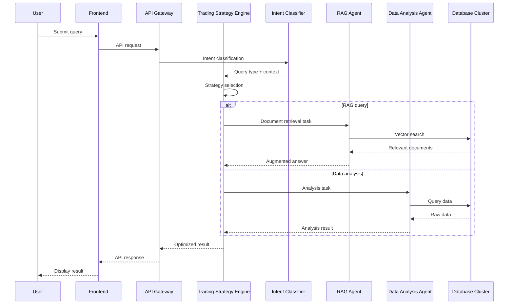

# Industry AI Flow — Detailed System Architecture

> 🌐 Language: **English** · [中文](./SYSTEM_ARCHITECTURE_DETAILED.md)

## Overview

Industry AI Flow adopts a **multi-layer containerized architecture** that partitions the system into clear logical layers and physical containers, delivering high availability, scalability, and security. This document highlights how the **Trading Strategy** and **AI Role Engine** sit inside the system and interact with the rest of the platform.

## Architecture Layers

### Layer 1 — UI Layer
**Container**: `frontend-container`
- **Next.js Web App** — modern React frontend
- **Streamlit admin console** — operator control panel
- **API clients** — third-party integration interface

### Layer 2 — API Gateway Layer
**Container**: `api-gateway-container`
- **FastAPI gateway** — unified API entry point
- **AuthN/AuthZ** — JWT token validation and permission checks
- **Rate limiting** — tenant-scoped request throttling
- **Request validation** — input validation and sanitization

### Layer 3 — Business Services Layer
**Container**: `business-services-container`
- **Workflow orchestrator** — manages complex AI workflows
- **Intent classifier** — identifies user query type
- **Routing strategy engine** — intelligent routing decisions
- **Budget controller** — usage monitoring and budget enforcement

### Layer 4 — AI Runtime Layer
**Container group**: `ai-runtime-cluster`
- **RAG engine container** — document retrieval and augmented generation
- **LLM dispatch container** — multi-provider management
- **Code execution container** — secure sandbox environment
- **Cost estimation container** — predicts and tracks AI spend

### Layer 5 — Data Storage Layer
**Container group**: `data-storage-cluster`
- **PostgreSQL primary container** — relational storage
- **pgvector container** — vector similarity search
- **Redis cache container** — session and query caching
- **File storage container** — documents and model artifacts

### Layer 6 — Security & Infrastructure Layer
**Cross-container services**:
- **Security monitoring container** — real-time threat detection
- **Observability container** — metrics, logs, and traces
- **Configuration management container** — centralized configuration
- **CI/CD pipeline container** — automated deployment

## Core Components in Detail

### 🎯 Trading Strategy System

#### Location: Business Services Layer → Routing Strategy Engine

**Component architecture**:
```
Trading Strategy Engine
├── Cost-optimization strategies
│   ├── Local-first
│   ├── Cloud-fallback
│   └── Hybrid-mode
├── Performance-optimization strategies
│   ├── Cache-first
│   ├── Parallel execution
│   └── Load balancing
└── Quality-optimization strategies
    ├── Confidence-threshold
    ├── Multi-model verification
    └── Result fusion
```

**Interaction flow**:
1. **Receive query** — pull the query type and context from the intent classifier.
2. **Select strategy** — pick the best strategy based on cost, performance, and quality requirements.
3. **Route decision** — dispatch the query to the appropriate AI engine.
4. **Result optimization** — fuse and optimize results from multiple engines.
5. **Feedback learning** — update strategy parameters based on execution outcomes.

### 🤖 AI Role Engine System

#### Location: AI Runtime Layer → dedicated Agent containers

**Component architecture**:
```
AI Role Engine Cluster
├── RAG Expert Agents
│   ├── Document retrieval expert
│   ├── Knowledge synthesis expert
│   └── Fact-checking expert
├── Data Analysis Agents
│   ├── Data cleaning expert
│   ├── Statistical analysis expert
│   └── Visualization expert
├── Code Execution Agents
│   ├── Code analysis expert
│   ├── Secure execution expert
│   └── Debug/optimization expert
└── Document Processing Agents
    ├── OCR recognition expert
    ├── Content extraction expert
    └── Format conversion expert
```

**Interaction flow**:
1. **Role assignment** — assign specialized agents by query type.
2. **Collaboration** — agents coordinate via a message queue.
3. **Result aggregation** — consolidate agent outputs into a single response.
4. **Experience learning** — agents learn from successful cases to improve.

## Data Flow & Interaction

### Typical Query Flow



### Container-to-Container Communication

1. **Synchronous**
   - REST: frontend ↔ gateway ↔ business services
   - gRPC: business services ↔ AI engines (high performance)

2. **Asynchronous**
   - Message queue: agent coordination
   - Event bus: system state-change notifications

3. **Shared data**
   - Shared storage: cross-container file sharing
   - Database connections: unified data access layer

## Deployment Architecture

### Development

```
Single Docker Compose file manages every container
├── Frontend dev container (hot reload)
├── Backend dev container (debug mode)
├── Database container (test data)
└── Tooling container (monitoring, logs)
```

### Production

```
Kubernetes cluster
├── Namespace: industry-ai-flow
│   ├── Deployment: frontend-deployment (3 replicas)
│   ├── Deployment: api-gateway-deployment (3 replicas)
│   ├── Deployment: business-services-deployment (3 replicas)
│   ├── StatefulSet: ai-agents-statefulset (autoscaled)
│   ├── StatefulSet: database-statefulset (primary/replica)
│   └── DaemonSet: monitoring-daemonset
├── Services: load balancing and discovery
├── Config: ConfigMaps and Secrets
└── Storage: PersistentVolumeClaims
```

## Security Architecture

### Container Security
- **Image scanning** — every container image is scanned
- **Least privilege** — containers run as non-root users
- **Network policy** — strict network access control
- **Resource limits** — CPU/memory caps

### Data Security
- **In-transit encryption** — TLS 1.3 everywhere
- **At-rest encryption** — encrypted database and storage
- **Access control** — role-based fine-grained permissions
- **Audit log** — complete audit trail of all operations

### API Security
- **Authentication** — JWT tokens and API keys
- **Authorization** — policy-based access control
- **Rate limiting** — protects against DDoS
- **Input validation** — prevents injection attacks

## Monitoring & Observability

### Metrics
- **Container metrics** — CPU, memory, network, disk
- **Application metrics** — request rate, error rate, latency
- **Business metrics** — user activity, query success rate
- **AI metrics** — model performance, cost efficiency

### Logging
- **Structured logs** — JSON for easy analysis
- **Centralized storage** — ELK stack
- **Real-time alerts** — anomaly detection and notification

### Distributed Tracing
- **Request tracing** — end-to-end request paths
- **Performance analysis** — bottleneck identification
- **Dependency mapping** — service dependency visualization

## Scalability & Resilience

### Horizontal Scaling
- **Stateless services** — API gateway and business services scale out
- **Stateful services** — databases and AI engines need special handling
- **Autoscaling** — metric-driven scale-up/down

### Failure Recovery
- **Health checks** — container and service health monitoring
- **Readiness checks** — service readiness validation
- **Failover** — automatic fault detection and takeover
- **Backups** — regular backup and restore tests

## Tech Stack Summary

### Containerization
- **Docker** — container runtime
- **Kubernetes** — container orchestration
- **Helm** — application packaging and deployment

### Backend
- **Python 3.11+** — primary language
- **FastAPI** — web framework
- **PostgreSQL 15+** — primary database
- **Redis** — cache and message queue

### AI
- **LangChain 1.0** — AI application framework
- **pgvector** — vector database extension
- **Multi-LLM** — OpenAI, Anthropic, Cohere, etc.

### Frontend
- **Next.js 14** — React framework
- **TypeScript** — type safety
- **Tailwind CSS** — styling framework

### Monitoring & Ops
- **Prometheus** — metrics collection
- **Grafana** — visualization
- **ELK stack** — log management
- **Jaeger** — distributed tracing

## Architecture Strengths

1. **Clear layering** — each layer owns a well-defined responsibility and interface
2. **Containerized deployment** — consistent environments, easy to scale
3. **Microservices** — independently deployable and scalable
4. **AI specialization** — dedicated agents for specific tasks
5. **Strategy-driven** — intelligent routing and optimization
6. **Security-first** — defense in depth
7. **Observability** — comprehensive monitoring and tracing
8. **Resilience** — high availability and fault recovery

This design delivers high performance, availability, and maintainability for Industry AI Flow while leaving a solid foundation for future capabilities.
