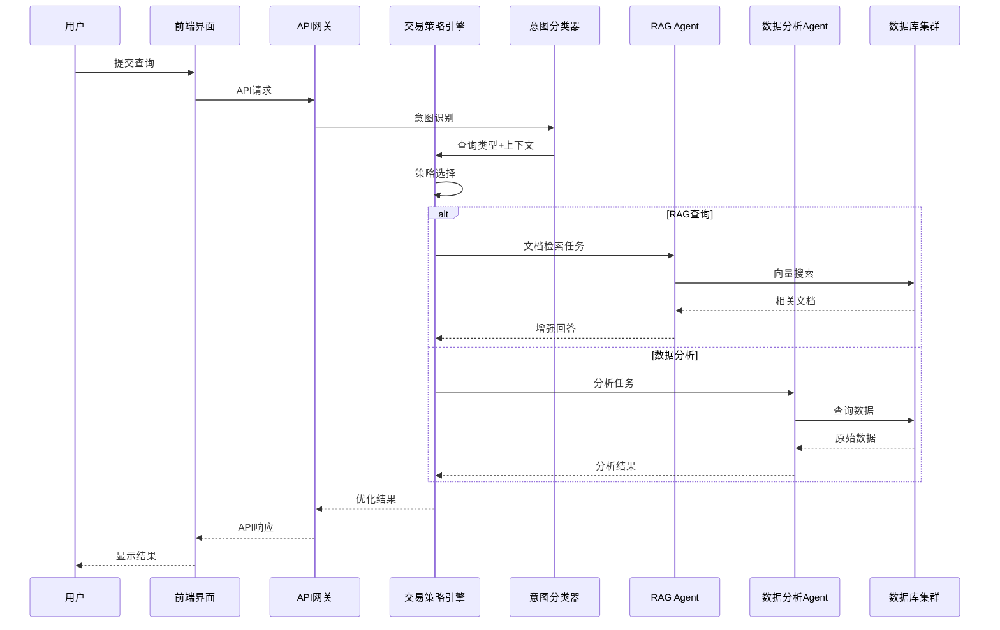

# Industry AI Flow - 详细系统架构图

## 概述

Industry AI Flow采用**多层容器化架构**，将系统划分为清晰的逻辑层次和物理容器，确保高可用性、可扩展性和安全性。本架构图特别强调**交易策略**和**AI角色引擎**在整个系统中的位置和交互方式。

## 架构层次

### 第1层：用户界面层 (UI Layer)
**容器**: `frontend-container`
- **Next.js Web应用**: 现代化的React前端
- **Streamlit管理界面**: 管理员控制面板
- **API客户端**: 第三方集成接口

### 第2层：API网关层 (API Gateway Layer)  
**容器**: `api-gateway-container`
- **FastAPI网关**: 统一的API入口点
- **认证与授权**: JWT令牌验证和权限检查
- **速率限制**: 基于租户的请求限制
- **请求验证**: 输入数据验证和清洗

### 第3层：业务服务层 (Business Services Layer)
**容器**: `business-services-container`
- **工作流编排器**: 管理复杂的AI工作流
- **意图分类器**: 识别用户查询类型
- **路由策略引擎**: 智能路由决策
- **预算控制器**: 使用量监控和预算执行

### 第4层：AI运行时层 (AI Runtime Layer)
**容器组**: `ai-runtime-cluster`
- **RAG引擎容器**: 文档检索和增强生成
- **LLM调度容器**: 多模型提供商管理
- **代码执行容器**: 安全的沙箱环境
- **成本估算容器**: 预测和跟踪AI成本

### 第5层：数据存储层 (Data Storage Layer)
**容器组**: `data-storage-cluster`
- **PostgreSQL主容器**: 关系数据存储
- **pgvector向量容器**: 向量相似性搜索
- **Redis缓存容器**: 会话和查询缓存
- **文件存储容器**: 文档和模型文件

### 第6层：安全与基础设施层 (Security & Infrastructure Layer)
**跨容器服务**:
- **安全监控容器**: 实时威胁检测
- **可观测性容器**: 指标、日志和追踪
- **配置管理容器**: 集中化配置
- **CI/CD管道容器**: 自动化部署

## 核心组件详细说明

### 🎯 交易策略系统 (Trading Strategy System)

#### 位置：业务服务层 → 路由策略引擎

**组件架构**:
```
交易策略引擎
├── 成本优化策略
│   ├── 本地优先策略
│   ├── 云端回退策略  
│   └── 混合模式策略
├── 性能优化策略
│   ├── 缓存优先策略
│   ├── 并行执行策略
│   └── 负载均衡策略
└── 质量优化策略
    ├── 置信度阈值策略
    ├── 多模型验证策略
    └── 结果融合策略
```

**交互方式**:
1. **接收查询请求**：从意图分类器获取查询类型和上下文
2. **策略选择**：基于成本、性能和质量需求选择最佳策略
3. **路由决策**：将查询路由到合适的AI引擎
4. **结果优化**：对多个引擎的结果进行融合和优化
5. **反馈学习**：根据执行结果优化策略参数

### 🤖 AI角色引擎系统 (AI Role Engine System)

#### 位置：AI运行时层 → 专用Agent容器

**组件架构**:
```
AI角色引擎集群
├── RAG专家Agent
│   ├── 文档检索专家
│   ├── 知识合成专家
│   └── 事实核查专家
├── 数据分析Agent
│   ├── 数据清洗专家
│   ├── 统计分析专家
│   └── 可视化专家
├── 代码执行Agent
│   ├── 代码分析专家
│   ├── 安全执行专家
│   └── 调试优化专家
└── 文档处理Agent
    ├── OCR识别专家
    ├── 内容提取专家
    └── 格式转换专家
```

**交互方式**:
1. **角色分配**：根据查询类型分配专业Agent
2. **协同工作**：多个Agent通过消息队列协同
3. **结果整合**：各Agent结果汇总到统一响应
4. **经验学习**：Agent从成功案例中学习优化

## 数据流和交互

### 典型查询流程



### 容器间通信

1. **同步通信**:
   - REST API: 前端 ↔ 网关 ↔ 业务服务
   - gRPC: 业务服务 ↔ AI引擎（高性能）

2. **异步通信**:
   - 消息队列: Agent间协同工作
   - 事件总线: 系统状态变更通知

3. **数据共享**:
   - 共享存储: 容器间文件共享
   - 数据库连接: 统一数据访问层

## 部署架构

### 开发环境
```
单个Docker Compose文件管理所有容器
├── 前端开发容器 (Hot Reload)
├── 后端开发容器 (Debug模式)
├── 数据库容器 (测试数据)
└── 工具容器 (监控、日志)
```

### 生产环境
```
Kubernetes集群部署
├── 命名空间: industry-ai-flow
│   ├── 部署: frontend-deployment (3副本)
│   ├── 部署: api-gateway-deployment (3副本)
│   ├── 部署: business-services-deployment (3副本)
│   ├── 状态集: ai-agents-statefulset (弹性伸缩)
│   ├── 状态集: database-statefulset (主从复制)
│   └── 守护进程集: monitoring-daemonset
├── 服务: 负载均衡和发现
├── 配置: ConfigMaps和Secrets
└── 存储: PersistentVolumeClaims
```

## 安全架构

### 容器安全
- **镜像扫描**: 所有容器镜像安全扫描
- **最小权限**: 容器以非root用户运行
- **网络策略**: 严格的网络访问控制
- **资源限制**: CPU/内存使用限制

### 数据安全
- **传输加密**: TLS 1.3所有通信
- **静态加密**: 数据库和存储加密
- **访问控制**: 基于角色的细粒度权限
- **审计日志**: 所有操作完整审计

### API安全
- **认证**: JWT令牌和API密钥
- **授权**: 基于策略的访问控制
- **限流**: 防止DDoS攻击
- **输入验证**: 防止注入攻击

## 监控和可观测性

### 指标监控
- **容器指标**: CPU、内存、网络、磁盘
- **应用指标**: 请求率、错误率、延迟
- **业务指标**: 用户活跃度、查询成功率
- **AI指标**: 模型性能、成本效率

### 日志收集
- **结构化日志**: JSON格式便于分析
- **集中存储**: ELK栈日志管理
- **实时告警**: 异常检测和通知

### 分布式追踪
- **请求追踪**: 端到端请求跟踪
- **性能分析**: 瓶颈识别和优化
- **依赖映射**: 服务依赖关系可视化

## 扩展性和弹性

### 水平扩展
- **无状态服务**: API网关和业务服务可水平扩展
- **有状态服务**: 数据库和AI引擎需要特殊处理
- **自动扩缩**: 基于指标的自动扩缩容

### 故障恢复
- **健康检查**: 容器和服务健康监控
- **就绪检查**: 服务就绪状态验证
- **故障转移**: 自动故障检测和转移
- **数据备份**: 定期备份和恢复测试

## 技术栈总结

### 容器化技术
- **Docker**: 容器运行时
- **Kubernetes**: 容器编排
- **Helm**: 应用打包和部署

### 后端技术
- **Python 3.11+**: 主要编程语言
- **FastAPI**: Web框架
- **PostgreSQL 15+**: 主数据库
- **Redis**: 缓存和消息队列

### AI技术栈
- **LangChain 1.0**: AI应用框架
- **pgvector**: 向量数据库扩展
- **多种LLM提供商**: OpenAI、Anthropic、Cohere等

### 前端技术
- **Next.js 14**: React框架
- **TypeScript**: 类型安全
- **Tailwind CSS**: 样式框架

### 监控和运维
- **Prometheus**: 指标收集
- **Grafana**: 数据可视化
- **ELK栈**: 日志管理
- **Jaeger**: 分布式追踪

## 架构优势

1. **清晰的分层**: 每层有明确的职责和接口
2. **容器化部署**: 环境一致，易于扩展
3. **微服务架构**: 独立部署和扩展
4. **AI专业化**: 专用Agent处理特定任务
5. **策略驱动**: 智能路由和优化决策
6. **安全优先**: 多层次安全防护
7. **可观测性**: 全面的监控和追踪
8. **弹性设计**: 高可用和故障恢复

这个架构设计确保了Industry AI Flow系统的高性能、高可用性和易维护性，同时为未来的功能扩展提供了坚实的基础。