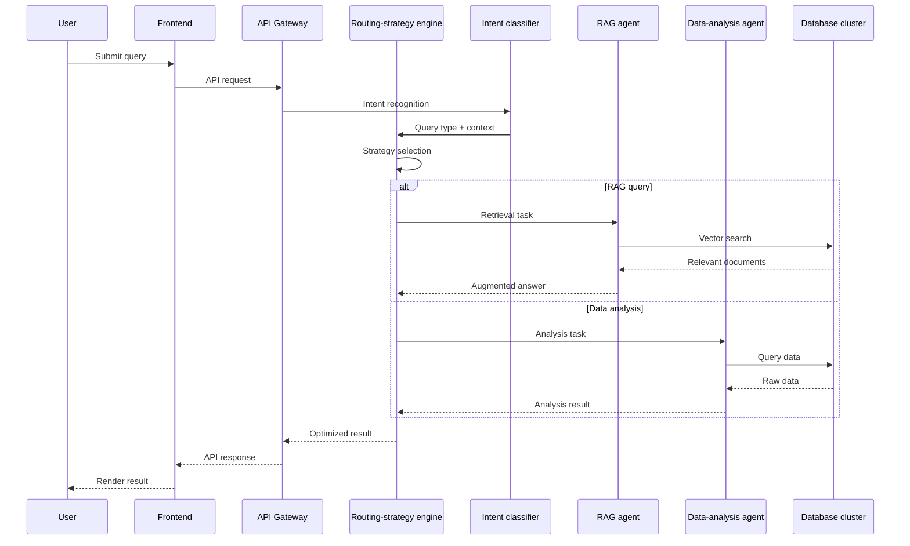

# Detailed System Architecture

> 🇨🇳 中文版： **[SYSTEM_ARCHITECTURE_DETAILED.zh.md](SYSTEM_ARCHITECTURE_DETAILED.zh.md)**

## Overview

Industry AI Flow uses a **layered, container-oriented architecture** that separates the system into clear logical tiers, with the **routing-strategy engine** and the **AI role engine** as its two coordinating cores. The design targets availability, scalability, and security.

## The six layers

| Layer | Container | Responsibility |
|-------|-----------|----------------|
| **1. UI** | `frontend-container` | Next.js web app, Streamlit admin console, third-party API clients |
| **2. API Gateway** | `api-gateway-container` | FastAPI entry point, JWT auth + authorization, per-tenant rate limiting, request validation |
| **3. Business Services** | `business-services-container` | Workflow orchestrator, intent classifier, routing-strategy engine, budget controller |
| **4. AI Runtime** | `ai-runtime-cluster` | RAG engine, LLM dispatch, code-execution sandbox, cost estimator |
| **5. Data Storage** | `data-storage-cluster` | PostgreSQL (relational), pgvector (similarity search), Redis (cache), file storage |
| **6. Security & Infrastructure** | cross-cutting | Threat monitoring, observability (metrics/logs/traces), config management, CI/CD |

## Core components

### Routing-strategy engine

**Location:** Business Services layer.

Selects the best execution path for each query, balancing cost, performance, and quality:

```
Routing-strategy engine
├── Cost strategies        — local-first, cloud-fallback, hybrid
├── Performance strategies — cache-first, parallel execution, load balancing
└── Quality strategies     — confidence threshold, multi-model validation, result fusion
```

Flow: receive query type + context from the intent classifier → select a strategy from cost/performance/quality needs → route to the right AI engine → fuse and optimize results → feed execution outcomes back to tune strategy parameters.

### AI role engine

**Location:** AI Runtime layer (specialized agent containers).

```
AI role engine cluster
├── RAG agent           — document retrieval, knowledge synthesis, fact-checking
├── Data-analysis agent — data cleaning, statistical analysis, visualization
├── Code-execution agent — code analysis, sandboxed execution, debugging
└── Document agent      — OCR, content extraction, format conversion
```

Flow: assign the specialized agent by query type → agents collaborate via a message queue → results merge into one unified response → agents learn from successful cases.

## Data flow — a typical query


```mermaid
sequenceDiagram
    participant User
    participant UI as Frontend
    participant Gateway as API Gateway
    participant Strategy as Routing-strategy engine
    participant Classifier as Intent classifier
    participant RAG as RAG agent
    participant Data as Data-analysis agent
    participant DB as Database cluster

    User->>UI: Submit query
    UI->>Gateway: API request
    Gateway->>Classifier: Intent recognition
    Classifier->>Strategy: Query type + context
    Strategy->>Strategy: Strategy selection

    alt RAG query
        Strategy->>RAG: Retrieval task
        RAG->>DB: Vector search
        DB-->>RAG: Relevant documents
        RAG-->>Strategy: Augmented answer
    else Data analysis
        Strategy->>Data: Analysis task
        Data->>DB: Query data
        DB-->>Data: Raw data
        Data-->>Strategy: Analysis result
    end

    Strategy-->>Gateway: Optimized result
    Gateway-->>UI: API response
    UI-->>User: Render result
```

### Inter-container communication

- **Synchronous** — REST (frontend ↔ gateway ↔ services); high-performance internal calls (services ↔ AI engines).
- **Asynchronous** — Message queue for agent collaboration; event bus for state-change notifications.
- **Shared data** — Shared file storage between containers; a unified database access layer.

## Deployment

**Development** — a single Docker Compose file runs all containers (frontend hot-reload, backend debug mode, database with test data, monitoring/logging tools).

**Production (target)** — Kubernetes deployment under the `industry-ai-flow` namespace: stateless deployments (frontend, gateway, services) with replicas; StatefulSets for AI agents (elastic) and the database (primary/replica); a monitoring DaemonSet; ConfigMaps/Secrets for configuration; PersistentVolumeClaims for storage.

## Security

- **Containers** — image scanning, non-root execution, strict network policies, CPU/memory limits.
- **Data** — TLS 1.3 in transit, encryption at rest, role-based access control, full audit logging.
- **API** — JWT tokens and API keys, policy-based authorization, rate limiting, input validation against injection.

## Observability & resilience

- **Metrics** — container (CPU/memory/network/disk), application (request rate, error rate, latency), business (query success rate), AI (model performance, cost efficiency).
- **Logs** — structured JSON, centralized aggregation, real-time alerting.
- **Tracing** — end-to-end request tracing, bottleneck analysis, dependency mapping.
- **Scaling** — stateless services scale horizontally; stateful services (DB, AI engines) use replication and elastic StatefulSets; metric-driven autoscaling.
- **Recovery** — health/readiness checks, automatic failover, periodic backup with restore tests.

## Technology summary

| Area | Stack |
|------|-------|
| Containerization | Docker, Kubernetes (target), Helm |
| Backend | Python 3.13, FastAPI, PostgreSQL 14+, Redis |
| AI | LangChain 1.0, pgvector; Ollama (local) + Zhipu/Groq (cloud) |
| Frontend | Next.js, TypeScript, Tailwind CSS |
| Monitoring | Prometheus, Grafana, structured-log stack, distributed tracing |

## Why this architecture

Clear layering with well-defined interfaces; container deployment for environment parity and easy scaling; specialized agents per task; strategy-driven routing; defense-in-depth security; full observability; and an elastic, fault-tolerant design that leaves room for future capabilities.
