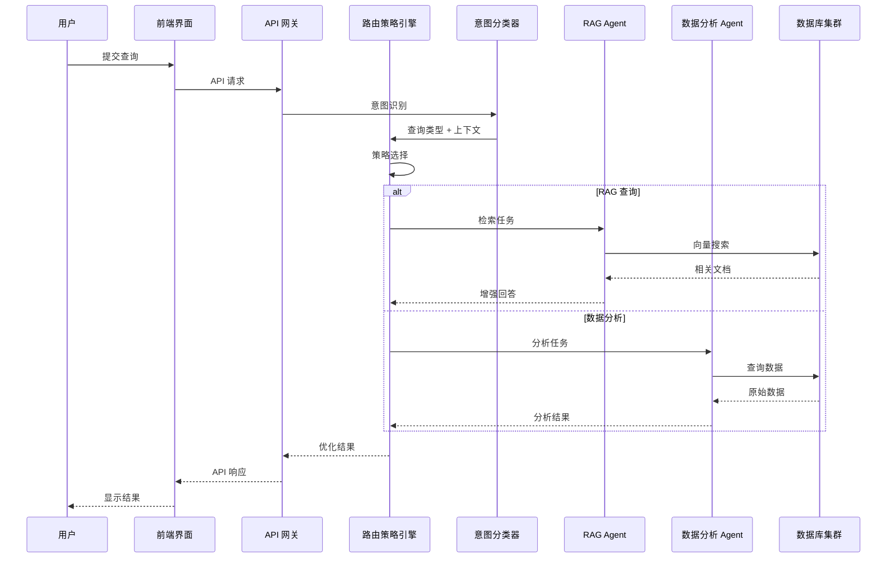

# 详细系统架构

> 🇬🇧 English： **[SYSTEM_ARCHITECTURE_DETAILED.md](SYSTEM_ARCHITECTURE_DETAILED.md)**

## 概述

Industry AI Flow 采用**分层、面向容器的架构**，把系统划分为清晰的逻辑层次，并以**路由策略引擎**和 **AI 角色引擎**作为两个协调核心。整体设计面向高可用、可扩展和安全。

## 六层架构

| 层 | 容器 | 职责 |
|----|------|------|
| **1. 用户界面层** | `frontend-container` | Next.js Web 应用、Streamlit 管理控制台、第三方 API 客户端 |
| **2. API 网关层** | `api-gateway-container` | FastAPI 统一入口、JWT 认证与授权、按租户限流、请求校验 |
| **3. 业务服务层** | `business-services-container` | 工作流编排器、意图分类器、路由策略引擎、预算控制器 |
| **4. AI 运行时层** | `ai-runtime-cluster` | RAG 引擎、LLM 调度、代码执行沙箱、成本估算器 |
| **5. 数据存储层** | `data-storage-cluster` | PostgreSQL（关系数据）、pgvector（相似度搜索）、Redis（缓存）、文件存储 |
| **6. 安全与基础设施层** | 横切 | 威胁监控、可观测性（指标/日志/追踪）、配置管理、CI/CD |

## 核心组件

### 路由策略引擎

**位置：** 业务服务层。

为每条查询选择最佳执行路径，在成本、性能与质量之间权衡：

```
路由策略引擎
├── 成本策略    —— 本地优先、云端回退、混合模式
├── 性能策略    —— 缓存优先、并行执行、负载均衡
└── 质量策略    —— 置信度阈值、多模型验证、结果融合
```

流程：从意图分类器接收查询类型与上下文 → 依据成本/性能/质量需求选择策略 → 路由到合适的 AI 引擎 → 融合并优化结果 → 用执行结果反馈调优策略参数。

### AI 角色引擎

**位置：** AI 运行时层（专用 Agent 容器）。

```
AI 角色引擎集群
├── RAG Agent        —— 文档检索、知识合成、事实核查
├── 数据分析 Agent   —— 数据清洗、统计分析、可视化
├── 代码执行 Agent   —— 代码分析、沙箱执行、调试优化
└── 文档处理 Agent   —— OCR、内容提取、格式转换
```

流程：按查询类型分配专业 Agent → 各 Agent 通过消息队列协同 → 结果汇总为统一响应 → Agent 从成功案例中学习。

## 数据流——一次典型查询



### 容器间通信

- **同步** —— REST（前端 ↔ 网关 ↔ 服务）；服务 ↔ AI 引擎的高性能内部调用。
- **异步** —— 消息队列用于 Agent 协同；事件总线用于状态变更通知。
- **数据共享** —— 容器间共享文件存储；统一的数据库访问层。

## 部署

**开发环境** —— 单个 Docker Compose 文件管理所有容器（前端热重载、后端 Debug 模式、带测试数据的数据库、监控/日志工具）。

**生产环境（目标）** —— Kubernetes 部署，命名空间 `industry-ai-flow`：无状态部署（前端、网关、服务）带多副本；StatefulSet 承载 AI Agent（弹性伸缩）与数据库（主从复制）；监控 DaemonSet；ConfigMap/Secret 管理配置；PersistentVolumeClaim 管理存储。

## 安全

- **容器** —— 镜像扫描、非 root 运行、严格网络策略、CPU/内存限制。
- **数据** —— 传输 TLS 1.3、静态加密、基于角色的访问控制、完整审计日志。
- **API** —— JWT 令牌与 API Key、基于策略的授权、限流、防注入输入校验。

## 可观测性与弹性

- **指标** —— 容器（CPU/内存/网络/磁盘）、应用（请求率、错误率、延迟）、业务（查询成功率）、AI（模型性能、成本效率）。
- **日志** —— 结构化 JSON、集中聚合、实时告警。
- **追踪** —— 端到端请求追踪、瓶颈分析、依赖关系可视化。
- **扩展** —— 无状态服务水平扩展；有状态服务（数据库、AI 引擎）采用复制与弹性 StatefulSet；基于指标的自动扩缩容。
- **恢复** —— 健康/就绪检查、自动故障转移、定期备份与恢复测试。

## 技术栈总结

| 领域 | 选型 |
|------|------|
| 容器化 | Docker、Kubernetes（目标）、Helm |
| 后端 | Python 3.13、FastAPI、PostgreSQL 14+、Redis |
| AI | LangChain 1.0、pgvector；Ollama（本地）+ Zhipu/Groq（云端） |
| 前端 | Next.js、TypeScript、Tailwind CSS |
| 监控 | Prometheus、Grafana、结构化日志栈、分布式追踪 |

## 架构优势

层次清晰、接口明确；容器化部署保证环境一致、易于扩展；按任务专业化的 Agent；策略驱动的智能路由；纵深防御的安全设计；全面的可观测性；以及为未来能力预留空间的弹性、容错设计。
