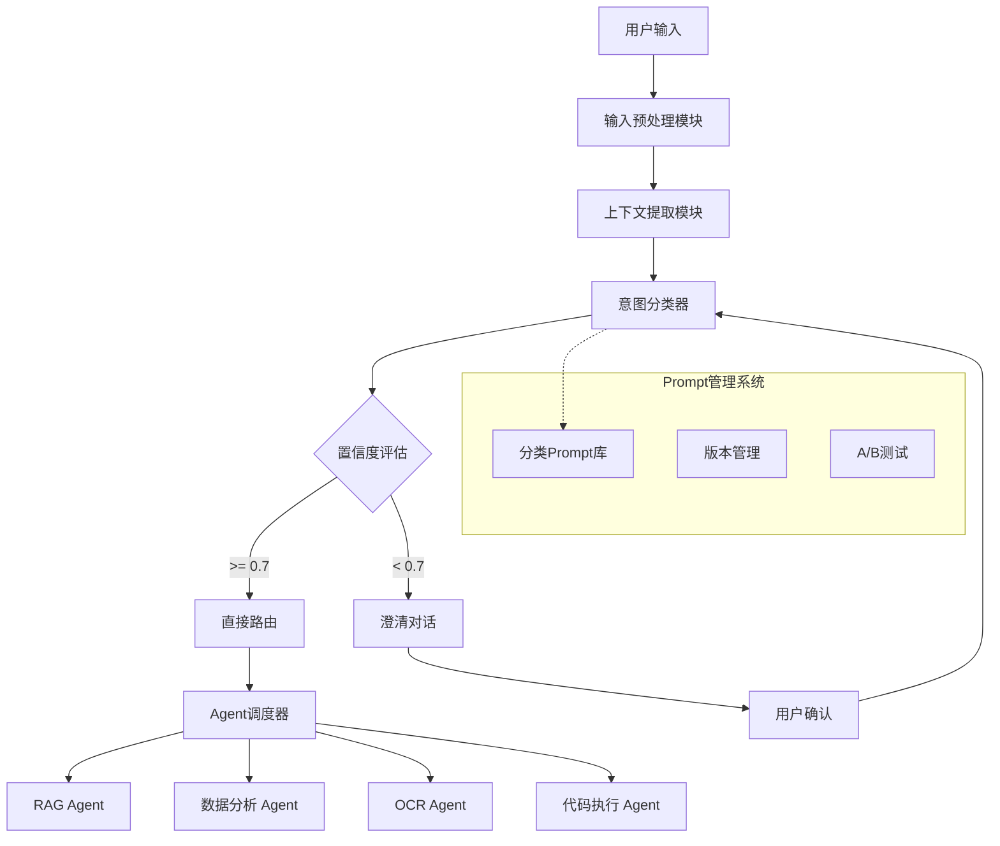

# 问题分类节点设计文档

## 1. 系统架构概览



## 2. 核心组件设计

### 2.1 输入预处理模块
**功能**: 清洗、去噪、格式化用户输入
- 移除多余标点符号
- 处理特殊字符和转义序列
- 统一编码格式
- 提取关键信息片段

### 2.2 上下文提取模块
**功能**: 构建完整的分类上下文
- 会话历史摘要
- 用户上传文件记录
- 前几次交互意图
- 当前会话主题
- 用户偏好设置

### 2.3 意图分类器
**功能**: 基于LLM的智能分类引擎
- 使用高质量分类Prompt
- 结构化输出格式
- 多轮分类推理
- 置信度评估

### 2.4 置信度评估机制
**功能**: 评估分类结果的可靠性
- 置信度阈值控制
- 不确定性处理
- 澄清策略触发

### 2.5 路由决策模块
**功能**: 智能路由到对应Agent
- 动态Agent选择
- 负载均衡
- 失败回退机制

## 3. 意图分类体系

### 3.1 主要分类类型
```python
IntentType = Enum('IntentType', [
    'KNOWLEDGE_RETRIEVAL',  # 知识检索类
    'DATA_ANALYSIS',        # 数据分析类
    'DOCUMENT_PROCESSING',  # 文档处理类
    'CODE_EXECUTION',       # 代码执行类
    'UNCLEAR_INTENT'        # 意图不明确
])
```

### 3.2 详细分类规则
- **知识检索类**: 包含"什么是"、"如何"、"告诉我"等询问
- **数据分析类**: 提到"分析"、"统计"、"图表"、"数据集"等
- **文档处理类**: 提到"PDF"、"图片"、"OCR"、"提取"等
- **代码执行类**: 提到"运行"、"计算"、"代码"、"程序"等

### 3.3 子分类体系
每个主分类下包含多个子分类：
- 知识检索: 事实查询、概念解释、比较分析
- 数据分析: EDA、统计分析、机器学习、可视化
- 文档处理: OCR、表格提取、图像分析
- 代码执行: 脚本运行、计算任务、算法实现

## 4. Prompt模板设计

### 4.1 主分类Prompt
```prompt
你是一个专业的AI系统意图分类器。请分析用户的问题，并将其分类到以下类别之一：

【分类类别】
1. knowledge_retrieval - 知识检索类：询问事实、概念、解释等问题
2. data_analysis - 数据分析类：对数据集进行统计分析、可视化等
3. document_processing - 文档处理类：PDF、图片OCR、文本提取等
4. code_execution - 代码执行类：运行程序、计算任务、算法实现等

【用户问题】
{{user_query}}

【上下文信息】
- 会话主题: {{session_topic}}
- 最近意图: {{recent_intents}}
- 上传文件: {{uploaded_files}}
- 用户偏好: {{user_preferences}}

【分析要求】
1. 仔细分析用户问题的核心意图
2. 结合上下文信息进行综合判断
3. 考虑用户的语言习惯和表达方式
4. 给出明确的分类结果和置信度

【输出格式】
请严格按照以下JSON格式输出：
```json
{
  "intent": "分类结果",
  "confidence": 0.00,
  "reasoning": "分类理由",
  "keywords": ["关键词1", "关键词2"],
  "context_clues": ["上下文线索1", "上下文线索2"],
  "suggested_action": "建议的处理动作",
  "uncertainty_factors": ["不确定因素"]
}
```

置信度范围：0.0-1.0，其中：
- 0.9-1.0: 非常确定的分类
- 0.7-0.9: 比较确定的分类
- 0.5-0.7: 一定不确定的分类
- 0.0-0.5: 非常不确定的分类
```

### 4.2 澄清Prompt
```prompt
用户的意图不够明确，需要澄清。请生成友好的澄清问题。

【用户问题】
{{user_query}}

【可能意图】
{{possible_intents}}

【澄清要求】
1. 使用友好、自然的语言
2. 提供具体的选择项
3. 避免技术术语
4. 保持简短清晰

【输出格式】
```json
{
  "clarification_needed": true,
  "clarification_message": "澄清问句",
  "suggested_options": [
    "选项1",
    "选项2",
    "选项3"
  ],
  "follow_up_questions": [
    "追问1",
    "追问2"
  ]
}
```
```

## 5. 技术实现方案

### 5.1 核心类设计
```python
class IntentClassifier:
    def __init__(self, prompt_manager: PromptManager, llm_client):
        self.prompt_manager = prompt_manager
        self.llm_client = llm_client
        self.confidence_threshold = 0.7
        self.max_context_length = 4000

    async def classify_intent(self, query: str, context: Dict) -> IntentResult:
        """分类用户意图"""
        pass

    async def preprocess_input(self, query: str) -> str:
        """输入预处理"""
        pass

    async def extract_context(self, session_id: str) -> Dict:
        """提取上下文"""
        pass
```

### 5.2 性能优化策略
- **缓存机制**: 缓存常见查询的分类结果
- **批处理**: 支持批量分类以提高效率
- **降级策略**: LLM不可用时的备选方案
- **并行处理**: 并行执行多个分类器并聚合结果

### 5.3 监控和评估
- **分类准确率**: 定期评估分类结果
- **置信度分布**: 分析置信度分布情况
- **用户反馈**: 收集用户对分类结果的反馈
- **性能指标**: 响应时间、成功率等

## 6. 集成方案

### 6.1 LangChain 1.0集成
```python
from langchain_core.runnables import RunnablePassthrough
from langchain_core.output_parsers import JsonOutputParser

# 创建意图分类链
intent_classifier = (
    RunnablePassthrough.assign(
        processed_input=lambda x: preprocess_query(x["query"]),
        context=lambda x: extract_context(x["session_id"])
    )
    | RunnablePassthrough.assign(
        classification_result=lambda x: classify_intent(
            x["processed_input"],
            x["context"]
        )
    )
    | RunnablePassthrough.assign(
        routing_decision=lambda x: make_routing_decision(x["classification_result"])
    )
)
```

### 6.2 State Graph集成
```python
def create_intent_routing_graph():
    workflow = StateGraph(AgentState)

    # 添加意图分类节点
    workflow.add_node("classify_intent", classify_intent_node)
    workflow.add_node("clarify_intent", clarify_intent_node)
    workflow.add_node("route_to_agent", route_to_agent_node)

    # 设置路由逻辑
    workflow.add_conditional_edges(
        "classify_intent",
        route_based_on_confidence,
        {
            "high_confidence": "route_to_agent",
            "low_confidence": "clarify_intent"
        }
    )

    return workflow
```

## 7. 部署和扩展

### 7.1 部署架构
- **微服务部署**: 独立部署意图分类服务
- **负载均衡**: 支持多实例部署和负载均衡
- **监控告警**: 完整的监控和告警体系
- **日志管理**: 结构化日志和错误追踪

### 7.2 扩展策略
- **新分类类型**: 支持动态添加新的分类类型
- **多语言支持**: 支持多语言意图分类
- **领域适应**: 针对特定领域优化分类器
- **个性化**: 根据用户习惯调整分类策略

## 8. 质量保证

### 8.1 测试策略
- **单元测试**: 核心功能的单元测试
- **集成测试**: 端到端的集成测试
- **性能测试**: 高并发下的性能测试
- **用户测试**: 真实用户的场景测试

### 8.2 持续优化
- **A/B测试**: 不同分类策略的对比测试
- **用户反馈**: 收集和分析用户反馈
- **数据驱动**: 基于使用数据持续优化
- **模型更新**: 定期更新和优化分类模型

这个设计确保了问题分类节点既智能又可靠，为整个RAG系统提供准确的意图识别和路由能力。
