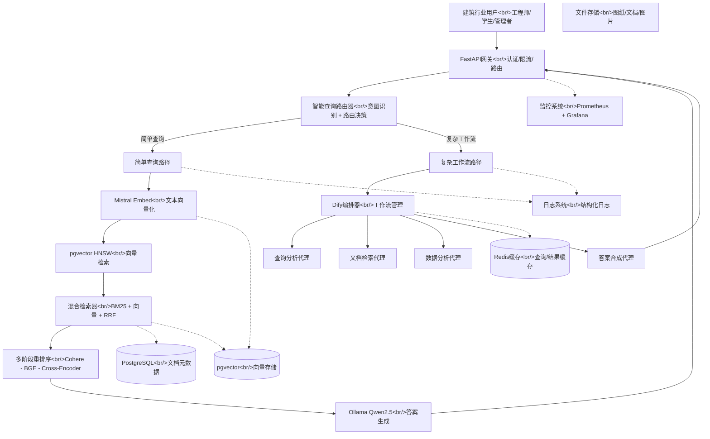

# 新RAG系统架构设计

## 架构设计原则

### 1. 毕业设计友好
- **渐进式改进**：保持现有架构，逐步优化
- **学习曲线平缓**：学生团队易理解易实现
- **演示价值高**：可视化组件，便于展示

### 2. 建筑行业优化
- **文档类型适配**：图纸、规范、报告、日志
- **查询模式匹配**：材料查找、规范查询、安全分析
- **多模态支持**：OCR + 文本混合处理

### 3. 成本控制
- **本地优先**：最大化利用现有Ollama部署
- **开源优先**：避免商业服务费用
- **云原生可选**：支持未来云部署

## 系统架构图



## 组件详细说明

### 1. 智能查询路由器 (Query Router)
**职责**：根据查询复杂度选择处理路径

```python
class QueryRouter:
    def route_query(self, query: str, context: dict) -> str:
        complexity = self.analyze_complexity(query)
        
        if complexity == "simple":
            return "simple_path"  # 材料属性、规范条款查找
        elif complexity == "multi_step":
            return "dify_path"    # 安全分析、设计建议
        else:
            return "simple_path"  # 默认简单路径
```

### 2. 简单查询路径优化
**核心改进**：
- **Embedding升级**：nomic → Mistral Embed
- **索引优化**：IVFFlat → HNSW
- **检索增强**：三重混合检索

```python
# 优化后的检索流程
def optimized_retrieval(query: str):
    # 1. 向量化（Mistral Embed）
    embedding = mistral_embedder.embed(query)
    
    # 2. 向量检索（pgvector HNSW）
    vector_results = pgvector_hnsw.search(embedding, top_k=20)
    
    # 3. BM25关键词检索
    bm25_results = bm25_retriever.search(query, top_k=20)
    
    # 4. RRF结果融合
    fused_results = rrf_fusion(vector_results, bm25_results)
    
    # 5. 多阶段重排序
    reranked = multi_stage_reranker.rerank(query, fused_results)
    
    return reranked[:5]  # 返回top-5
```

### 3. Dify复杂工作流路径
**适用场景**：建筑行业多步骤分析

```yaml
# dify_workflow.yaml
workflow:
  name: "建筑安全分析工作流"
  steps:
    - agent: "query_analyzer"
      task: "识别查询类型和需求"
    
    - agent: "regulation_retriever" 
      task: "检索相关安全规范"
      
    - agent: "case_finder"
      task: "查找类似案例"
      
    - agent: "risk_analyzer"
      task: "风险评估和建议"
      
    - agent: "report_generator"
      task: "生成分析报告"
```

### 4. 建筑行业专用组件

```python
# 建筑文档处理器
class ConstructionDocumentProcessor:
    def process_document(self, doc_type: str, content: bytes):
        if doc_type == "blueprint":
            return self.process_blueprint(content)  # OCR + 构件识别
        elif doc_type == "safety_log":
            return self.process_safety_log(content)  # 结构化提取
        elif doc_type == "specification":
            return self.process_specification(content)  # 条款分段
        else:
            return self.process_general(content)  # 通用处理
```

## 推荐的代码目录结构

```
industry-ai-flow/
├── backend/
│   ├── api/                          # FastAPI路由
│   │   ├── simple_query_routes.py    # 简单查询接口
│   │   ├── complex_workflow_routes.py # 复杂工作流接口
│   │   └── construction_routes.py    # 建筑行业专用接口
│   │
│   ├── services/
│   │   ├── retrieval/                # 检索服务
│   │   │   ├── mistral_embedder.py   # Mistral Embedding
│   │   │   ├── pgvector_hnsw.py      # HNSW优化向量存储
│   │   │   ├── hybrid_retriever_v2.py # 三重混合检索
│   │   │   └── multi_stage_reranker.py # 多阶段重排序
│   │   │
│   │   ├── dify_integration/         # Dify集成
│   │   │   ├── dify_orchestrator.py  # Dify编排器
│   │   │   ├── construction_agents/  # 建筑行业代理
│   │   │   │   ├── blueprint_analyzer.py
│   │   │   │   ├── safety_checker.py
│   │   │   │   └── regulation_expert.py
│   │   │   └── workflow_templates/   # 工作流模板
│   │   │
│   │   └── construction/             # 建筑行业处理
│   │       ├── document_processor.py # 文档处理器
│   │       ├── blueprint_ocr.py      # 图纸OCR
│   │       └── specification_parser.py # 规范解析
│   │
│   ├── core/
│   │   ├── query_router.py           # 查询路由器
│   │   ├── cache_manager.py          # 缓存管理
│   │   └── monitoring.py             # 监控系统
│   │
│   └── config/
│       ├── rag_optimized.yaml        # 优化配置
│       └── construction_domains.yaml # 建筑领域配置
│
├── research/                         # 研究文档（当前目录）
│   ├── adoption_analysis.md
│   └── new_architecture.md
│
├── tests/
│   ├── performance/                  # 性能测试
│   │   ├── test_mistral_vs_nomic.py
│   │   └── test_hnsw_vs_ivfflat.py
│   │
│   └── construction/                 # 建筑行业测试
│       ├── test_blueprint_qa.py
│       └── test_safety_analysis.py
│
└── docker/
    ├── docker-compose.optimized.yml  # 优化版部署
    └── monitoring/                   # 监控配置
        ├── prometheus.yml
        └── grafana-dashboards/
```

## 数据流说明

### 1. 简单查询数据流
```
用户查询 → API网关 → 查询路由器 → Mistral Embedding → pgvector HNSW检索 → 
混合检索融合 → 多阶段重排序 → Ollama生成 → 返回答案
```

### 2. 复杂工作流数据流
```
用户查询 → API网关 → 查询路由器 → Dify编排器 → 查询分析代理 → 
并行执行：文档检索代理 + 数据分析代理 → 答案合成代理 → 返回报告
```

### 3. 建筑文档处理流
```
上传文档 → 类型识别 → 专用处理器 → 分块策略 → 向量化 → 存储 → 
建立索引 → 可用于检索
```

## 性能目标

### 检索性能
| 指标 | 当前 | 目标 | 提升 |
|------|------|------|------|
| 简单查询延迟 | 300-500ms | <200ms | 40%+ |
| 检索准确率 (MRR) | 0.65 | 0.80 | 23% |
| 复杂查询准确率 | 0.50 | 0.75 | 50% |
| 并发支持 | 10 QPS | 50 QPS | 5x |

### 资源使用
| 资源 | 当前 | 目标 | 说明 |
|------|------|------|------|
| CPU使用率 | 70-80% | <60% | 优化算法 |
| 内存占用 | 4GB | 3GB | 缓存优化 |
| 存储需求 | 50GB | 60GB | HNSW索引 |

## 实施阶段

### 阶段1：基础优化（2周）
1. 集成Mistral Embedding
2. 升级pgvector HNSW索引
3. 实现三重混合检索
4. 性能基准测试

### 阶段2：Dify集成（2周）
1. 部署Dify Community Edition
2. 实现建筑行业代理
3. 创建示例工作流
4. 集成测试

### 阶段3：建筑优化（2周）
1. 实现建筑文档处理器
2. 优化分块策略
3. 构建测试数据集
4. 领域评估

### 阶段4：生产准备（2周）
1. 性能调优
2. 监控部署
3. 文档完善
4. 演示准备

## 风险评估与缓解

### 技术风险
1. **HNSW稳定性**：测试环境充分验证，保留IVFFlat回滚
2. **Dify学习曲线**：提供详细教程和示例
3. **建筑领域适配**：与Construction school紧密合作验证

### 项目风险
1. **时间不足**：优先核心优化，可选功能作为扩展
2. **团队技能**：提供培训资源和代码示例
3. **演示压力**：确保核心功能稳定，演示场景预先测试

### 成功标准
1. **技术指标**：达成性能目标
2. **用户体验**：建筑团队反馈积极
3. **学术价值**：毕业设计评审通过
4. **扩展基础**：为未来工作奠定基础