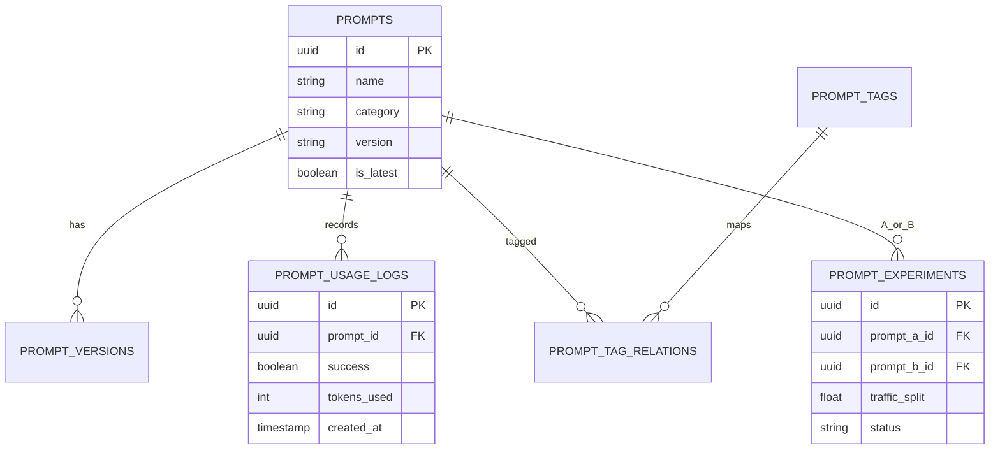

# RAG + Workflow 数据模型与表结构设计（一期目标）

> 目标：给出一期可落地的 model 层与表结构方案，避免 schema 分叉与字段漂移。

## 1. 设计原则
1. 单一事实源：`backend/init_database.py` 为唯一主线。
2. 幂等初始化：所有 DDL 使用 `IF NOT EXISTS`。
3. 兼容优先：不破坏现有 `/api/v1/query` 与 dispatch 链路。
4. 先稳定再扩展：一期不启用 prompt_usage 分区。

---

## 2. 应用层模型设计（Python）

### 2.1 Prompt 相关

```python
@dataclass
class PromptVariable:
    name: str
    type: str = "string"
    required: bool = True
    default_value: Any = None
    description: str = ""
    validation_regex: str | None = None
    options: list[Any] | None = None

@dataclass
class PromptInfo:
    id: uuid.UUID
    name: str
    category: str
    subcategory: str | None
    version: str
    content: str
    variables: list[PromptVariable]
    metadata: dict[str, Any]
    is_active: bool
    is_latest: bool
    priority: int
    performance_score: float
    usage_count: int
    success_count: int
    created_at: datetime
    updated_at: datetime
    created_by: str | None
    updated_by: str | None
    tags: list[str]
```

### 2.2 Workflow 相关（建议）

```python
class WorkflowState(TypedDict):
    trace_id: str
    tenant_id: str
    query: str
    intent: str | None
    retrieved_context: list[dict]
    system_prompt: str | None
    prompt_meta: dict[str, Any] | None
    route_mode: str
    provider_used: str | None
    response: str | None
    metrics: dict[str, Any]
    error: str | None
```

### 2.3 执行器抽象（建议）

```python
@dataclass
class ExecutionResult:
    success: bool
    stdout: str
    stderr: str
    error: str | None
    execution_time_s: float
    output_files: dict[str, bytes]
```

---

## 3. 数据库表结构（一期）

## 3.1 Prompt 核心表
```sql
CREATE TABLE IF NOT EXISTS prompts (
  id UUID PRIMARY KEY DEFAULT gen_random_uuid(),
  name VARCHAR(255) NOT NULL,
  category VARCHAR(100) NOT NULL,
  subcategory VARCHAR(100),
  version VARCHAR(50) NOT NULL,
  content TEXT NOT NULL,
  variables JSONB DEFAULT '{}'::jsonb,
  metadata JSONB DEFAULT '{}'::jsonb,
  is_active BOOLEAN DEFAULT true,
  is_latest BOOLEAN DEFAULT false,
  priority INTEGER DEFAULT 0,
  performance_score NUMERIC(5,4) DEFAULT 0,
  usage_count BIGINT DEFAULT 0,
  success_count BIGINT DEFAULT 0,
  created_by VARCHAR(255),
  updated_by VARCHAR(255),
  created_at TIMESTAMP DEFAULT CURRENT_TIMESTAMP,
  updated_at TIMESTAMP DEFAULT CURRENT_TIMESTAMP,
  CONSTRAINT uq_prompt_name_category_version UNIQUE(name, category, version)
);
```

## 3.2 Prompt 版本表
```sql
CREATE TABLE IF NOT EXISTS prompt_versions (
  id UUID PRIMARY KEY DEFAULT gen_random_uuid(),
  prompt_id UUID NOT NULL REFERENCES prompts(id) ON DELETE CASCADE,
  version VARCHAR(50) NOT NULL,
  content TEXT NOT NULL,
  variables JSONB DEFAULT '{}'::jsonb,
  change_description TEXT,
  performance_metrics JSONB DEFAULT '{}'::jsonb,
  usage_stats JSONB DEFAULT '{}'::jsonb,
  created_by VARCHAR(255),
  created_at TIMESTAMP DEFAULT CURRENT_TIMESTAMP,
  CONSTRAINT uq_prompt_version UNIQUE(prompt_id, version)
);
```

## 3.3 Prompt 使用日志（一期非分区）
```sql
CREATE TABLE IF NOT EXISTS prompt_usage_logs (
  id UUID PRIMARY KEY DEFAULT gen_random_uuid(),
  prompt_id UUID REFERENCES prompts(id) ON DELETE SET NULL,
  session_id VARCHAR(255),
  context JSONB DEFAULT '{}'::jsonb,
  variables_used JSONB DEFAULT '{}'::jsonb,
  execution_time_ms INTEGER,
  success BOOLEAN,
  error_message TEXT,
  user_feedback INTEGER CHECK (user_feedback BETWEEN 1 AND 5),
  llm_response JSONB,
  tokens_used INTEGER DEFAULT 0,
  model_name VARCHAR(100),
  temperature NUMERIC(3,2),
  created_at TIMESTAMP DEFAULT CURRENT_TIMESTAMP
);
```

## 3.4 Prompt 实验表
```sql
CREATE TABLE IF NOT EXISTS prompt_experiments (
  id UUID PRIMARY KEY DEFAULT gen_random_uuid(),
  name VARCHAR(255) NOT NULL,
  description TEXT,
  prompt_a_id UUID NOT NULL REFERENCES prompts(id),
  prompt_b_id UUID NOT NULL REFERENCES prompts(id),
  traffic_split NUMERIC(4,3) NOT NULL DEFAULT 0.5,
  metrics JSONB DEFAULT '{}'::jsonb,
  status VARCHAR(32) NOT NULL DEFAULT 'active',
  winner_prompt_id UUID REFERENCES prompts(id),
  confidence_level NUMERIC(4,3),
  sample_size BIGINT DEFAULT 0,
  created_by VARCHAR(255),
  created_at TIMESTAMP DEFAULT CURRENT_TIMESTAMP,
  ended_at TIMESTAMP,
  CONSTRAINT ck_traffic_split CHECK (traffic_split > 0 AND traffic_split < 1),
  CONSTRAINT ck_experiment_status CHECK (status IN ('active','paused','completed','cancelled')),
  CONSTRAINT uq_experiment_prompts UNIQUE(prompt_a_id, prompt_b_id)
);
```

## 3.5 标签表与关联表
```sql
CREATE TABLE IF NOT EXISTS prompt_tags (
  id UUID PRIMARY KEY DEFAULT gen_random_uuid(),
  name VARCHAR(100) NOT NULL UNIQUE,
  description TEXT,
  color VARCHAR(7) DEFAULT '#007bff',
  created_at TIMESTAMP DEFAULT CURRENT_TIMESTAMP
);

CREATE TABLE IF NOT EXISTS prompt_tag_relations (
  prompt_id UUID NOT NULL REFERENCES prompts(id) ON DELETE CASCADE,
  tag_id UUID NOT NULL REFERENCES prompt_tags(id) ON DELETE CASCADE,
  PRIMARY KEY(prompt_id, tag_id)
);
```

---

## 4. 索引设计

```sql
CREATE INDEX IF NOT EXISTS idx_prompts_category_active_latest
ON prompts(category, is_active, is_latest);

CREATE INDEX IF NOT EXISTS idx_prompts_name_category_latest
ON prompts(name, category, is_latest)
WHERE is_active = true;

CREATE INDEX IF NOT EXISTS idx_prompt_usage_prompt_created
ON prompt_usage_logs(prompt_id, created_at DESC);

CREATE INDEX IF NOT EXISTS idx_prompt_usage_session_created
ON prompt_usage_logs(session_id, created_at DESC);

CREATE INDEX IF NOT EXISTS idx_prompt_experiments_status_created
ON prompt_experiments(status, created_at DESC);
```

---

## 5. ER 关系图（核心）



---

## 6. 迁移与兼容策略
1. 新增 schema version：`2026_02_10_prompt_schema_unify_v1`。
2. 启动时检测：若已存在旧表但列缺失，执行 `ALTER TABLE ... ADD COLUMN IF NOT EXISTS`。
3. 保持历史 SQL 文件，不再作为运行主入口。
4. 一期不做分区迁移；二期再评估 partition 或 timescaledb。

---

## 7. 关键查询模式（面向 API）

### 7.1 获取最优 Prompt
```sql
SELECT * FROM prompts
WHERE name = $1 AND category = $2 AND is_active = true
ORDER BY priority DESC, performance_score DESC, version DESC
LIMIT 1;
```

### 7.2 获取性能概览
```sql
SELECT
  p.usage_count,
  p.success_count,
  p.performance_score,
  AVG(l.execution_time_ms) AS avg_execution_time,
  MIN(l.execution_time_ms) AS min_execution_time,
  MAX(l.execution_time_ms) AS max_execution_time
FROM prompts p
LEFT JOIN prompt_usage_logs l ON p.id = l.prompt_id
WHERE p.id = $1
GROUP BY p.id, p.usage_count, p.success_count, p.performance_score;
```

### 7.3 天级性能趋势
```sql
SELECT
  DATE(created_at) AS date,
  COUNT(*) AS usage_count,
  SUM(CASE WHEN success THEN 1 ELSE 0 END) AS success_count
FROM prompt_usage_logs
WHERE prompt_id = $1
  AND created_at >= NOW() - ($2::text || ' days')::interval
GROUP BY DATE(created_at)
ORDER BY date DESC;
```

---

## 8. 一期不做的内容（明确边界）
1. prompt_usage_logs 分区自动维护。
2. 多数据库引擎兼容（仅 PostgreSQL）。
3. 复杂实验统计平台（仅基础 A/B）。
4. 前端生产级权限体系（Streamlit 原型优先）。

---

## 9. 验收标准（Model/Schema 专项）
1. `PromptManager` 的插入列与表结构 100% 一致。
2. Prompt API 不出现模型字段缺失错误。
3. 启动初始化可在“空库”和“已有旧库”两种场景通过。
4. 所有 schema 相关测试通过，且回归不影响 query/dispatch 主链。
