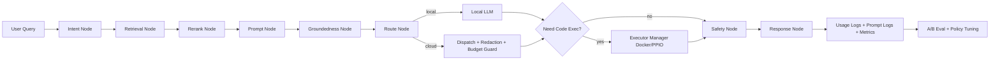

# Industry AI Flow：RAG + Workflow 深度优化总计划（V2 可直接开发版）

> 更新时间：2026-02-10
> 适用范围：Capstone 一期（4周主线 + Prompt补充2周并行）
> 约束：Ollama 本地优先、PPIO 可选代码执行、预算 < 500 CAD、工期 < 6 周

## 0. 本计划解决什么问题
本版计划针对上一版“过于笼统”的问题，补齐以下缺口：
1. 关键环节的**实现建议**与**核心代码片段**。
2. 关键疑难点的**风险与验证方式**。
3. 改造后的**目标项目结构树**。
4. Model 层（类型契约）与数据库表结构的**预期设计**。
5. Workflow 管理与 Prompt 模板管理的**完整闭环**。

配套文档：
- `research/rag-workflow-implementation-details.md`
- `research/rag-workflow-data-model-and-schema-design.md`

---

## 1. 当前实现诊断（与代码对照）

### 1.1 现状优势
1. 已有可用 RAG 主链：`SimpleRAG` + 混合检索 + reranker + 安全守卫。
2. 已有 LangGraph 基础：`backend/services/intent_classification/intent_workflow.py`。
3. 已有 LLM dispatch 与成本治理基础：`dispatch_service`、`cost_tracker`、`llm_usage_logs`。
4. 已有 Prompt 管理核心类与 API 草案：`PromptManager` + `prompt_routes`。

### 1.2 阻断问题（必须先修）
1. Prompt API 依赖断裂：`prompt_routes` 依赖 `get_database_pool`，`config.py` 未提供。
2. Prompt API 请求模型与实现不一致：`PromptUpdate` 缺 `updated_by/created_by` 语义字段。
3. Prompt 查询 SQL 存在参数绑定与字段别名错误。
4. Prompt schema 存在两套分叉定义（`001_create_prompt_tables.sql` 与 `001_create_comprehensive_schema.sql`）。
5. 综合 schema 的 `prompt_usage_logs` 分区仅建到 2025，2026 写入存在故障风险。
6. 主应用未挂载 `prompt_routes`，导致功能不可用。

---

## 2. 总体架构决策（锁定）

### 2.1 技术决策
1. Workflow 主编排：LangGraph（不引入第二套主编排）。
2. Prompt 存储：数据库主存 + 文件镜像导出（Git 审计）。
3. Schema 主线：统一到 `backend/init_database.py` 幂等建表。
4. Prompt usage log：一期先非分区 + 复合索引。
5. 代码执行：Docker 主用，PPIO 作为 provider 扩展与 fallback。

### 2.2 交付决策
1. 主线 4 周：RAG + Workflow + Prompt + 验证闭环。
2. Prompt 补充 2 周：并行推进，不阻塞主线核心功能。

---

## 3. 目标项目结构（改造后）

```text
backend/
  api/
    enhanced_query_routes.py
    llm_dispatch_routes.py
    llm_cost_routes.py
    prompt_routes.py
    workflow_query_routes.py                    # 新增
  services/
    rag_engine.py
    retrieval/
      hybrid_search.py
      reranker.py
    llm_integration/
      dispatch_service.py
      cost_tracker.py
      types.py
    prompt_manager.py
    workflows/                                  # 新增主目录
      __init__.py
      graph.py
      state.py
      orchestrator.py
      nodes/
        intent_node.py
        retrieval_node.py
        rerank_node.py
        prompt_node.py                          # 新增
        groundedness_node.py
        route_node.py
        code_exec_node.py
        safety_node.py
        response_node.py
      policies/
        routing_policy.py
        budget_policy.py
        prompt_policy.py                        # 新增
      prompting/
        template_selector.py                    # 新增
        template_registry.py                    # 新增
        ab_allocator.py                         # 新增
        render_service.py                       # 新增
    code_executor/
      docker_executor.py
      providers/
        base.py                                 # 新增
        docker_provider.py                      # 新增
        ppio_provider.py                        # 新增
      manager.py                                # 新增
  migrations/
    001_create_prompt_tables.sql                # 保留参考，停止作为主线
  init_database.py                              # 主线收敛点
  main.py                                       # 路由注册与启动初始化

tools/
  prompt-admin/                                 # 新增（由 streamlit_prompt_manager 迁移）
    app.py
    api_client.py
    pages/
      prompt_list.py
      prompt_editor.py
      prompt_test.py
      experiments.py
      metrics.py

research/
  rag-workflow-deep-optimization-plan.md        # 本文档（总计划）
  rag-workflow-implementation-details.md        # 关键代码片段与疑难点
  rag-workflow-data-model-and-schema-design.md  # model层+表结构设计
```

---

## 4. Workflow 管理方案（闭环）

### 4.1 节点编排


### 4.2 管理策略
1. `Route Policy`：`local_only/hybrid_auto/cloud_only` + 预算约束。
2. `Prompt Policy`：按任务类型/租户/场景选模板，支持 A/B。
3. `Safety Policy`：groundedness + 敏感信息脱敏 + 失败降级。
4. `Observability`：统一 trace_id，记录路由、模板、成本、时延。

---

## 5. Prompt 模板管理补充计划（完整）

### 5.1 建筑场景模板（首批 8 个）
1. `construction_rag_grounded_qa`
2. `alberta_ohs_compliance_check`
3. `construction_spec_extraction`
4. `drawing_ocr_structured_parse`
5. `code_exec_data_analysis_explainer`
6. `incident_risk_assessment`
7. `cost_estimation_assistant`
8. `clarification_followup_for_low_confidence`

### 5.2 存储方案（推荐）
1. 主存：PostgreSQL（支持版本、实验、统计）。
2. 镜像：`research/prompt-catalog/*.yaml`（导出只读）。

### 5.3 接入方式
1. API 层：`/api/prompts/*` 正式启用。
2. Workflow 层：新增 `prompt_node`，将模板选择前置到生成前。
3. 管理层：Streamlit 对接真实 API，不再使用 Mock。

### 5.4 2周实施分解

#### Week 1
1. 修复 Prompt API 契约与连接池。
2. 收敛 schema 到 `init_database.py`。
3. 导入模板并验证渲染。
4. 挂载 prompt_routes 并打通最小管理链。

#### Week 2
1. A/B 实验管理（10% -> 30% -> 50%）。
2. Prompt usage 指标汇总接口。
3. DB -> 文件镜像导出任务。
4. Streamlit 管理原型联调与演示脚本。

---

## 6. 分阶段主实施（4周）

### Phase 1（Week 1）- 收敛与修复
任务：修复 P0、统一 schema 主线、补齐 Prompt API 依赖。
改动点：`config.py`、`main.py`、`prompt_routes.py`、`prompt_manager.py`、`init_database.py`。
影响范围：Prompt 管理能力从“半接入”变“可用”。

### Phase 2（Week 2）- Workflow + Prompt Node
任务：新增 workflow 子模块与 prompt_node；统一 trace。
改动点：`services/workflows/*`。
影响范围：RAG 输出模板化、可实验化。

### Phase 3（Week 3）- Provider 扩展与质量提升
任务：Executor Provider 抽象（Docker/PPIO）；检索策略调优。
改动点：`services/code_executor/providers/*`、`workflows/policies/*`。
影响范围：代码执行稳定性和弹性提升。

### Phase 4（Week 4）- 验收与回滚演练
任务：全链路验证、KPI 评估、回滚演练、演示冻结。
改动点：测试与运维文档。
影响范围：发布质量与答辩稳定性。

---

## 7. 疑难点重点说明（高风险环节）

### 7.1 Schema 分叉
- 风险：同名表不同列导致运行时插入失败。
- 方案：唯一主线 `init_database.py`，历史 SQL 文件仅保留参考。
- 验证：启动后自动检查关键表列集合一致。

### 7.2 Prompt API 契约漂移
- 风险：Pydantic 模型与 handler 入参不一致导致 500。
- 方案：统一请求模型，加入字段校验与测试。
- 验证：`test_prompt_admin_api.py` 覆盖 create/update/search/performance。

### 7.3 A/B 测试失真
- 风险：流量分配不稳定、样本不足导致错误结论。
- 方案：最小样本阈值 + 固定窗口 + 指标联合判定。
- 验证：离线回放 + 在线统计双验。

### 7.4 PPIO 接入稳定性
- 风险：网络波动或额度问题影响执行链。
- 方案：Provider manager 熔断，自动回退 Docker。
- 验证：故障注入测试 + fallback 指标。

---

## 8. 验证计划与发布门禁

### 8.1 测试维度
1. 单元：prompt 渲染、A/B 分配、SQL 参数、policy 决策。
2. 集成：Prompt API、workflow query、provider fallback。
3. 回归：legacy `/api/v1/query` 与 `/api/v1/query/dispatch`。
4. 非功能：p95 延迟、错误率、成本估算误差、敏感信息泄露。

### 8.2 KPI 门槛
1. `faithfulness >= 0.80`
2. `answer_relevancy >= 0.75`
3. Prompt A/B 胜出模板质量提升 >= 5%
4. `p95` 延迟增幅 <= 10%
5. 敏感明文出站 = 0

---

## 9. 风险与回滚
1. `PROMPT_EXPERIMENTS_ENABLED=false` 可立即关闭实验。
2. `CODE_EXECUTION_PROVIDER=docker` 可关闭 PPIO 路径。
3. Workflow 失败可回退到现有 `SimpleRAG` 直连模式。
4. schema 变更全部幂等且有 `schema_migrations` 记录。

---

## 10. 文档使用说明
1. 先读本文档把握范围与阶段。
2. 开发前按 `research/rag-workflow-implementation-details.md` 执行关键改动。
3. 改表前按 `research/rag-workflow-data-model-and-schema-design.md` 完成 schema 检查。
